# Babylon.js ：標準メッシュだけで飛行機・記号・生物を作ってみた

## この記事のスナップショット

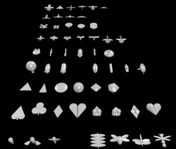  
*sample*

https://playground.babylonjs.com/?BabylonToolkit#MA38CY

（上記のURLにおいて、ツールバーの歯車マークから「EDITOR」のチェックを外せばウィンドウいっぱいに、歯車マークから「FULLSCREEN」を選べば画面いっぱいになります。）

[ソース](151/)

ローカルで動かす場合、上記ソースに加え、別途 git 内の [136/js](https://github.com/fnamuoo/webgl/tree/main/136/js) を ./js として配置してください。

## 概要

Babylon.js にある標準メッシュ（直方体、球、円柱、カプセルなど）を組み合わせるだけのシンプルな構成でも、
そこそこの見栄えのするものが作れないか？
と思い、チャレンジしてみました。

「簡単に作れて、そこそこ見栄えのある、かつコード量が少ないと尚良い」と、無茶ぶりとも思える課題です。
デザイン性よりも「標準メッシュだけでどこまで表現できるか」を重視しています。

尚、飛行機が多いですが、とっかかりが飛行機だった＋趣味です。悪しからず。
飛行機に始まり、記号や人型、生物といったものまで試作しています。

サイズは全長が 4 程度に、Z軸＋方向を向くようにしています。

## 使うメッシュ

基本的に使うメッシュは下記になります。

Mesh     | 可能な形状     | 使用例
---------|----------------|------
Box      | 立方体、直方体 | 飛行機ボディ、飛行機ウィング
Sphere   | 球、楕円       | 飛行機ボディ、飛行機ウィング、キャノピー、バーニア、目、羽、口
Cylinder | 円柱、角柱、円すい台、角すい台 | プロペラ、三角ウィング、人型ボディ、船ボディ、ミレニアムファルコン風、ダイヤ（立方
Capsule  | カプセル       | 飛行機ボディ、気球、エンジン、ミサイルボディ、ロケットボディ、ハート（立体
Torus    | ドーナツ       | 天使の輪、フライングディスク

これらの大きさ、位置、姿勢（角度）を工夫して配置します。

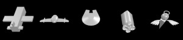  
*左よりBox,Sphere,Cylinder,Capsule,Torus例*

特に興味深いのは下記の機能です。整形できる形、表現の幅が広がります。

- slice(Sphere)
  - 飛行機のウィングやキャノピー、バーニア
- arc(Sphere, Cylinder)
  - ハート（平版）や虫の口
- scaling
  - ひし形状（ステルス爆撃機）、船のボディ

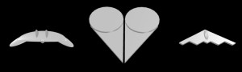  
*左よりslice,arc,scaling例*

Extrude を使えばそこそこに見栄えするモノがつくれますが、座標値の指定が面倒なので１つ(後退翼の飛行機)だけ作ったのみです。

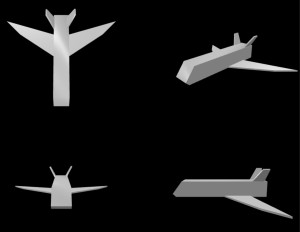  
*Extrude例：後退翼の飛行機/crPlane29*

## メッシュサンプル一覧

形状のスナップショットとコードを示します。

- [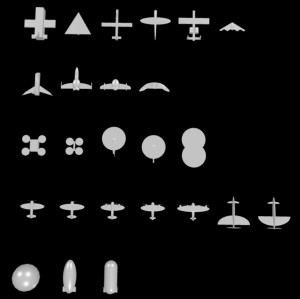](#飛行機)
  - [四角い飛行機](#飛行機四角い飛行機)
  - [三角翼（紙飛行機 風](#飛行機三角翼紙飛行機-風)
  - [ドローン：グライダー風](#ドローングライダー風)
  - [ドローン：グライダー風（２）](#ドローングライダー風２)
  - [A10風](#飛行機a10風)
  - [ステルス爆撃機](#飛行機ステルス爆撃機)
  - [後退翼の飛行機](#飛行機後退翼の飛行機)
  - [コスモタイガーII風](#飛行機コスモタイガーii風)
  - [たまご風](#飛行機たまご風)
  - [メーヴェ風](#飛行機メーヴェ風)
  - [ドローン：荷物運搬](#ドローン荷物運搬)
  - [ドローン：小型](#ドローン小型)
  - [ヘリコプター](#飛行機ヘリコプター)
  - [ヘリコプター（２）](#飛行機ヘリコプター２)
  - [輸送ヘリ](#飛行機輸送ヘリ)
  - [プロペラ機](#飛行機プロペラ機)
  - [プロペラ機（複翼](#飛行機プロペラ機複翼)
  - [プロペラ機（２エンジン上部配置](#飛行機プロペラ機２エンジン上部配置)
  - [プロペラ機（２エンジン下部配置](#飛行機プロペラ機２エンジン下部配置)
  - [プロペラ機（４エンジン下部配置](#飛行機プロペラ機４エンジン下部配置)
  - [プロペラ機：推進式（プッシャー式）](#飛行機プロペラ機推進式プッシャー式)
  - [プロペラ機：推進式（プッシャー式）、前進翼](#飛行機プロペラ機推進式プッシャー式前進翼)
  - [気球](#飛行機気球)
  - [飛行船（楕円ベース）](#飛行機飛行船楕円ベース)
  - [飛行船（カプセルベース）](#飛行機飛行船カプセルベース)

- [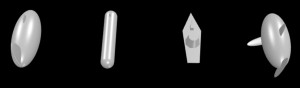](#海)
  - [潜水艦（楕円）](#海潜水艦楕円)
  - [潜水艦（カプセル）](#海潜水艦カプセル)
  - [イージス艦](#海イージス艦)
  - [マグロ風](#海マグロ風)

- [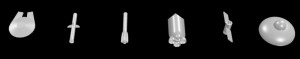](#宇宙)
  - [ミレニアムファルコン風](#宇宙ミレニアムファルコン風)
  - [ハープーンミサイル](#宇宙ハープーンミサイル)
  - [ロケット、4ノズル](#宇宙ロケット4ノズル)
  - [スペースシャトル風](#宇宙スペースシャトル風)
  - [人工衛星](#宇宙人工衛星)
  - [UFO,アダムスキー 風](#宇宙ufoアダムスキー-風)

- [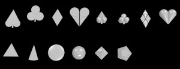](#記号)
  - [スペード（平板](#記号スペード平板)
  - [クローバー（平板](#記号クローバー平板)
  - [ダイヤ（平板](#記号ダイヤ平板)
  - [ハート（平板](#記号ハート平板)
  - [スペード（立体](#記号スペード立体)
  - [クローバー（立体](#記号クローバー立体)
  - [ダイヤ（立体](#記号ダイヤ立体)
  - [ハート（立体](#記号ハート立体)
  - [正三角](#記号正三角)
  - [ケーキ片](#記号ケーキ片)
  - [フライングディスク](#記号フライングディスク)
  - [提灯](#記号提灯)
  - [８面体](#記号８面体)
  - [ダイヤ](#記号ダイヤ)

- [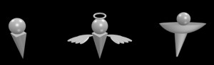](#人型)
  - [マーカー](#人型マーカー)
  - [天使](#人型天使)
  - [式神](#人型式神)

- [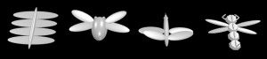](#生物)
  - [スカイフィッシュ風](#生物スカイフィッシュ風)
  - [ウシアブ風](#生物ウシアブ風)
  - [大王ヤンマ風](#生物大王ヤンマ風)
  - [ヘビケラ風](#生物ヘビケラ風)

### 飛行機

#### 飛行機：四角い飛行機

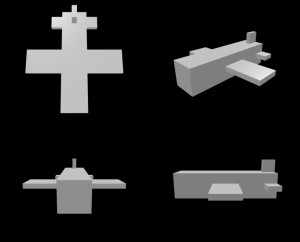  
*飛行機：四角い飛行機/crPlane0*

```js
let crPlane0 = function() {
    // 飛行機：四角い飛行機
    let mesh = BABYLON.MeshBuilder.CreateBox("", {width:1, height:1, depth:4}, scene);
    let mesh1 = BABYLON.MeshBuilder.CreateBox("", {width:4, height:0.2, depth:1}, scene);
    mesh1.position.z = 0.0;
    mesh1.parent = mesh;
    let mesh2 = BABYLON.MeshBuilder.CreateBox("", {width:2, height:0.2, depth:0.5}, scene);
    mesh2.position.z = -1.75;
    mesh2.parent = mesh;
    let mesh3 = BABYLON.MeshBuilder.CreateBox("", {width:0.2, height:0.5, depth:0.5}, scene);
    mesh3.position.y = 0.75;
    mesh3.position.z = -1.75;
    mesh3.parent = mesh;
    return mesh;
}
```

#### 飛行機：三角翼（紙飛行機 風

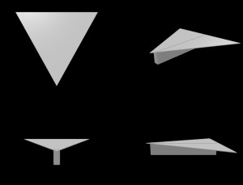  
*飛行機：三角翼（紙飛行機 風/crPlane2*

```js
let crPlane2 = function() {
    // 飛行機：三角翼（紙飛行機 風
    let mesh = BABYLON.MeshBuilder.CreateBox("", {width:0.2, height:0.5, depth:2.7}, scene);
    let R90 = Math.PI/2;
    let mesh1 = BABYLON.MeshBuilder.CreateCylinder("", {diameter:4, height:0.02, tessellation:3}, scene);
    mesh1.rotation.y = -R90;
    mesh1.position.y = 0.23;
    mesh1.position.z = -0.45;
    mesh1.parent = mesh;
    return mesh;
}
```

#### ドローン：グライダー風

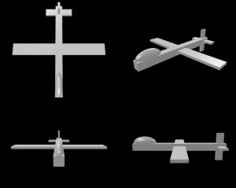  
*ドローン：グライダー風/crPlane1*

```js
let crPlane1 = function() {
    // ドローン：グライダー風
    let mesh = BABYLON.MeshBuilder.CreateBox("", {width:0.3, height:0.3, depth:4}, scene);
    // キャノピー
    let mesh0 = BABYLON.MeshBuilder.CreateSphere("", {diameterX:0.3, diameterY:0.6, diameterZ:1}, scene);
    mesh0.position.y = 0.15;
    mesh0.position.z = 1.5;
    mesh0.parent = mesh;
    // 主翼
    let mesh1 = BABYLON.MeshBuilder.CreateBox("", {width:4, height:0.1, depth:0.5}, scene);
    mesh1.position.z = 0.0;
    mesh1.parent = mesh;
    // 尾翼
    let mesh2 = BABYLON.MeshBuilder.CreateBox("", {width:1.2, height:0.1, depth:0.3}, scene);
    mesh2.position.z = -1.75;
    mesh2.parent = mesh;
    let mesh3 = BABYLON.MeshBuilder.CreateBox("", {width:0.1, height:1.2, depth:0.3}, scene);
    mesh3.position.z = -1.75;
    mesh3.parent = mesh;
    return mesh;
}
```

#### ドローン：グライダー風（２）

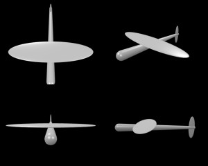  
*ドローン：グライダー風（２）/crPlane3*

```js
let crPlane3 = function() {
    // ドローン：グライダー風（２）
    let mesh = new BABYLON.TransformNode();
    let R90 = Math.PI/2;
    let mesh0 = BABYLON.MeshBuilder.CreateCapsule("", {radius:0.2, height:4, radiusBottom:0.07}, scene);
    mesh0.rotation.x = R90;
    mesh0.parent = mesh;
    let mesh1 = BABYLON.MeshBuilder.CreateSphere("", {diameterX:4.0, diameterY:0.1, diameterZ:1}, scene);
    mesh1.position.y = 0.20;
    mesh1.position.z = 0.50;
    mesh1.parent = mesh;
    let mesh2 = BABYLON.MeshBuilder.CreateSphere("", {diameterX:0.1, diameterY:1.1, diameterZ:0.3}, scene);
    mesh2.position.z = -1.75;
    mesh2.parent = mesh;
    return mesh;
}
```

#### 飛行機：A10風

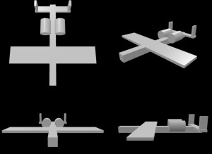  
*飛行機：A10風/crPlane19*

```js
let crPlane19 = function() {
    // 飛行機：A10風
    let mesh = BABYLON.MeshBuilder.CreateBox("", {width:0.3, height:0.3, depth:4}, scene);
    // 主翼
    let mesh1 = BABYLON.MeshBuilder.CreateBox("", {width:4, height:0.1, depth:0.8}, scene);
    mesh1.position.set(0, 0.1, 0.6);
    mesh1.parent = mesh;
    // 尾翼
    let mesh2 = BABYLON.MeshBuilder.CreateBox("", {width:1.8, height:0.1, depth:0.3}, scene);
    mesh2.position.set(0, 0.1, -1.75);
    mesh2.parent = mesh;
    for (let x of [-0.8, 0.8]) {
        let mesh3 = BABYLON.MeshBuilder.CreateBox("", {width:0.1, height:0.6, depth:0.3}, scene);
        mesh3.position.set(x, 0.4, -1.75);
        mesh3.parent = mesh;
    }
    // エンジン
    let R90 = Math.PI/2;
    for (let x of [-0.35, 0.35]) {
        let mesh5 = BABYLON.MeshBuilder.CreateCylinder("", {diameter:0.5, height:0.7}, scene);
        mesh5.rotation.x = R90;
        mesh5.position.set(x, 0.22, -0.75);
        mesh5.parent = mesh;
    }
    return mesh;
}
```

#### 飛行機：ステルス爆撃機

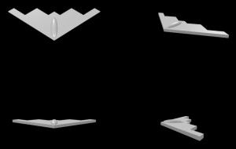  
*飛行機：ステルス爆撃機/crPlane50*

```js
let crPlane50 = function() {
    // 飛行機：ステルス爆撃機
    let R45 = Math.PI/4;
    let mesh = new BABYLON.TransformNode();
    // ボディ
    let mesh1 = BABYLON.MeshBuilder.CreateBox("", {width:1, height:0.1, depth:1}, scene);
    mesh1.rotation.set(0, R45, 0);
    mesh1.position.set(0, 0.0, 0.0);
    mesh1.parent = mesh;
    // ウイング(R
    let cos45 = Math.cos(R45);
    let mesh2 = BABYLON.MeshBuilder.CreateBox("", {width:1, height:0.1, depth:0.25}, scene);
    mesh2.rotation.set(0, R45, 0);
    mesh2.position.set(cos45*1.375, 0.0, -cos45*0.625);
    mesh2.parent = mesh;
    let mesh4 = BABYLON.MeshBuilder.CreateBox("", {width:0.5, height:0.1, depth:0.5}, scene);
    mesh4.rotation.set(0, R45, 0);
    mesh4.position.set(cos45*0.75, 0.0, -cos45*0.75);
    mesh4.parent = mesh;
    // ウイング(L
    let mesh3 = BABYLON.MeshBuilder.CreateBox("", {width:1, height:0.1, depth:0.25}, scene);
    mesh3.rotation.set(0, -R45, 0);
    mesh3.position.set(-cos45*1.375, 0.0, -cos45*0.625);
    mesh3.parent = mesh;
    let mesh5 = BABYLON.MeshBuilder.CreateBox("", {width:0.5, height:0.1, depth:0.5}, scene);
    mesh5.rotation.set(0, -R45, 0);
    mesh5.position.set(-cos45*0.75, 0.0, -cos45*0.75);
    mesh5.parent = mesh;
    // キャノピー
    let mesh6 = BABYLON.MeshBuilder.CreateSphere("", {diameter:0.2, diameterY:0.2, diameterZ:1.0, slice:0.5}, scene);
    mesh6.position.set(0, 0.05, 0.1);
    mesh6.parent = mesh;
    // 前後に短く、横に長くする
    mesh.scaling.set(1.2, 1, 0.75);
    return mesh;
}
```

#### 飛行機：後退翼の飛行機

  
*飛行機：後退翼の飛行機/crPlane29*

```js
let crPlane29 = function() {
    // 飛行機：後退翼の飛行機
    let R30 = Math.PI/6;
    let R90 = Math.PI/2;
    let mesh = new BABYLON.TransformNode();
    // ボディ
    {
        let myPoints = [
            new BABYLON.Vector3( -1.5, -0.15, 0),
            new BABYLON.Vector3( -1.4, -0.25, 0),
            new BABYLON.Vector3(  1.5, -0.25, 0),
            new BABYLON.Vector3(  1.5,  0.25, 0),
            new BABYLON.Vector3( -1.2,  0.25, 0),
        ];
        myPoints.push(myPoints[0]);
        let myPath = [
            new BABYLON.Vector3(0, 0, -0.25),
            new BABYLON.Vector3(0, 0, 0.25),
        ];
        let options = {
            shape:myPoints,
            path:myPath,
            cap:BABYLON.Mesh.CAP_ALL,
            sideOrientation:BABYLON.Mesh.DOUBLESIDE,
        }
        let mesh1 = BABYLON.MeshBuilder.ExtrudeShape("", options, scene);
        mesh1.rotation.y = R90;
        mesh1.position.set(0.0, 0.0, 0.0);
        mesh1.parent = mesh;
    }
    // 主翼
    {
        let myPoints = [
            new BABYLON.Vector3( 0, 0, 0),
            new BABYLON.Vector3( 1.5, -1, 0),
            new BABYLON.Vector3( 2, -1.5, 0),
            new BABYLON.Vector3( 0, -0.9, 0),
            new BABYLON.Vector3(-2, -1.5, 0),
            new BABYLON.Vector3(-1.5, -1, 0),
        ];
        myPoints.push(myPoints[0]);
        let myPath = [
            new BABYLON.Vector3(0, 0, 0),
            new BABYLON.Vector3(0, 0, 0.05),
        ];
        let options = {
            shape:myPoints,
            path:myPath,
            cap:BABYLON.Mesh.CAP_ALL,
            sideOrientation:BABYLON.Mesh.DOUBLESIDE,
            // cap:BABYLON.CAP_ALL,
            // sideOrientation:
        }
        let mesh1 = BABYLON.MeshBuilder.ExtrudeShape("", options, scene);
        mesh1.rotation.x = R90;
        mesh1.position.set(0.0, -0.21, 0.0);
        mesh1.parent = mesh;
    }
    // 尾翼
    for (let d of [-1, 1]) {
        let myPoints = [
            new BABYLON.Vector3( 0, 0, 0),
            new BABYLON.Vector3( 0.4, 0, 0),
            new BABYLON.Vector3( 0.5, 0.5, 0),
            new BABYLON.Vector3( 0.3, 0.5, 0),
        ];
        myPoints.push(myPoints[0]);
        let myPath = [
            new BABYLON.Vector3(0, 0, 0),
            new BABYLON.Vector3(0, 0, 0.05),
        ];
        let options = {
            shape:myPoints,
            path:myPath,
            cap:BABYLON.Mesh.CAP_ALL,
            sideOrientation:BABYLON.Mesh.DOUBLESIDE,
        }
        let mesh1 = BABYLON.MeshBuilder.ExtrudeShape("", options, scene);
        mesh1.rotation.set(R30*d, R90, 0);
        mesh1.position.set(0.2*d, 0.2, -1.0);
        mesh1.parent = mesh;
    }
    return mesh;
}
```

#### 飛行機：コスモタイガーII風

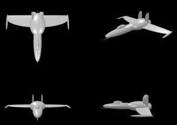  
*飛行機：コスモタイガーII風/crPlane43*

```js
let crPlane43 = function() {
    // 飛行機：コスモタイガーII風
    let R90 = Math.PI/2;
    let mesh = new BABYLON.TransformNode();
    // ノーズ
    let mesh11 = BABYLON.MeshBuilder.CreateSphere("", {diameterX:0.5, diameterY:2.5, diameterZ:0.4, slice:0.6}, scene);
    mesh11.rotation.x = R90;
    mesh11.position.set(0.0, 0.0, 1.0);
    mesh11.parent = mesh;
    // ノーズ下のトゲ
    let mesh13 = BABYLON.MeshBuilder.CreateCylinder("", {diameterTop:0.0, diameterBottom:0.05, height:0.5}, scene);
    mesh13.rotation.x = R90;
    mesh13.position.set(0.0, -0.12, 2.2);
    mesh13.parent = mesh;
    // キャノピー
    let mesh12 = BABYLON.MeshBuilder.CreateSphere("", {diameterX:0.2, diameterY:0.3, diameterZ:0.6, slice:0.6}, scene);
    mesh12.position.set(0.0, 0.18, 1.3);
    mesh12.parent = mesh;
    // ボディ
    let mesh1 = BABYLON.MeshBuilder.CreateSphere("", {diameterX:1.0, diameterY:0.6, diameterZ:1.5, segments:8}, scene);
    mesh1.position.set(0.0, 0.0, 0.0);
    mesh1.parent = mesh;
    // 主翼
    let mesh2 = BABYLON.MeshBuilder.CreateSphere("", {diameterX:4, diameterY:1.2, diameterZ:0.1, slice:0.6}, scene);
    mesh2.rotation.x = R90;
    mesh2.position.set(0.0, -0.05, -0.4);
    mesh2.parent = mesh;
    // 翼の端のトゲ
    let mesh3 = BABYLON.MeshBuilder.CreateSphere("", {diameterX:0.1, diameterY:0.1, diameterZ:1.0}, scene);
    mesh3.position.set(1.95, -0.05, -0.15);
    mesh3.parent = mesh;
    let mesh4 = BABYLON.MeshBuilder.CreateSphere("", {diameterX:0.1, diameterY:0.1, diameterZ:1.0}, scene);
    mesh4.position.set(-1.95, -0.05, -0.15);
    mesh4.parent = mesh;
    // 垂直尾翼
    let mesh5 = BABYLON.MeshBuilder.CreateSphere("", {diameterX:0.1, diameterY:0.5, diameterZ:0.8, slice:0.6}, scene);
    mesh5.rotation.x = R90;
    mesh5.position.set(0.3, 0.3, -0.5);
    mesh5.parent = mesh;
    let mesh6 = BABYLON.MeshBuilder.CreateSphere("", {diameterX:0.1, diameterY:0.5, diameterZ:0.8, slice:0.6}, scene);
    mesh6.rotation.x = R90;
    mesh6.position.set(-0.3, 0.3, -0.5);
    mesh6.parent = mesh;
    // ノズル
    let mesh21 = BABYLON.MeshBuilder.CreateSphere("", {diameterX:0.3, diameterY:0.4, diameterZ:0.3, slice:0.6, sideOrientation:BABYLON.Mesh.DOUBLESIDE}, scene);
    mesh21.rotation.x = R90;
    mesh21.position.set(0.25, 0.0, -0.7);
    mesh21.parent = mesh;
    let mesh22 = BABYLON.MeshBuilder.CreateSphere("", {diameterX:0.3, diameterY:0.4, diameterZ:0.3, slice:0.6, sideOrientation:BABYLON.Mesh.DOUBLESIDE}, scene);
    mesh22.rotation.x = R90;
    mesh22.position.set(-0.25, 0.0, -0.7);
    mesh22.parent = mesh;
    return mesh;
}
```

#### 飛行機：たまご風

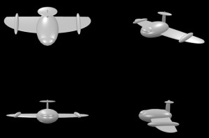  
*飛行機：たまご風/crPlane44*

```js
let crPlane44 = function() {
    // 飛行機：たまご風
    let R90 = Math.PI/2;
    let mesh = new BABYLON.TransformNode();
    // ボディ
    let mesh1 = BABYLON.MeshBuilder.CreateSphere("", {diameterX:1.0, diameterY:0.6, diameterZ:1.5, segments:8}, scene);
    mesh1.position.set(0.0, 0.0, 0.0);
    mesh1.parent = mesh;
    // キャノピー
    let mesh11 = BABYLON.MeshBuilder.CreateSphere("", {diameterX:0.6, diameterY:0.3, diameterZ:0.5, slice:0.6}, scene);
    mesh11.position.set(0.0, 0.10, 0.45);
    mesh11.parent = mesh;
    // 主翼
    let mesh2 = BABYLON.MeshBuilder.CreateSphere("", {diameterX:4, diameterY:1.2, diameterZ:0.1, slice:0.6}, scene);
    mesh2.rotation.x = R90;
    mesh2.position.set(0.0, -0.05, -0.4);
    mesh2.parent = mesh;
    // 翼上のコブ
    let mesh3 = BABYLON.MeshBuilder.CreateSphere("", {diameterX:0.2, diameterY:0.2, diameterZ:1.0}, scene);
    mesh3.position.set(1.4, 0.0, -0.25);
    mesh3.parent = mesh;
    let mesh4 = BABYLON.MeshBuilder.CreateSphere("", {diameterX:0.2, diameterY:0.2, diameterZ:1.0}, scene);
    mesh4.position.set(-1.4, 0.0, -0.25);
    mesh4.parent = mesh;
    // 垂直尾翼
    let mesh5 = BABYLON.MeshBuilder.CreateSphere("", {diameterX:0.1, diameterY:0.3, diameterZ:0.8, slice:0.6}, scene);
    mesh5.rotation.x = R90;
    mesh5.position.set(0.0, 0.3, -0.6);
    mesh5.parent = mesh;
    let mesh6 = BABYLON.MeshBuilder.CreateSphere("", {diameterX:0.8, diameterY:0.4, diameterZ:0.1}, scene);
    mesh6.rotation.x = R90;
    mesh6.position.set(0.0, 0.6, -0.6);
    mesh6.parent = mesh;
    return mesh;
}
```

#### 飛行機：メーヴェ風

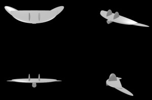  
*飛行機：メーヴェ風/crPlane45*

```js
let crPlane45 = function() {
    // 飛行機：メーヴェ風
    let R90 = Math.PI/2;
    let mesh = new BABYLON.TransformNode();
    // ボディ（主翼下のエンジン
    let mesh1 = BABYLON.MeshBuilder.CreateCylinder("", {diameterTop:0.25, diameterBottom:0.2, height:0.8}, scene);
    mesh1.rotation.x = R90+0.04;
    mesh1.position.set(0.0, -0.2, 0.0);
    mesh1.parent = mesh;
    // 主翼
    let mesh2 = BABYLON.MeshBuilder.CreateSphere("", {diameterX:3, diameterY:1.6, diameterZ:0.2, slice:0.5, sideOrientation:BABYLON.Mesh.DOUBLESIDE}, scene);
    mesh2.rotation.x = R90;
    mesh2.position.set(0.0, -0.05, -0.4);
    mesh2.parent = mesh;
    // 主翼端：風切り羽
    let mesh3 = BABYLON.MeshBuilder.CreateSphere("", {diameterX:0.5, diameterY:2.0, diameterZ:0.1, slice:0.5}, scene);
    mesh3.rotation.set(-R90-0.2, 0, -1.0);
    mesh3.position.set(1.1, -0.08, -0.2);
    mesh3.parent = mesh;
    let mesh4 = BABYLON.MeshBuilder.CreateSphere("", {diameterX:0.5, diameterY:2.0, diameterZ:0.1, slice:0.5}, scene);
    mesh4.rotation.set(-R90-0.2, 0, 1.0);
    mesh4.position.set(-1.1, -0.08, -0.2);
    mesh4.parent = mesh;
    // 主翼上の持ち手
    let mesh5 = BABYLON.MeshBuilder.CreateSphere("", {diameterX:0.1, diameterY:0.8, diameterZ:0.5, slice:0.5}, scene);
    mesh5.position.set(0.3, 0.0, 0.0);
    mesh5.parent = mesh;
    let mesh6 = BABYLON.MeshBuilder.CreateSphere("", {diameterX:0.1, diameterY:0.8, diameterZ:0.5, slice:0.5}, scene);
    mesh6.position.set(-0.3, 0.0, 0.0);
    mesh6.parent = mesh;
    return mesh;
}
```

#### ドローン：荷物運搬

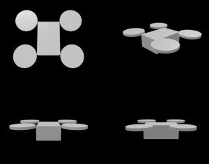  
*ドローン：荷物運搬/crPlane4*

```js
let crPlane4 = function() {
    // ドローン：荷物運搬
    let mesh = BABYLON.MeshBuilder.CreateBox("", {width:1, height:0.6, depth:1.5}, scene);
    for (let z of [-0.8, 0.8]) {
    for (let x of [-1.0, 1.0]) {
        let mesh1 = BABYLON.MeshBuilder.CreateCylinder("", {diameter:1.0, height:0.1}, scene);
        mesh1.position.set(x, 0.3, z);
        mesh1.parent = mesh;
        mesh1.material = new BABYLON.StandardMaterial("");
//            mesh1.material.alpha = 0.5;
    }
    }
    return mesh;
}
```

#### ドローン：小型

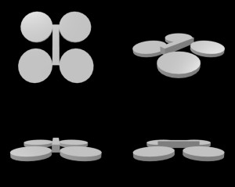  
*ドローン：小型/crPlane5*

```js
let crPlane5 = function() {
    // ドローン：小型
    let mesh = BABYLON.MeshBuilder.CreateBox("", {width:0.2, height:0.2, depth:1.2}, scene);
    for (let z of [-0.6, 0.6]) {
    for (let x of [-0.6, 0.6]) {
        let mesh1 = BABYLON.MeshBuilder.CreateCylinder("", {diameter:1.0, height:0.1}, scene);
        mesh1.position.set(x, -0.1, z);
        mesh1.parent = mesh;
        mesh1.material = new BABYLON.StandardMaterial("");
//            mesh1.material.alpha = 0.5;
    }
    }
    return mesh;
}
```

#### 飛行機：ヘリコプター

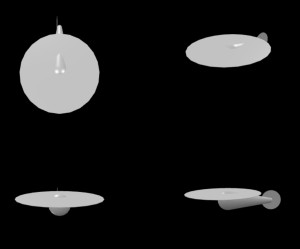  
*飛行機：ヘリコプター/crPlane6*

```js
let crPlane6 = function() {
    // 飛行機：ヘリコプター
    let mesh = new BABYLON.TransformNode();
    let R90 = Math.PI/2;
    let mesh0 = BABYLON.MeshBuilder.CreateCapsule("", {radius:0.4, height:2.2, radiusBottom:0.1}, scene);
    mesh0.rotation.x = R90;
    mesh0.parent = mesh;
    let mesh1 = BABYLON.MeshBuilder.CreateCylinder("", {diameter:3.0, height:0.01}, scene);
    mesh1.position.set(0.0, 0.3, 1.0);
    mesh1.parent = mesh;
    mesh1.material = new BABYLON.StandardMaterial("");
//        mesh1.material.alpha = 0.5;
    let mesh2 = BABYLON.MeshBuilder.CreateCylinder("", {diameter:0.8, height:0.01}, scene);
    mesh2.rotation.z = R90;
    mesh2.position.set( 0.1, 0.0, -0.9);
    mesh2.parent = mesh;
    mesh2.material = new BABYLON.StandardMaterial("");
//        mesh2.material.alpha = 0.5;
    return mesh;
}
```

#### 飛行機：ヘリコプター（２）

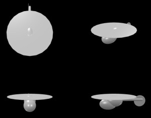  
*飛行機：ヘリコプター（２）/crPlane13*

```js
let crPlane13 = function() {
    // 飛行機：ヘリコプター（２）
    let R90 = Math.PI/2;
    let mesh = BABYLON.MeshBuilder.CreateSphere("", {diameterX:0.8, diameterY:0.8, diameterZ:1.2}, scene);
    let mesh1 = BABYLON.MeshBuilder.CreateSphere("", {diameterX:0.8, diameterY:0.8, diameterZ:1.2}, scene);
    mesh1.position.set(0.0, -0.2, 0.4);
    mesh1.parent = mesh;
    let mesh2 = BABYLON.MeshBuilder.CreateCapsule("", {radius:0.1, height:1.8, radiusBottom:0.08}, scene);
    mesh2.rotation.x = R90;
    mesh2.position.set(0.0, 0.1, -1.1);
    mesh2.parent = mesh;
    let mesh3 = BABYLON.MeshBuilder.CreateCylinder("", {diameter:3.0, height:0.01}, scene);
    mesh3.position.set(0.0, 0.35, 0.0);
    mesh3.parent = mesh;
    mesh3.material = new BABYLON.StandardMaterial("");
//        mesh3.material.alpha = 0.5;
    let mesh4 = BABYLON.MeshBuilder.CreateCylinder("", {diameter:0.8, height:0.01}, scene);
    mesh4.rotation.z = R90;
    mesh4.position.set( 0.1, 0.0, -1.8);
    mesh4.parent = mesh;
    mesh4.material = new BABYLON.StandardMaterial("");
//        mesh4.material.alpha = 0.5;
    return mesh;
}
```

#### 飛行機：輸送ヘリ

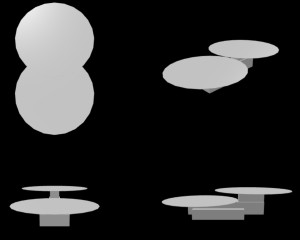  
*飛行機：輸送ヘリ/crPlane20*

```js
let crPlane20 = function() {
    // 飛行機：輸送ヘリ
    let mesh = BABYLON.MeshBuilder.CreateBox("", {width:0.5, height:0.5, depth:3}, scene);
    let mesh1 = BABYLON.MeshBuilder.CreateBox("", {width:0.4, height:0.4, depth:1}, scene);
    mesh1.position.set(0.0, 0.45, -1.0);
    mesh1.parent = mesh;
    let mesh2 = BABYLON.MeshBuilder.CreateBox("", {width:1.0, height:0.4, depth:2}, scene);
    mesh2.position.set(0.0, -0.2, 0.3);
    mesh2.parent = mesh;
    for (let [y,z] of [[0.3, 1.0], [0.7, -1.05]]) {
        let mesh3 = BABYLON.MeshBuilder.CreateCylinder("", {diameter:3.0, height:0.01}, scene);
        mesh3.position.set(0.0, y, z);
        mesh3.parent = mesh;
        mesh3.material = new BABYLON.StandardMaterial("");
//            mesh3.material.alpha = 0.5;
    }
    return mesh;
}
```

#### 飛行機：プロペラ機

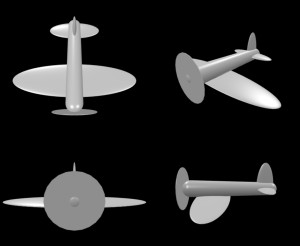  
*飛行機：プロペラ機/crPlane14*

```js
let crPlane14 = function() {
    // 飛行機：プロペラ機
    let mesh = new BABYLON.TransformNode();
    let R90 = Math.PI/2;
    let mesh0 = BABYLON.MeshBuilder.CreateCapsule("", {radius:0.2, height:2.2, radiusBottom:0.15}, scene);
    mesh0.rotation.x = R90;
    mesh0.parent = mesh;
    // プロペラ
    let mesh1 = BABYLON.MeshBuilder.CreateCylinder("", {diameter:1.0, height:0.01}, scene);
    mesh1.rotation.x = R90;
    mesh1.position.set(0.0, 0.0, 1.1);
    mesh1.material = new BABYLON.StandardMaterial("");
//        mesh1.material.alpha = 0.5;
    mesh1.parent = mesh;
    // 主翼
    let mesh2 = BABYLON.MeshBuilder.CreateSphere("", {diameterX:3.0, diameterY:0.1, diameterZ:0.8}, scene);
    mesh2.position.set(0.0, -0.2, 0.4);
    mesh2.parent = mesh;
    // 尾翼
    let mesh3 = BABYLON.MeshBuilder.CreateSphere("", {diameterX:1.2, diameterY:0.1, diameterZ:0.4}, scene);
    mesh3.position.set(0.0, 0.0, -0.8);
    mesh3.parent = mesh;
    let mesh4 = BABYLON.MeshBuilder.CreateSphere("", {diameterX:0.1, diameterY:1.2, diameterZ:0.4, slice:0.5}, scene);
    mesh4.position.set(0.0, 0.0, -0.8);
    mesh4.parent = mesh;
    return mesh;
}
```

#### 飛行機：プロペラ機（複翼

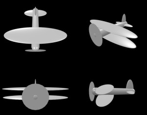  
*飛行機：プロペラ機（複翼/crPlane15*

```js
let crPlane15 = function() {
    // 飛行機：プロペラ機（複翼
    let mesh = new BABYLON.TransformNode();
    let R90 = Math.PI/2;
    let mesh0 = BABYLON.MeshBuilder.CreateCapsule("", {radius:0.2, height:2.2, radiusBottom:0.15}, scene);
    mesh0.rotation.x = R90;
    mesh0.parent = mesh;
    // プロペラ
    let mesh1 = BABYLON.MeshBuilder.CreateCylinder("", {diameter:1.0, height:0.01}, scene);
    mesh1.rotation.x = R90;
    mesh1.position.set(0.0, 0.0, 1.1);
    mesh1.material = new BABYLON.StandardMaterial("");
//        mesh1.material.alpha = 0.5;
    mesh1.parent = mesh;
    for (let y of [-0.2, 0.2]) {
        // 主翼
        let mesh2 = BABYLON.MeshBuilder.CreateSphere("", {diameterX:3.0, diameterY:0.1, diameterZ:0.8}, scene);
        mesh2.position.set(0.0, y, 0.4);
        mesh2.parent = mesh;
    }
    // 尾翼
    let mesh4 = BABYLON.MeshBuilder.CreateSphere("", {diameterX:1.2, diameterY:0.1, diameterZ:0.4}, scene);
    mesh4.position.set(0.0, 0.0, -0.8);
    mesh4.parent = mesh;
    let mesh5 = BABYLON.MeshBuilder.CreateSphere("", {diameterX:0.1, diameterY:1.2, diameterZ:0.4, slice:0.5}, scene);
    mesh5.position.set(0.0, 0.0, -0.8);
    mesh5.parent = mesh;
    return mesh;
}
```

#### 飛行機：プロペラ機（２エンジン上部配置

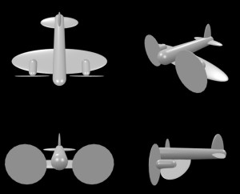  
*飛行機：プロペラ機（２エンジン上部配置/crPlane16*

```js
let crPlane16 = function() {
    // 飛行機：プロペラ機（２エンジン上部配置
    let mesh = new BABYLON.TransformNode();
    let R90 = Math.PI/2;
    let mesh0 = BABYLON.MeshBuilder.CreateCapsule("", {radius:0.2, height:2.2, radiusBottom:0.15}, scene);
    mesh0.rotation.x = R90;
    mesh0.parent = mesh;
    // 主翼
    let mesh2 = BABYLON.MeshBuilder.CreateSphere("", {diameterX:3.0, diameterY:0.1, diameterZ:0.8}, scene);
    mesh2.position.set(0.0, -0.2, 0.4);
    mesh2.parent = mesh;
    for (let x of [-0.8, 0.8]) {
        // エンジン
        let mesh10 = BABYLON.MeshBuilder.CreateCapsule("", {radius:0.12, height:0.5}, scene);
        mesh10.rotation.x = R90;
        mesh10.position.set(x, -0.1, 0.6);
        mesh10.parent = mesh;
        // プロペラ
        let mesh11 = BABYLON.MeshBuilder.CreateCylinder("", {diameter:1.0, height:0.01}, scene);
        mesh11.rotation.x = R90;
        mesh11.position.set(x, -0.1, 0.85);
        mesh11.material = new BABYLON.StandardMaterial("");
//            mesh11.material.alpha = 0.5;
        mesh11.parent = mesh;
    }
    // 尾翼
    let mesh4 = BABYLON.MeshBuilder.CreateSphere("", {diameterX:1.2, diameterY:0.1, diameterZ:0.4}, scene);
    mesh4.position.set(0.0, 0.0, -0.8);
    mesh4.parent = mesh;
    let mesh5 = BABYLON.MeshBuilder.CreateSphere("", {diameterX:0.1, diameterY:1.2, diameterZ:0.4, slice:0.5}, scene);
    mesh5.position.set(0.0, 0.0, -0.8);
    mesh5.parent = mesh;
    return mesh;
}
```

#### 飛行機：プロペラ機（２エンジン下部配置

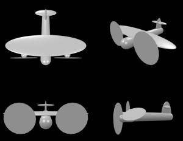  
*飛行機：プロペラ機（２エンジン下部配置/crPlane17*

```js
let crPlane17 = function() {
    // 飛行機：プロペラ機（２エンジン下部配置
    let mesh = new BABYLON.TransformNode();
    let R90 = Math.PI/2;
    let mesh0 = BABYLON.MeshBuilder.CreateCapsule("", {radius:0.2, height:2.2, radiusBottom:0.15}, scene);
    mesh0.rotation.x = R90;
    mesh0.parent = mesh;
    // 主翼
    let mesh2 = BABYLON.MeshBuilder.CreateSphere("", {diameterX:3.0, diameterY:0.1, diameterZ:0.8}, scene);
    mesh2.position.set(0.0, 0.2, 0.4);
    mesh2.parent = mesh;
    for (let x of [-0.8, 0.8]) {
        // エンジン
        let mesh10 = BABYLON.MeshBuilder.CreateCapsule("", {radius:0.12, height:0.5}, scene);
        mesh10.rotation.x = R90;
        mesh10.position.set(x, 0.1, 0.6);
        mesh10.parent = mesh;
        // プロペラ
        let mesh11 = BABYLON.MeshBuilder.CreateCylinder("", {diameter:1.0, height:0.01}, scene);
        mesh11.rotation.x = R90;
        mesh11.position.set(x, 0.1, 0.85);
        mesh11.material = new BABYLON.StandardMaterial("");
//            mesh11.material.alpha = 0.5;
        mesh11.parent = mesh;
    }
    // 尾翼
    let mesh4 = BABYLON.MeshBuilder.CreateSphere("", {diameterX:0.8, diameterY:0.1, diameterZ:0.25}, scene);
    mesh4.position.set(0.0, 0.4, -0.8);
    mesh4.parent = mesh;
    let mesh5 = BABYLON.MeshBuilder.CreateSphere("", {diameterX:0.1, diameterY:1.2, diameterZ:0.4, slice:0.5}, scene);
    mesh5.position.set(0.0, 0.0, -0.8);
    mesh5.parent = mesh;
    return mesh;
}
```

#### 飛行機：プロペラ機（４エンジン下部配置

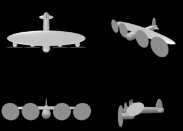  
*飛行機：プロペラ機（４エンジン下部配置/crPlane18*

```js
let crPlane18 = function() {
    // 飛行機：プロペラ機（４エンジン下部配置
    let mesh = new BABYLON.TransformNode();
    let R90 = Math.PI/2;
    let mesh0 = BABYLON.MeshBuilder.CreateCapsule("", {radius:0.2, height:2.2, radiusBottom:0.15}, scene);
    mesh0.rotation.x = R90;
    mesh0.parent = mesh;
    // 主翼
    let mesh2 = BABYLON.MeshBuilder.CreateSphere("", {diameterX:4.0, diameterY:0.1, diameterZ:0.8}, scene);
    mesh2.position.set(0.0, 0.2, 0.4);
    mesh2.parent = mesh;
    for (let x of [-1.6, -0.7, 0.7, 1.6]) {
        // エンジン
        let mesh10 = BABYLON.MeshBuilder.CreateCapsule("", {radius:0.12, height:0.5}, scene);
        mesh10.rotation.x = R90;
        mesh10.position.set(x, 0.1, 0.6);
        mesh10.parent = mesh;
        // プロペラ
        let mesh11 = BABYLON.MeshBuilder.CreateCylinder("", {diameter:0.8, height:0.01}, scene);
        mesh11.rotation.x = R90;
        mesh11.position.set(x, 0.1, 0.85);
        mesh11.material = new BABYLON.StandardMaterial("");
//            mesh11.material.alpha = 0.5;
        mesh11.parent = mesh;
    }
    // 尾翼
    let mesh4 = BABYLON.MeshBuilder.CreateSphere("", {diameterX:0.8, diameterY:0.1, diameterZ:0.25}, scene);
    mesh4.position.set(0.0, 0.0, -0.8);
    mesh4.parent = mesh;
    let mesh5 = BABYLON.MeshBuilder.CreateSphere("", {diameterX:0.1, diameterY:1.2, diameterZ:0.4, slice:0.5}, scene);
    mesh5.position.set(0.0, 0.0, -0.8);
    mesh5.parent = mesh;
    return mesh;
}
```

#### 飛行機：プロペラ機：推進式（プッシャー式）

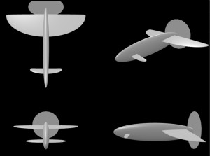  
*飛行機：プロペラ機：推進式（プッシャー式）/crPlane21*

```js
let crPlane21 = function() {
    // 飛行機：プロペラ機：推進式（プッシャー式）
    let R90 = Math.PI/2;
    let mesh = BABYLON.MeshBuilder.CreateSphere("", {diameterX:0.3, diameterY:0.9, diameterZ:4.0}, scene);
    // 主翼
    let mesh2 = BABYLON.MeshBuilder.CreateSphere("", {diameterX:4.0, diameterY:2.3, diameterZ:0.1, slice:0.5}, scene);
    mesh2.rotation.x = R90;
    mesh2.position.set(0.0, 0.1, -1.5);
    mesh2.parent = mesh;
    // 操舵翼
    let mesh3 = BABYLON.MeshBuilder.CreateSphere("", {diameterX:1.5, diameterY:0.4, diameterZ:0.1, slice:0.6}, scene);
    mesh3.rotation.x = R90;
    mesh3.position.set(0.0, -0.1, 1.2);
    mesh3.parent = mesh;
        // プロペラ
        let mesh11 = BABYLON.MeshBuilder.CreateCylinder("", {diameter:1.8, height:0.01}, scene);
        mesh11.rotation.x = R90;
        mesh11.position.set(0, 0.1, -1.85);
        mesh11.material = new BABYLON.StandardMaterial("");
//            mesh11.material.alpha = 0.5;
        mesh11.parent = mesh;
    return mesh;
}
```

#### 飛行機：プロペラ機：推進式（プッシャー式）、前進翼

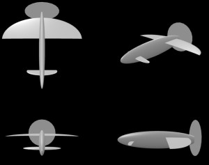  
*飛行機：プロペラ機：推進式（プッシャー式）、前進翼/crPlane22*

```js
let crPlane22 = function() {
    // 飛行機：プロペラ機：推進式（プッシャー式）、前進翼
    //                        -+-
    // プロペラ機（いかり型 ＼_|_／
    let R90 = Math.PI/2;
    let mesh = BABYLON.MeshBuilder.CreateSphere("", {diameterX:0.3, diameterY:0.9, diameterZ:4.0}, scene);
    // 主翼
    let mesh2 = BABYLON.MeshBuilder.CreateSphere("", {diameterX:4.0, diameterY:0.1, diameterZ:2.3, arc:0.5}, scene);
    mesh2.position.set(0.0, 0.1, -0.4);
    mesh2.parent = mesh;
    // 操舵翼
    let mesh3 = BABYLON.MeshBuilder.CreateSphere("", {diameterX:1.5, diameterY:0.4, diameterZ:0.1, slice:0.6}, scene);
    mesh3.rotation.x = R90;
    mesh3.position.set(0.0, -0.1, 1.2);
    mesh3.parent = mesh;
        // プロペラ
        let mesh11 = BABYLON.MeshBuilder.CreateCylinder("", {diameter:1.8, height:0.01}, scene);
        mesh11.rotation.x = R90;
        mesh11.position.set(0, 0.1, -1.85);
        mesh11.material = new BABYLON.StandardMaterial("");
//            mesh11.material.alpha = 0.5;
        mesh11.parent = mesh;
    return mesh;
}
```

#### 飛行機：気球

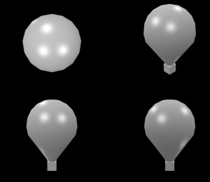  
*飛行機：気球/crPlane7*

```js
let crPlane7 = function() {
    // 飛行機：気球
    let mesh = BABYLON.MeshBuilder.CreateCapsule("", {radius:1.6, height:4, radiusBottom:0.4}, scene);
    let mesh1 = BABYLON.MeshBuilder.CreateBox("", {width:0.6, height:0.6, depth:0.6}, scene);
    mesh1.position.set(0.0, -1.6, 0.0);
    mesh1.parent = mesh;
    return mesh;
}
```

#### 飛行機：飛行船（楕円ベース）

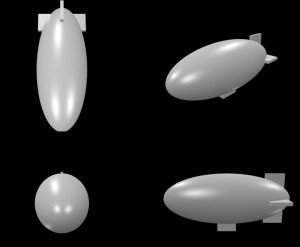  
*飛行機：飛行船（楕円ベース）/crPlane8*

```js
let crPlane8 = function() {
    // 飛行機：飛行船（楕円ベース）
    let mesh = BABYLON.MeshBuilder.CreateSphere("", {diameterX:1.6, diameterY:1.6, diameterZ:4.0}, scene);
    let mesh1 = BABYLON.MeshBuilder.CreateBox("", {width:0.3, height:0.3, depth:0.6}, scene);
    mesh1.position.set(0.0, -0.9, 0.0);
    mesh1.parent = mesh;
    let mesh2 = BABYLON.MeshBuilder.CreateBox("", {width:1.6, height:0.1, depth:0.6}, scene);
    mesh2.position.set(0.0, 0.0, -1.5);
    mesh2.parent = mesh;
    let mesh3 = BABYLON.MeshBuilder.CreateBox("", {width:0.1, height:1.6, depth:0.6}, scene);
    mesh3.position.set(0.0, 0.0, -1.5);
    mesh3.parent = mesh;
    return mesh;
}
```

#### 飛行機：飛行船（カプセルベース）

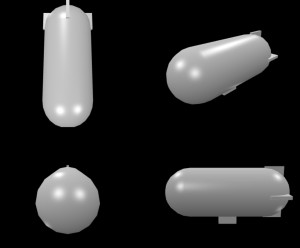  
*飛行機：飛行船（カプセルベース）/crPlane9*

```js
let crPlane9 = function() {
    // 飛行機：飛行船（カプセルベース）
    let mesh = new BABYLON.TransformNode();
    let R90 = Math.PI/2;
    let mesh0 = BABYLON.MeshBuilder.CreateCapsule("", {radius:0.8, height:4}, scene);
    mesh0.rotation.x = R90;
    mesh0.parent = mesh;
    //// let mesh = BABYLON.MeshBuilder.CreateSphere("", {diameterX:0.1, diameterY:1.1, diameterZ:0.3}, scene);
    let mesh1 = BABYLON.MeshBuilder.CreateBox("", {width:0.3, height:0.3, depth:0.6}, scene);
    mesh1.position.set(0.0, -0.9, 0.0);
    mesh1.parent = mesh;
    let mesh2 = BABYLON.MeshBuilder.CreateBox("", {width:1.7, height:0.1, depth:0.6}, scene);
    mesh2.position.set(0.0, 0.0, -1.5);
    mesh2.parent = mesh;
    let mesh3 = BABYLON.MeshBuilder.CreateBox("", {width:0.1, height:1.7, depth:0.6}, scene);
    mesh3.position.set(0.0, 0.0, -1.5);
    mesh3.parent = mesh;
    return mesh;
}
```

### 海

#### 海：潜水艦（楕円）

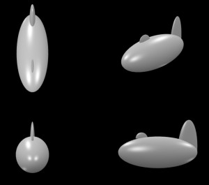  
*海：潜水艦（楕円）/crPlane10*

```js
let crPlane10 = function() {
    // 海：潜水艦（楕円）
    let mesh = BABYLON.MeshBuilder.CreateSphere("", {diameterX:1.6, diameterY:1.6, diameterZ:4.0}, scene);
    let mesh1 = BABYLON.MeshBuilder.CreateSphere("", {diameterX:0.1, diameterY:0.6, diameterZ:0.6, slice:0.5}, scene);
    mesh1.position.set(0.0, 0.7, 0.8);
    mesh1.parent = mesh;
    let mesh2 = BABYLON.MeshBuilder.CreateSphere("", {diameterX:0.3, diameterY:3.2, diameterZ:1.0, slice:0.5}, scene);
    mesh2.position.set(0.0, 0.0, -1.5);
    mesh2.parent = mesh;
    return mesh;
}
```

#### 海：潜水艦（カプセル）

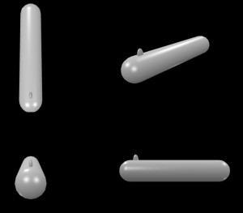  
*海：潜水艦（カプセル）/crPlane11*

```js
let crPlane11 = function() {
    // 海：潜水艦（カプセル）
    let mesh = new BABYLON.TransformNode();
    let R90 = Math.PI/2;
    let mesh0 = BABYLON.MeshBuilder.CreateCapsule("", {radius:0.4, height:4}, scene);
    mesh0.rotation.x = R90;
    mesh0.parent = mesh;
    let mesh1 = BABYLON.MeshBuilder.CreateSphere("", {diameterX:0.1, diameterY:0.4, diameterZ:0.2, slice:0.5}, scene);
    mesh1.position.set(0.0, 0.4, 1.4);
    mesh1.parent = mesh;
    return mesh;
}
```

#### 海：イージス艦

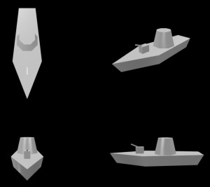  
*海：イージス艦/crPlane42*

```js
let crPlane42 = function() {
    // 海：イージス艦
    let R90 = Math.PI/2;
    let R22 = Math.PI/8;
    let mesh = new BABYLON.TransformNode();
    // 甲板
    let mesh1 = BABYLON.MeshBuilder.CreateCylinder("", {diameterTop:4.0, diameterBottom:3.5, height:0.4, tessellation:5}, scene);
    mesh1.scaling.set(1,1,0.3);
    mesh1.rotation.y = -R90;
    mesh1.position.set(0.0, -0.2, 0.0);
    mesh1.parent = mesh;
    // 艦橋
    let mesh2 = BABYLON.MeshBuilder.CreateCylinder("", {diameterTop:0.6, diameterBottom:0.9, height:0.6, tessellation:8}, scene);
    mesh2.rotation.y = R22;
    mesh2.position.set(0.0, 0.3, -0.2);
    mesh2.parent = mesh;
    // 砲台
    let mesh3 = BABYLON.MeshBuilder.CreateBox("", {width:0.2, height:0.3, depth:0.3}, scene);
    mesh3.position.set(0.0, 0.1, 0.8);
    mesh3.parent = mesh;
    // 砲身
    let mesh4 = BABYLON.MeshBuilder.CreateBox("", {width:0.04, height:0.04, depth:0.3}, scene);
    mesh4.rotation.x = -0.4;
    mesh4.position.set(0.0, 0.3, 1.0);
    mesh4.parent = mesh;
    return mesh;
}
```

#### 海：マグロ風

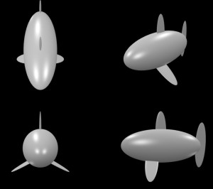  
*海：マグロ風/crPlane12*

```js
let crPlane12 = function() {
    // 海：マグロ風
    let mesh = BABYLON.MeshBuilder.CreateSphere("", {diameterX:1.6, diameterY:1.6, diameterZ:3.8}, scene);
    // 背びれ
    let mesh1 = BABYLON.MeshBuilder.CreateSphere("", {diameterX:0.1, diameterY:1.8, diameterZ:0.5, slice:0.5}, scene);
    mesh1.position.set(0.0, 0.7, 0.0);
    mesh1.parent = mesh;
    // 尾びれ
    let mesh2 = BABYLON.MeshBuilder.CreateSphere("", {diameterX:0.1, diameterY:2.2, diameterZ:0.5}, scene);
    mesh2.position.set(0.0, 0.0, -1.9);
    mesh2.parent = mesh;
    // 胸びれ
    let R120 = Math.PI*2/3;
    let mesh3 = BABYLON.MeshBuilder.CreateSphere("", {diameterX:0.1, diameterY:2.2, diameterZ:0.6, slice:0.5}, scene);
    mesh3.rotation.z = R120;
    mesh3.position.set(-0.4, -0.6, 0.4);
    mesh3.parent = mesh;
    let mesh4 = BABYLON.MeshBuilder.CreateSphere("", {diameterX:0.1, diameterY:2.2, diameterZ:0.6, slice:0.5}, scene);
    mesh4.rotation.z = -R120;
    mesh4.position.set(0.4, -0.6, 0.4);
    mesh4.parent = mesh;
    return mesh;
}
```

### 宇宙

#### 宇宙：ミレニアムファルコン風

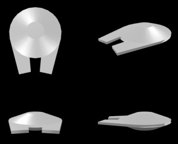  
*宇宙：ミレニアムファルコン風/crPlane36*

```js
let crPlane36 = function() {
    // 宇宙：ミレニアムファルコン風
    let R90 = Math.PI/2;
    let rarc = 0.09;
    let R01 = Math.PI*rarc*2, r0 = 3.8, r=2.5;
    let mesh = new BABYLON.TransformNode();
    // // くちばし
    let mesh1 = BABYLON.MeshBuilder.CreateCylinder("", {diameter:3.0, height:0.1, tessellation:5}, scene);
    mesh1.scaling.set(1,1,0.3);
    mesh1.rotation.y = R90+0.2;
    mesh1.position.set(-0.7, 0.0, 0.7);
    mesh1.parent = mesh;
    let mesh2 = BABYLON.MeshBuilder.CreateCylinder("", {diameter:3.0, height:0.1, tessellation:5}, scene);
    mesh2.scaling.set(1,1,0.3);
    mesh2.rotation.y = R90-0.2;
    mesh2.position.set(0.7, 0.0, 0.7);
    mesh2.parent = mesh;
    // 上部
    let mesh3 = BABYLON.MeshBuilder.CreateCylinder("", {diameter:2.5, height:0.3, diameterTop:0.8}, scene);
    mesh3.position.set(0, 0.2, 0);
    mesh3.parent = mesh;
    // 下部
    let mesh4 = BABYLON.MeshBuilder.CreateCylinder("", {diameter:2.5, height:0.3, diameterBottom:1.3}, scene);
    mesh4.position.set(0, -0.2, 0);
    mesh4.parent = mesh;
    return mesh;
}
```

#### 宇宙：ハープーンミサイル

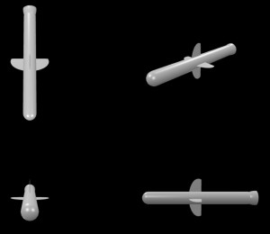  
*宇宙：ハープーンミサイル/crPlane37*

```js
let crPlane37 = function() {
    // 宇宙：ハープーンミサイル
    let mesh = new BABYLON.TransformNode();
    let R90 = Math.PI/2;
    let mesh0 = BABYLON.MeshBuilder.CreateCapsule("", {radius:0.2, height:3.5, bottomCapSubdivisions:1}, scene);
    mesh0.rotation.x = R90;
    mesh0.parent = mesh;
    // バーニア
    let mesh2 = BABYLON.MeshBuilder.CreateSphere("", {diameterX:0.45, diameterY:0.8, diameterZ:0.45, slice:.5, sideOrientation:BABYLON.Mesh.DOUBLESIDE,}, scene);
    mesh2.rotation.x = R90;
    mesh2.position.set(0.0, 0.0, -1.8);
    mesh2.parent = mesh;
    // はね
    let mesh3 = BABYLON.MeshBuilder.CreateSphere("", {diameterX:1.2, diameterY:0.6, diameterZ:0.02, slice:.6,}, scene);
    mesh3.rotation.x = R90;
    mesh3.position.set(0.0, 0.0, 0.0);
    mesh3.parent = mesh;
    let mesh4 = BABYLON.MeshBuilder.CreateSphere("", {diameterX:0.02, diameterY:0.6, diameterZ:1.2, slice:.6,}, scene);
    mesh4.rotation.x = R90;
    mesh4.position.set(0.0, 0.0, 0.0);
    mesh4.parent = mesh;
    return mesh;
}
```

#### 宇宙：ロケット、4ノズル

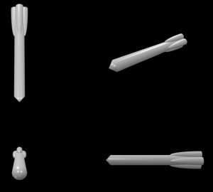  
*宇宙：ロケット、4ノズル/crPlane51*

```js
let crPlane51 = function() {
    // 宇宙：ロケット、4ノズル
    let R90 = Math.PI/2;
    let mesh = new BABYLON.TransformNode();
    let mesh0 = BABYLON.MeshBuilder.CreateCapsule("", {radius:0.2, height:3.8, topCapSubdivisions:1}, scene);
    mesh0.rotation.x = R90;
    mesh0.parent = mesh;
    let xy=0.2, z=-1.8;
    let plist = [
        [0.0, xy, z],
        [0.0, -xy, z],
        [xy, 0.0, z],
        [-xy, 0.0, z],
    ];
    // ブースター
    for (let p of plist) {
        let mesh2 = BABYLON.MeshBuilder.CreateSphere("", {diameter:0.3, diameterY:2.4, slice:.5, sideOrientation:BABYLON.Mesh.DOUBLESIDE,}, scene);
        mesh2.rotation.x = R90;
        mesh2.position = BABYLON.Vector3.FromArray(p);
        mesh2.parent = mesh;
    }
    return mesh;
}
```

#### 宇宙：スペースシャトル風

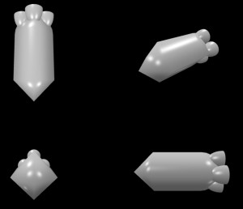  
*宇宙：スペースシャトル風/crPlane38*

```js
let crPlane38 = function() {
    // 宇宙：スペースシャトル風
    let mesh = new BABYLON.TransformNode();
    let R90 = Math.PI/2;
    let mesh0 = BABYLON.MeshBuilder.CreateCapsule("", {radius:0.8, height:3.5, tessellation:4, topCapSubdivisions:1}, scene);
    mesh0.rotation.x = R90;
    mesh0.parent = mesh;
    // バーニア
    let xy = 0.5, z = -1.8;
    let plist = [
        [0.0, xy, z],
        [0.0, -xy, z],
        [xy, 0.0, z],
        [-xy, 0.0, z],
    ];
    for (let p of plist) {
        let mesh2 = BABYLON.MeshBuilder.CreateSphere("", {diameter:0.7, diameterY:1.2, slice:.5, sideOrientation:BABYLON.Mesh.DOUBLESIDE,}, scene);
        mesh2.rotation.x = R90;
        mesh2.position = BABYLON.Vector3.FromArray(p);
        mesh2.parent = mesh;
    }
    return mesh;
}
```

#### 宇宙：人工衛星

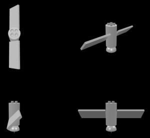  
*宇宙：人工衛星/crPlane49*

```js
let crPlane49 = function() {
    // 宇宙：人工衛星
    let R45 = Math.PI/4;
    let R180 = Math.PI;
    // 本体
    let mesh = BABYLON.MeshBuilder.CreateCylinder("", {diameter:0.6, height:1.2}, scene);
    mesh.position.set(0.0, 0.0, 0.0);
    // パネル
    let mesh1 = BABYLON.MeshBuilder.CreateBox("", {width:0.1, height:0.7, depth:1.4}, scene);
    mesh1.rotation.set(0, 0, R45);
    mesh1.position.set(0, 0.0, 1.0);
    mesh1.parent = mesh;
    let mesh2 = BABYLON.MeshBuilder.CreateBox("", {width:0.1, height:0.7, depth:1.4}, scene);
    mesh2.rotation.set(0, 0, R45);
    mesh2.position.set(0, 0.0, -1.0);
    mesh2.parent = mesh;
    // パラボラ
    let mesh3 = BABYLON.MeshBuilder.CreateSphere("", {diameter:0.6, slice:0.5, sideOrientation:BABYLON.Mesh.DOUBLESIDE}, scene);
    mesh3.position.set(0.0, -0.9, 0);
    mesh3.parent = mesh;
    let mesh4 = BABYLON.MeshBuilder.CreateBox("", {width:0.02, height:0.4, depth:0.02}, scene);
    mesh4.rotation.set(0, 0, 0);
    mesh4.position.set(0, -0.9, 0.0);
    mesh4.parent = mesh;
    // スラスター
    let y = 0.7, d = 0.1;
    let plist = [
        [d, y, d],
        [d, y, -d],
        [-d, y, d],
        [-d, y, -d],
    ];
    for (let p of plist) {
        let mesh5 = BABYLON.MeshBuilder.CreateSphere("", {diameter:0.15, diameterY:0.3, slice:0.5, sideOrientation:BABYLON.Mesh.DOUBLESIDE}, scene);
        mesh5.rotation.set(R180, 0, 0.0);
        mesh5.position = BABYLON.Vector3.FromArray(p);
        mesh5.parent = mesh;
    }
    return mesh;
}
```

#### 宇宙：UFO,アダムスキー 風

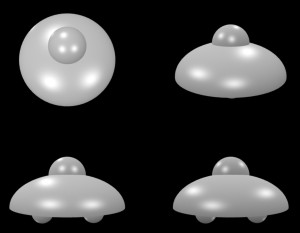  
*宇宙：UFO,アダムスキー 風/crPlane54*

```js
let crPlane54 = function() {
    // 宇宙：UFO,アダムスキー 風
    let mesh = new BABYLON.TransformNode();
    // 1F(スカート部分
    let mesh1 = BABYLON.MeshBuilder.CreateSphere("", {diameter:3.5, diameterY:2.0, slice:.5, sideOrientation:BABYLON.Mesh.DOUBLESIDE,}, scene);
    mesh1.position.set(0.0, -0.8, 0.0);
    mesh1.parent = mesh;
    // 2F(艦橋部分
    let mesh2 = BABYLON.MeshBuilder.CreateSphere("", {diameter:1.2, slice:.5,}, scene);
    mesh2.position.set(0.0, 0.14, 0.0);
    mesh2.parent = mesh;
    // ボディ下の突起
    let xz=0.7, y=-0.9;
    let plist = [
        [xz, y ,xz],
        [-xz, y ,xz],
        [xz, y ,-xz],
        [-xz, y ,-xz],
    ];
    // ブースター
    for (let p of plist) {
        let mesh3 = BABYLON.MeshBuilder.CreateSphere("", {diameter:0.6,}, scene);
        mesh3.position = BABYLON.Vector3.FromArray(p);
        mesh3.parent = mesh;
    }
    return mesh;
}
```

### 記号

#### 記号：スペード（平板

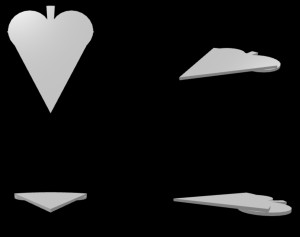  
*記号：スペード（平板/crPlane32*

```js
let crPlane32 = function() {
    // 記号：スペード（平板
    let R90 = Math.PI/2;
    let R360 = Math.PI*2;
    // let rr = 0.1;
    let rarc = 0.16;
    let R01 = Math.PI*rarc, r=3.50*Math.sin(R01);
    let mesh = new BABYLON.TransformNode();
    let mesh0 = BABYLON.MeshBuilder.CreateCylinder("", {diameter:5.5, height: 0.1, arc:0.02, enclose:true });
    mesh0.rotation.y = R90 - 0.01*R360;
    mesh0.position.set(0.0, 0.0, 0.2);
    mesh0.parent = mesh;
    let mesh1 = BABYLON.MeshBuilder.CreateCylinder("", {diameter:7.0, height:0.1, arc:rarc, enclose:true });
    mesh1.rotation.y = R90 - R01;
    mesh1.position.set(0.0, 0.1, 3.5*Math.sin(R01));
    mesh1.parent = mesh;
    let mesh11 = BABYLON.MeshBuilder.CreateCylinder("", {diameter:r, height:0.1 });
    mesh11.position.set(3.4*Math.sin(R01/2), 0.0, -3.5*Math.cos(R01/2)/2+0.2);
    mesh11.parent = mesh;
    let mesh22 = BABYLON.MeshBuilder.CreateCylinder("", {diameter:r, height:0.1 });
    mesh22.position.set(-3.4*Math.sin(R01/2), 0.0, -3.5*Math.cos(R01/2)/2+0.2);
    mesh22.parent = mesh;
    return mesh;
}
```

#### 記号：クローバー（平板

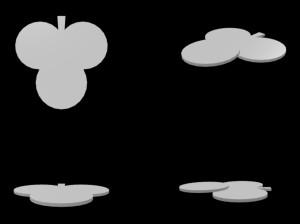  
*記号：クローバー（平板/crPlane31*

```js
let crPlane31 = function() {
    // 記号：クローバー（平板
    let R90 = Math.PI/2;
    let R360 = Math.PI*2;
    let mesh = new BABYLON.TransformNode();
    let mesh1 = BABYLON.MeshBuilder.CreateCylinder("", {diameter:5.5, height: 0.1, arc:0.02, enclose:true });
    mesh1.rotation.y = R90 - 0.01*R360;
    mesh1.position.set(0.0, 0.0, 1.7);
    mesh1.parent = mesh;
    let mesh11 = BABYLON.MeshBuilder.CreateCylinder("", {diameter:2, height:0.1 });
    mesh11.position.set(0.0, 0.1, 1.7);
    mesh11.parent = mesh;
    let mesh12 = BABYLON.MeshBuilder.CreateCylinder("", {diameter:2, height:0.1 });
    mesh12.position.set(0.9, 0.0, 0.2);
    mesh12.parent = mesh;
    let mesh13 = BABYLON.MeshBuilder.CreateCylinder("", {diameter:2, height:0.1 });
    mesh13.position.set(-0.9, 0.0, 0.2);
    mesh13.parent = mesh;
    return mesh;
}
```

#### 記号：ダイヤ（平板

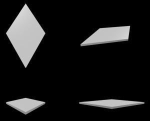  
*記号：ダイヤ（平板/crPlane33*

```js
let crPlane33 = function() {
    // 記号：ダイヤ（平板
    let mesh = new BABYLON.TransformNode();
    let mesh1 = BABYLON.MeshBuilder.CreateCylinder("", {diameter:4, height:0.1, tessellation:4 });
    // 横に短く
    mesh1.scaling.set(0.6, 1, 1);
    mesh1.parent = mesh;
    return mesh;
}
```

#### 記号：ハート（平板

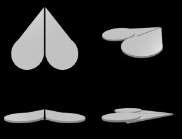  
*記号：ハート（平板/crPlane30*

```js
let crPlane30 = function() {
    // 記号：ハート（平板
    let R90 = Math.PI/2;
    // let R360 = Math.PI*2;
    let R01 = Math.PI*2*0.1, r=3.70*Math.sin(R01);
    let mesh = new BABYLON.TransformNode();
    {
        let mesh1 = BABYLON.MeshBuilder.CreateCylinder("", {diameter:7.0, height:0.1, arc:0.1, enclose:true });
        mesh1.rotation.y = -R90 - R01;
        mesh1.position.set(-0.05, 0.0, -3.5*Math.sin(R01));
        mesh1.parent = mesh;
        let mesh11 = BABYLON.MeshBuilder.CreateCylinder("", {diameter:r, height:0.1 });
        mesh11.position.set(0.05+3.5*Math.sin(R01/2), 0.1, 3.5*Math.cos(R01/2)/2-0.4);
        mesh11.parent = mesh;
    }
    {
        let mesh2 = BABYLON.MeshBuilder.CreateCylinder("", {diameter:7.0, height: 0.1, arc:0.1, enclose:true });
        mesh2.rotation.y = -R90;
        mesh2.position.set(0.05, 0.0, -3.5*Math.sin(R01));
        // mesh2.position.set(-0.1, 0.0, 0.0);
        mesh2.parent = mesh;
        let mesh22 = BABYLON.MeshBuilder.CreateCylinder("", {diameter:r, height:0.1 });
        mesh22.position.set(-0.05-3.5*Math.sin(R01/2), 0.1, 3.5*Math.cos(R01/2)/2-0.4);
        mesh22.parent = mesh;
    }
    return mesh;
}
```

#### 記号：スペード（立体

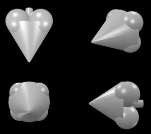  
*記号：スペード（立体/crPlane41*

```js
let crPlane41 = function() {
    // 記号：スペード（立体
    let mesh = new BABYLON.TransformNode();
    let R90 = Math.PI/2;
    let mesh1 = BABYLON.MeshBuilder.CreateCylinder("", {diameter:2.4, height:1.8, diameterTop:0.1}, scene);
    mesh1.rotation.x = R90;
    mesh1.position.set(0.0, 0.0, 0.65);
    mesh1.parent = mesh;
    // バーニア
    let xy = 0.55, z = -0.45;
    let plist = [
        [xy, xy, z],
        [xy, -xy, z],
        [-xy, xy, z],
        [-xy, -xy, z],
    ];
    for (let p of plist) {
        let mesh2 = BABYLON.MeshBuilder.CreateSphere("", {diameter:1.2, slice:.9, sideOrientation:BABYLON.Mesh.DOUBLESIDE,}, scene);
        mesh2.rotation.x = R90;
        mesh2.position = BABYLON.Vector3.FromArray(p);
        mesh2.parent = mesh;
    }
    // メインノズル
    let mesh3 = BABYLON.MeshBuilder.CreateSphere("", {diameter:0.45, diameterY:2.4, slice:.6, sideOrientation:BABYLON.Mesh.DOUBLESIDE,}, scene);
    mesh3.rotation.x = R90;
    mesh3.position.set(0.0, 0.0, -1.0);
    mesh3.parent = mesh;
    return mesh;
}
```

#### 記号：クローバー（立体

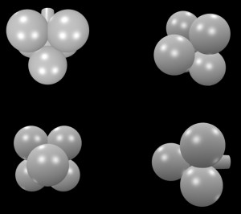  
*記号：クローバー（立体/crPlane40*

```js
let crPlane40 = function() {
    // 記号：クローバー（立体
    let mesh = new BABYLON.TransformNode();
    let R90 = Math.PI/2;
    let mesh1 = BABYLON.MeshBuilder.CreateSphere("", {diameter:1.2,}, scene);
    mesh1.position.set(0.0, 0.0, 0.45);
    mesh1.parent = mesh;
    // バーニア
    let xy = 0.55, z = -0.45;
    let plist = [
        [xy, xy, z],
        [xy, -xy, z],
        [-xy, xy, z],
        [-xy, -xy, z],
    ];
    for (let p of plist) {
        let mesh2 = BABYLON.MeshBuilder.CreateSphere("", {diameter:1.2, slice:.9, sideOrientation:BABYLON.Mesh.DOUBLESIDE,}, scene);
        mesh2.rotation.x = R90;
        mesh2.position = BABYLON.Vector3.FromArray(p);
        mesh2.parent = mesh;
    }
    // メインノズル
    let mesh3 = BABYLON.MeshBuilder.CreateSphere("", {diameter:0.45, diameterY:2.4, slice:.6, sideOrientation:BABYLON.Mesh.DOUBLESIDE,}, scene);
    mesh3.rotation.x = R90;
    mesh3.position.set(0.0, 0.0, -1.0);
    mesh3.parent = mesh;
    return mesh;
}
```

#### 記号：ダイヤ（立体

  
*記号：ダイヤ（立体/crPlane35*

```js
let crPlane35 = function() {
    // 記号：ダイヤ（立方体
    let mesh = new BABYLON.TransformNode();
    // 前
    let mesh1 = BABYLON.MeshBuilder.CreateCylinder("", {diameter:2, diameterTop:0, height:0.5, tessellation:4 });
    mesh1.scaling.set(0.6, 1, 1);
    mesh1.position.set(0.0, 0.0, 1.1);
    mesh1.parent = mesh;
    // 後ろ
    let mesh2 = BABYLON.MeshBuilder.CreateCylinder("", {diameter:2, diameterTop:0, height:0.5, tessellation:4 });
    mesh2.scaling.set(0.6, 1, 1);
    mesh2.position.set(0.0, 0.0, -1.1);
    mesh2.parent = mesh;
    // 右
    let mesh3 = BABYLON.MeshBuilder.CreateCylinder("", {diameter:2, diameterBottom:0, height:0.5, tessellation:4 });
    mesh3.scaling.set(0.6, 1, 1);
    mesh3.position.set(0.6, -0.5, 0.0);
    mesh3.parent = mesh;
    // 左
    let mesh4 = BABYLON.MeshBuilder.CreateCylinder("", {diameter:2, diameterBottom:0, height:0.5, tessellation:4 });
    mesh4.scaling.set(0.6, 1, 1);
    mesh4.position.set(-0.6, -0.5, 0.0);
    mesh4.parent = mesh;
    return mesh;
}
```

#### 記号：ハート（立体

  
*記号：ハート（立体/crPlane39*

```js
let crPlane39 = function() {
    // 記号：ハート（立体
    let mesh = new BABYLON.TransformNode();
    let R90 = Math.PI/2, rad2=0.35, d=0.5;
    let mesh1 = BABYLON.MeshBuilder.CreateCapsule("", {radius:1.0, height:3.6, radiusBottom:0.1 }, scene);
    mesh1.rotation.set(R90, 0, rad2);
    mesh1.position.set(-d, 0, 0);
    mesh1.parent = mesh;
    let mesh2 = BABYLON.MeshBuilder.CreateCapsule("", {radius:1.0, height:3.6, radiusBottom:0.1 }, scene);
    mesh2.rotation.set(R90, 0, -rad2);
    mesh2.position.set(d, 0, 0);
    mesh2.parent = mesh;
    return mesh;
}
```

#### 記号：正三角

  
*記号：正三角/crPlane23*

```js
let crPlane23 = function() {
    // 記号：正三角
    let R90 = Math.PI/2;
    let mesh = new BABYLON.TransformNode();
    let mesh1 = BABYLON.MeshBuilder.CreateCylinder("", {diameter:4.0, height: 0.1, tessellation:3 });
    mesh1.rotation.y = -R90;
    mesh1.parent = mesh;
    return mesh;
}
```

#### 記号：ケーキ片

  
*記号：ケーキ片/crPlane24*

```js
let crPlane24 = function() {
    // 記号：ケーキ片
    let R90 = Math.PI/2;
    let R360 = Math.PI*2;
    let mesh = new BABYLON.TransformNode();
    let mesh1 = BABYLON.MeshBuilder.CreateCylinder("", {diameter:7.0, height: 0.1, arc:0.1, enclose:true });
    mesh1.rotation.y = R90 - 0.05*R360;
    mesh1.position.set(0.0, 0.0, 1.7);
    mesh1.parent = mesh;
    return mesh;
}
```

#### 記号：フライングディスク

  
*記号：フライングディスク/crPlane52*

```js
let crPlane52 = function() {
    // 記号：フライングディスク
    let mesh = new BABYLON.TransformNode();
    // リング
    let mesh1 = BABYLON.MeshBuilder.CreateTorus("", {diameter:3.5, thickness:0.2}, scene);
    mesh1.parent = mesh;
    // プレート
    let mesh2 = BABYLON.MeshBuilder.CreateSphere("", {diameter:4.5, diameterY:1.4, slice:.3, sideOrientation:BABYLON.Mesh.DOUBLESIDE,}, scene);
    mesh2.position.set(0.0, -0.35, 0.0);
    mesh2.parent = mesh;
    return mesh;
}
```

#### 記号：提灯

  
*記号：提灯/crPlane27*

```js
let crPlane27 = function() {
    // 記号：提灯
    let mesh = new BABYLON.TransformNode();
    // 笠
    let mesh1 = BABYLON.MeshBuilder.CreateCylinder("", {diameter:1.4, height:0.2, tessellation:6, diameterTop:1.0}, scene);
    mesh1.position.set(0, 1.5, 0);
    mesh1.parent = mesh;
    // 中心
    let mesh2 = BABYLON.MeshBuilder.CreateSphere("", {diameter:3}, scene);
    mesh2.position.set(0.0, 0.0, 0.0);
    mesh2.parent = mesh;
    // 足
    let mesh3 = BABYLON.MeshBuilder.CreateCylinder("", {diameter:1.4, height:0.2, tessellation:6, diameterBottom:1.0}, scene);
    mesh3.position.set(0, -1.5, 0);
    mesh3.parent = mesh;
    return mesh;
}
```

#### 記号：８面体

  
*記号：８面体/crPlane28*

```js
let crPlane28 = function() {
    // 記号：８面体
    let mesh = new BABYLON.TransformNode();
    // 笠
    let mesh1 = BABYLON.MeshBuilder.CreateCylinder("", {diameter:3, height:1.5, tessellation:4, diameterTop:0}, scene);
    mesh1.position.set(0, 0.9, 0);
    mesh1.parent = mesh;
    // 中心
    let mesh2 = BABYLON.MeshBuilder.CreateSphere("", {diameter:0.4}, scene);
    mesh2.position.set(0.0, 0.0, 0.0);
    mesh2.parent = mesh;
    // 足
    let mesh3 = BABYLON.MeshBuilder.CreateCylinder("", {diameter:3, height:1.5, tessellation:4, diameterBottom:0}, scene);
    mesh3.position.set(0, -0.9, 0);
    mesh3.parent = mesh;
    return mesh;
}
```

#### 記号：ダイヤ

  
*記号：ダイヤ/crPlane53*

```js
let crPlane53 = function() {
    // 記号：ダイヤ
    let mesh = new BABYLON.TransformNode();
    let mesh1 = BABYLON.MeshBuilder.CreateCylinder("", {diameterTop:1.8, diameterBottom:3.5, height:1.0, tessellation:5}, scene);
    mesh1.position.set(0.0, 0.45, 0.0);
    mesh1.parent = mesh;
    let mesh2 = BABYLON.MeshBuilder.CreateCylinder("", {diameterTop:3.5, diameterBottom:0.1, height:2.5, tessellation:5}, scene);
    mesh2.position.set(0.0, -1.3, 0.0);
    mesh2.parent = mesh;
    return mesh;
}
```

### 人型

#### 人型：マーカー

  
*人型：マーカー/crPlane25*

```js
let crPlane25 = function() {
    // 人型：マーカー
    let mesh = new BABYLON.TransformNode();
    // 頭
    let mesh2 = BABYLON.MeshBuilder.CreateSphere("", {diameter:1}, scene);
    mesh2.position.set(0.0, 0.5, 0.0);
    mesh2.parent = mesh;
    // ボディ
    let mesh3 = BABYLON.MeshBuilder.CreateCylinder("", {diameter:1.0, height:2, tessellation:4, diameterBottom:0}, scene);
    mesh3.position.set(0, -1, 0);
    mesh3.parent = mesh;
    return mesh;
}
```

#### 人型：天使

  
*人型：天使/crPlane26*

```js
let crPlane26 = function() {
    // 人型：天使
    let mesh = new BABYLON.TransformNode();
    // 天使の輪
    let mesh1 = BABYLON.MeshBuilder.CreateTorus("", {diameter:0.7, thickness:0.1}, scene);
    mesh1.position.set(0.0, 1.2, 0.0);
    mesh1.parent = mesh;
    // 頭
    let mesh2 = BABYLON.MeshBuilder.CreateSphere("", {diameter:1}, scene);
    mesh2.position.set(0.0, 0.5, 0.0);
    mesh2.parent = mesh;
    // ボディ
    let mesh3 = BABYLON.MeshBuilder.CreateCylinder("", {diameter:1.0, height:2, tessellation:4, diameterBottom:0}, scene);
    mesh3.position.set(0, -1, 0);
    mesh3.parent = mesh;
    for (let d of [-1, 1]) {
        // 羽
        let mesh4 = BABYLON.MeshBuilder.CreateSphere("", {diameterX:1, diameterY:0.1, diameterZ:0.3}, scene);
        mesh4.rotation.y = 0.2*d;
        mesh4.position.set(0.9*d, -0.1, -0.2);
        mesh4.parent = mesh;
        let mesh41 = BABYLON.MeshBuilder.CreateSphere("", {diameterX:1, diameterY:0.1, diameterZ:0.3}, scene);
        mesh41.rotation.y = 0.6*d;
        mesh41.position.set(1.5*d, -0.1, -0.5);
        mesh41.parent = mesh;
        let mesh42 = BABYLON.MeshBuilder.CreateSphere("", {diameterX:1, diameterY:0.1, diameterZ:0.3}, scene);
        mesh42.rotation.y = 0.7*d;
        mesh42.position.set(1.3*d, -0.1, -0.6);
        mesh42.parent = mesh;
        let mesh43 = BABYLON.MeshBuilder.CreateSphere("", {diameterX:1, diameterY:0.1, diameterZ:0.3}, scene);
        mesh43.rotation.y = 0.9*d;
        mesh43.position.set(1.1*d, -0.1, -0.65);
        mesh43.parent = mesh;
        let mesh44 = BABYLON.MeshBuilder.CreateSphere("", {diameterX:1, diameterY:0.1, diameterZ:0.3}, scene);
        mesh44.rotation.y = 1.1*d;
        mesh44.position.set(0.9*d, -0.1, -0.65);
        mesh44.parent = mesh;
    }
    return mesh;
}
```

#### 人型：式神

  
*人型：式神/crPlane48*

```js
let crPlane48 = function() {
    // 人型：式神
    let R180 = Math.PI;
    let mesh = new BABYLON.TransformNode();
    // 頭
    let mesh1 = BABYLON.MeshBuilder.CreateSphere("", {diameter:0.8}, scene);
    mesh1.position.set(0.0, 1.0, 0);
    mesh1.parent = mesh;
    // 手
    let mesh2 = BABYLON.MeshBuilder.CreateSphere("", {diameter:3.5, diameterZ:0.5, slice:0.3, sideOrientation:BABYLON.Mesh.DOUBLESIDE}, scene);
    mesh2.rotation.set(R180, 0, 0.0);
    mesh2.position.set(0.0, 1.7, 0);
    mesh2.parent = mesh;
    // 足
    let mesh3 = BABYLON.MeshBuilder.CreateCylinder("", {diameterTop:0.8, diameterBottom:0.1, height:1.8}, scene);
    mesh3.position.set(0.0, -0.9, 0.0);
    mesh3.scaling.set(1, 1, 0.2);
    mesh3.parent = mesh;
    return mesh;
}
```

### 生物

#### 生物：スカイフィッシュ風

  
*生物：スカイフィッシュ風/crPlane34*

```js
let crPlane34 = function() {
    // 生物：スカイフィッシュ風
    let mesh = new BABYLON.TransformNode();
    let mesh1 = BABYLON.MeshBuilder.CreateSphere("", {diameterX:0.3, diameterY:0.3, diameterZ:4.0}, scene);
    mesh1.parent = mesh;
    for (let iz = 0; iz < 4; ++iz) {
        let z = -iz*0.8+1.3;
        let mesh3 = BABYLON.MeshBuilder.CreateSphere("", {diameterX:3.5, diameterY:0.05, diameterZ:0.8}, scene);
        mesh3.position.set(0.0, -0.12, z);
        mesh3.parent = mesh;
    }
    return mesh;
}
```

#### 生物：ウシアブ風

  
*生物：ウシアブ風/crPlane46*

```js
let crPlane46 = function() {
    // 生物：ウシアブ風
    let mesh = new BABYLON.TransformNode();
    // 胴体
    let mesh1 = BABYLON.MeshBuilder.CreateSphere("", {diameterX:1.2, diameterY:1.3, diameterZ:2.0}, scene);
    mesh1.parent = mesh;
    // 目玉
    let mesh2 = BABYLON.MeshBuilder.CreateSphere("", {diameter:0.3, diameterY:0.6}, scene);
    mesh2.position.set(-0.3, 0.1, 0.8);
    mesh2.parent = mesh;
    let mesh3 = BABYLON.MeshBuilder.CreateSphere("", {diameter:0.3, diameterY:0.6}, scene);
    mesh3.position.set(0.3, 0.1, 0.8);
    mesh3.parent = mesh;
    // 羽（前
    let mesh4 = BABYLON.MeshBuilder.CreateSphere("", {diameterX:1.8, diameterY:0.1, diameterZ:0.8}, scene);
    mesh4.rotation.set(0, -0.2, 0.4);
    mesh4.position.set(1.2, 0.6, 0.6);
    mesh4.parent = mesh;
    let mesh5 = BABYLON.MeshBuilder.CreateSphere("", {diameterX:1.8, diameterY:0.1, diameterZ:0.8}, scene);
    mesh5.rotation.set(0, 0.2, -0.4);
    mesh5.position.set(-1.2, 0.6, 0.6);
    mesh5.parent = mesh;
    // 羽（後
    let mesh6 = BABYLON.MeshBuilder.CreateSphere("", {diameterX:2.2, diameterY:0.1, diameterZ:0.8}, scene);
    mesh6.rotation.set(0, 0.1, -0.2);
    mesh6.position.set(1.2, 0.2, -0.0);
    mesh6.parent = mesh;
    let mesh7 = BABYLON.MeshBuilder.CreateSphere("", {diameterX:2.2, diameterY:0.1, diameterZ:0.8}, scene);
    mesh7.rotation.set(0, -0.1, 0.2);
    mesh7.position.set(-1.2, 0.2, -0.0);
    mesh7.parent = mesh;
    return mesh;
}
```

#### 生物：大王ヤンマ風

  
*生物：大王ヤンマ風/crPlane47*

```js
let crPlane47 = function() {
    // 生物：大王ヤンマ風
    let R90 = Math.PI/2;
    let mesh = new BABYLON.TransformNode();
    // 胴体
    let mesh1 = BABYLON.MeshBuilder.CreateSphere("", {diameterX:0.4, diameterY:0.6, diameterZ:3.0}, scene);
    mesh1.parent = mesh;
    // 目玉
    let mesh2 = BABYLON.MeshBuilder.CreateSphere("", {diameter:0.2}, scene);
    mesh2.position.set(-0.08, 0.05, 1.1);
    mesh2.parent = mesh;
    let mesh3 = BABYLON.MeshBuilder.CreateSphere("", {diameter:0.2}, scene);
    mesh3.position.set(0.08, 0.05, 1.1);
    mesh3.parent = mesh;
    // 口ばし
    let mesh11 = BABYLON.MeshBuilder.CreateSphere("", {diameterX:0.4, diameterY:0.05, diameterZ:0.2, arc:0.85, sideOrientation:BABYLON.Mesh.DOUBLESIDE,}, scene);
    mesh11.rotation.set(R90, 0, R90);
    mesh11.position.set(0.00, -0.05, 1.5);
    mesh11.parent = mesh;
    // 羽（前
    let mesh4 = BABYLON.MeshBuilder.CreateSphere("", {diameterX:2.0, diameterY:0.1, diameterZ:0.8}, scene);
    mesh4.rotation.set(0, -0.2, -0.2);
    mesh4.position.set(1.1, 0.0, -0.1);
    mesh4.parent = mesh;
    let mesh5 = BABYLON.MeshBuilder.CreateSphere("", {diameterX:2.0, diameterY:0.1, diameterZ:0.8}, scene);
    mesh5.rotation.set(0, 0.2, 0.2);
    mesh5.position.set(-1.1, 0.0, -0.1);
    mesh5.parent = mesh;
    // 羽（後
    let mesh6 = BABYLON.MeshBuilder.CreateSphere("", {diameterX:1.9, diameterY:0.1, diameterZ:0.8}, scene);
    mesh6.rotation.set(0, 0.1, 0.4);
    mesh6.position.set(0.9, 0.5, -0.9);
    mesh6.parent = mesh;
    let mesh7 = BABYLON.MeshBuilder.CreateSphere("", {diameterX:1.9, diameterY:0.1, diameterZ:0.8}, scene);
    mesh7.rotation.set(0, -0.1, -0.4);
    mesh7.position.set(-0.9, 0.5, -0.9);
    mesh7.parent = mesh;
    return mesh;
}
```

#### 生物：ヘビケラ風

  
*生物：ヘビケラ風/crPlane55*

```js
let crPlane55 = function() {
    // 生物：ヘビケラ風
    let R22 = Math.PI/8;
    let mesh = new BABYLON.TransformNode();
    // 胴体
    let z=0.4;
    let plist = [
        [0, 0, 3*z],
        [0, 0, z],
        [0, 0, -z],
        [0, 0, -3*z],
    ];
    for (let p of plist) {
        // 胴体 節
        let mesh2 = BABYLON.MeshBuilder.CreateCylinder("", {diameterTop:0.7, diameterBottom:0.9, height:0.2, tessellation:8}, scene);
        mesh2.rotation.set(0, R22, 0);
        mesh2.position = BABYLON.Vector3.FromArray(p);
        mesh2.parent = mesh;
        // 背骨
        let mesh21 = BABYLON.MeshBuilder.CreateSphere("", {diameterX:0.1, diameterY:0.2, diameterZ:0.6}, scene);
        mesh21.position = BABYLON.Vector3.FromArray(p);
        mesh21.position.y +=0.1;
        mesh21.parent = mesh;
    }
    // 目玉
    for (let x of [-0.3, 0.3]) {
        let mesh2 = BABYLON.MeshBuilder.CreateSphere("", {diameter:0.1}, scene);
        mesh2.position.set(x, 0.05, 1.4);
        mesh2.parent = mesh;
    }
    // 触覚
    let rplist = [
        [[0, 0.8, 0], [0.5, -0.1, 1.3]],
        [[0, -0.8, 0], [0.5, -0.1, 1.6]],
        [[0, -0.8, 0], [-0.5, -0.1, 1.3]],
        [[0, 0.8, 0], [-0.5, -0.1, 1.6]],
    ];
    for (let [r,p] of rplist) {
        let mesh11 = BABYLON.MeshBuilder.CreateSphere("", {diameterX:0.1, diameterY:0.1, diameterZ:0.5}, scene);
        mesh11.rotation = BABYLON.Vector3.FromArray(r);
        mesh11.position = BABYLON.Vector3.FromArray(p);
        mesh11.parent = mesh;
    }
    // 羽・しっぽ
    let drplist = [
        [[2.0, 0.1, 0.4], [0, -0.2, 0.1], [1.1, 0.1, 0.7]], // 羽（前
        [[2.0, 0.1, 0.4], [0, 0.2, -0.1], [-1.1, 0.1, 0.7]],
        [[1.9, 0.1, 0.4], [0, 0.2, -0.1], [0.9, -0.1, 0.2]], // 羽（後
        [[1.9, 0.1, 0.4], [0, -0.2, 0.1], [-0.9, -0.1, 0.2]],
        [[0.2, 0.8, 0.1], [-0.3, 0, 0], [0.0, 0.45, -1.6]],]; // しっぽ
    for (let [[dx,dy,dz], r,p] of drplist) {
        let mesh41 = BABYLON.MeshBuilder.CreateSphere("", {diameterX:dx, diameterY:dy, diameterZ:dz}, scene);
        mesh41.rotation = BABYLON.Vector3.FromArray(r);
        mesh41.position = BABYLON.Vector3.FromArray(p);
        mesh41.parent = mesh;
    }
    return mesh;
}
```

## まとめ・雑感

Babylon.js Tips 集にある
[ヨット](https://scrapbox.io/babylonjs/%E3%83%A8%E3%83%83%E3%83%88)
が参考になりました。感謝です。
表現の幅が広がったことで興が乗って、作りすぎてしまった感は否めないです。

------------------------------

前の記事：[Babylon.js で物理演算(havok)：ドミノ倒しで一筆書き](150.md)

次の記事：[Babylon.js ：飛んでいる演出と操作方法](152.md)


目次：[目次](000.md)

この記事には関連記事がありません。

--
