# Babylon.js ：飛んでいる演出と操作方法

## この記事のスナップショット

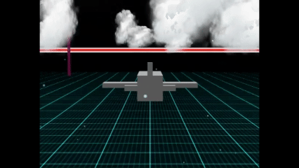  
*加速、上昇しながら左旋回（1.5倍速）*

https://playground.babylonjs.com/?BabylonToolkit#FMMPHY

（上記のURLにおいて、ツールバーの歯車マークから「EDITOR」のチェックを外せばウィンドウいっぱいに、歯車マークから「FULLSCREEN」を選べば画面いっぱいになります。）

[ソース](152/)

ローカルで動かす場合、上記ソースに加え、別途 git 内の [136/js](https://github.com/fnamuoo/webgl/tree/main/136/js) を ./js として配置してください。

## 概要

自分なりのフライトシミュレーターの第一歩として、
いくつかの「飛行感の演出」、「機体操作」を実装して ON/OFFできるようにしました。

生成AIに
『3D で飛んでいる感、気流の流れや空気の質感を出す方法』
を聞いてみたところ、下記提案を受けました。
初見のものがいくつかあったので、動作確認を兼ねてそれぞれ実装してみました。

- 地面を用意する
- カメラを遅延（FollowCamera）
- 微振動（メッシュを回転x,yを乱数で加算）
- 速度でカメラのFOVを変化
- 雲（スプライト/billboard
- 翼端渦
- 空気感：雪（パーティクル
- フォグ（高度に応じて）

また、機体操作に対する簡単操作についても３通り実装してみました。

オーバースペックとは思いつつも、動的に効果や操作を切り替えられるようにしています。
キー操作については、PlayGround でソースコードを表示したときに確認できるようにしています。

それぞれのデフォルト値、演出の ON/OFF や機体操作のモードについては、私の好みに合わせてます。
どれがON/OFFになっているかはソースコードを見ていただけると幸いです。

## やったこと

- 第一部
  - 飛行感０：環境を作る
  - 飛行感１：微振動：飛行体を振動させる
  - 飛行感２：速度でFOV変化
  - 飛行感３：翼端渦
  - 飛行感４：雲（スプライト）
  - 飛行感５：降雪
  - 飛行感６：フォグ

- 第二部
  - 機体操作１：上昇下降とヨー回転
  - 機体操作２：ロール角度に応じたヨー回転と自動補正
  - 機体操作３：クォータニオンによる回転


## 第一部　飛行感

### 飛行感０：環境を作る

基準となる飛行環境を作ります。

  - 遅延・追跡するカメラ
  - 床（地上）を配置
  - 障害物を配置
  - 飛行機を直進
    - 加速あり（通常の３倍）
    - 周期境界で繰り返し同じ場所を飛ぶ

これだけでも、飛行感は出ます。

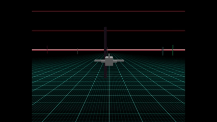  
*基本環境*

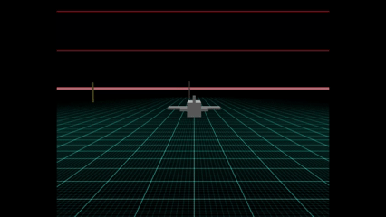  
*基本環境（加速時）*

ちなみに生成AIの解説だと以下のような効果があるそうです。

> カメラ遅延（超重要）
> 
> 完全追従はダメ。
> 
> 少し遅れるだけで：
> 
> * 重量感
> * 慣性感
> * 空気抵抗感
> 
> が出ます。

> 地面の流れ
> 
> 重要。
> 
> 宇宙空間っぽさを消す。
> 
> ---
> 
> 必要
> 
> * 地形ディテール
> * 流れる影
> * 高低差


----------------------------------------------------------------------
### 飛行感１：微振動：飛行体を振動させる

#### 目的

加速時に「微振動」を起こします。
生成AIでは カメラの rotation を揺らすコードを紹介してくれましたが、FollowCameraだと上手くいかないので飛行機（メッシュ）の位置を微振動させます。

生成AIの解説

> 微振動（Buffeting）
> 
> 空気を切っている感じ。
> 
> 特に：
> 
> * 高速
> * 失速前
> * 乱気流
> 
> で重要。

#### 実装

```js
// 微振動（Buffeting）
let actBuffeting = function() {
    // 飛行体を振動させる
    let amp = 0.2;
    let v = (Math.random()-0.5)*amp;
    let quat = myMesh.rotationQuaternion;
    let vUD = BABYLON.Vector3.Up().applyRotationQuaternion(quat);
    let vLR = BABYLON.Vector3.Right().applyRotationQuaternion(quat);
    myMesh.position.addInPlace(vUD.scale(v));
    v = (Math.random()-0.5)*amp;
    myMesh.position.addInPlace(vLR.scale(v));
}
```

#### 結果

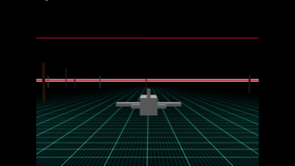  
*微振動している様子*

----------------------------------------------------------------------
### 飛行感２：速度でFOV変化

#### 目的

FOV(Field of View)とはカメラの画角／視野のことです。
FOVを大きくすることで、広角レンズのように広がる一方で飛行機が遠く・小さくに見え、
また遠近感が強調されて軸が斜めになります。

生成AIの解説だと以下のように絶賛してますが、実際に試してみるとちょっと微妙かも？

というのも、思ったよりも 一点透視図／斜めになる感じが強くでるので、
宇宙空間でのワープ／空間が歪む感じに見えて、ちょっとやりすぎかもです。

生成AIの解説

> 超効果的。
> 
> 速度上昇で視界が広がる。
> 
> ---
> 
> なぜ効く？
> 
> 人間は：
> 
> ```text
> 周辺視野の流れ
> ```
> 
> で速度を感じる。

#### 実装

飛行機の加速時に FOV を大きくすると、
FollowCamera が遅れるのに重ねて、視野が大きくなることで飛行機が更に小さくなり、
遠くに離れすぎてしまいます。

なので加速時にFOVを大きくするときは、FollowCameraの移動速度（加速）も大きくします。

FOVを大きくする際は、急に大きな値を割り振ると違和感があるので、Lerpで目的地に寄せていきます。

```js
// FOV
// 速度でFOV変化 .. 画角が広がるともに被写体と離れる（遅延した感じに
let enableFOV = false;
let cameraFOVlock = false; // key-push時に true / release時に false
let setCameraFOVup = function() {}
let setCameraFOVdown = function() {}
{
    setCameraFOVup = function() {
        // 加速時／FOV ON
        const camera_fovMax = 2.2; // 1.2;
        if (camera.fov < camera_fovMax) {
            const speedRatio = 0.02;
            camera.fov = BABYLON.Lerp(camera.fov, camera_fovMax, speedRatio);
        }
        // FollowCameraでFOV有効にすると離れすぎ。加速時と同じでも違和感なし
        camera.cameraAcceleration = camera._cameraAccelerationMax;
    }
    setCameraFOVdown = function() {
        // 減速時／FOV OFF
        const camera_fovMin = 0.8;
        if (camera_fovMin < camera.fov) {
            const speedRatio = 0.02;
            camera.fov = BABYLON.Lerp(camera.fov, camera_fovMin, speedRatio);
        }
        camera.cameraAcceleration = camera._cameraAccelerationMin;
    }
    scene.onBeforeRenderObservable.add(() => {
        if (cameraFOVlock == false) {
            setCameraFOVdown();
        }
    });
}
```

#### 結果

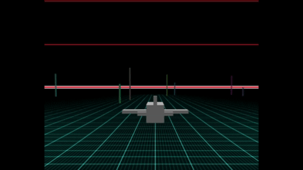  
*FOVの感じ*

----------------------------------------------------------------------
### 飛行感３：翼端渦

#### 目的

翼の端から雲をひく、定番の演出です。

ON/OFF の仕方がちょっと雑（突然表示／突然消える）ですが、それでもちょっと楽しいです。

生成AIの説明

> 翼端渦
> 
> 高速旋回時。
> 
> ---
> 
> 表現
> 
> * 白い帯
> * vapor trail

#### 実装

```js
// 翼端渦
let enableVaporTrail = true;
let trailMeshWingR = null, trailMeshWingL = null;
let setWingTipVortex = function(myMesh) {
    // trail 用のメッシュ
    let wingL = 2.0;
    let myWingR = BABYLON.MeshBuilder.CreateBox("wingR", { width: 0.1, height:0.1, depth:0.1 }, scene);
    myWingR.position.copyFrom(myMesh.position);
    myWingR.position.addInPlaceFromFloats(wingL, 0, 2);
    myWingR.visibility = 0;
    myWingR.parent = myMesh;
    myMesh._myWingR = myWingR; // for setMyMeshVisibility
    let myWingL = BABYLON.MeshBuilder.CreateBox("wingL", { width: 0.1, height:0.1, depth:0.1 }, scene);
    myWingL.position.copyFrom(myMesh.position);
    myWingL.position.addInPlaceFromFloats(-wingL, 0, 2);
    myWingL.visibility = 0;
    myWingL.parent = myMesh;
    myMesh._myWingL = myWingL; // for setMyMeshVisibility
    // 飛行機の主翼端に追跡をつける
    trailMeshWingR = new BABYLON.TrailMesh("", myWingR, scene, {diameter:0.1, length:20, sections:2});
    trailMeshWingR.material = new BABYLON.StandardMaterial("", scene);
    trailMeshWingR.material.emissiveColor = new BABYLON.Color3(1, 1, 1);
    trailMeshWingR.material.alpha = 0.2;
    trailMeshWingL = new BABYLON.TrailMesh("", myWingL, scene, {diameter:0.1, length:20, sections:2});
    trailMeshWingL.material = new BABYLON.StandardMaterial("", scene);
    trailMeshWingL.material.emissiveColor = new BABYLON.Color3(1, 1, 1);
    trailMeshWingL.material.alpha = 0.2;
    trailMeshWingR.stop();
    trailMeshWingL.stop();
}
let onVaporTrail = function() {
    if (trailMeshWingR != null) {
        trailMeshWingR.start();
        trailMeshWingL.start();
        trailMeshWingR.material.alpha = 0.2;
        trailMeshWingL.material.alpha = 0.2;
    }
}
let offVaporTrail = function() {
    if (trailMeshWingR != null) {
        trailMeshWingR.stop();
        trailMeshWingL.stop();
        trailMeshWingR.material.alpha = 0;
        trailMeshWingL.material.alpha = 0;
    }
}
setWingTipVortex(myMesh);
```

#### 結果

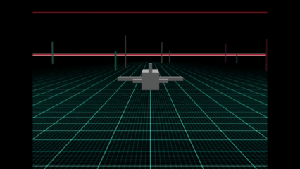  
*翼端渦*


----------------------------------------------------------------------
### 飛行感４：雲（スプライト）

#### 目的

生成AIの説明（下記）にあるように、雲が浮かんでいるだけで ぐっと「空を飛んでいる感覚」が出てきます。

生成AIの説明

> 雲（飛行感の主役）
> 
> 実は飛行感の大部分。
> 
> ---
> 
> 雲を「通過」する
> 
> 重要。
> 
> 雲を：
> 
> ```text
> 背景
> ```
> 
> にするとダメ。
> 
> ---
> 
> 必要
> 
> * 雲の中に入る
> * 視界悪化
> * 出ると眩しい
> 
> ---
> 
> これだけで：
> 
> ```text
> 高度感
> ```
> 
> が出る。

#### 実装

雲を表現する方法には

 * Billboard Cloud
 * GPU Particle
 * Raymarch Cloud

とありますがここでは１番目の手段でお手軽に実施しました。
ビルボードなので常にこちらを向く動きには違和感を感じますが、そのようなケースは稀なので、普通に飛行している分にはわかりにくいです。

```js
// 雲テスト／スプライト（低層
// 雲海をつくる
let enableCloud1 = true, renderCloud1 = false;
let spriteManagerTrees1 = null;
let meshlist1 = [];
let cloudRng1 = 1000;
let clearCloud1 = function() {
    renderCloud1 = false;
    if (spriteManagerTrees1 != null) {
        spriteManagerTrees1.dispose();
        spriteManagerTrees1 = null;
    }
    while (meshlist1.length > 0) {
        let mesh = meshlist1.pop();
        mesh.dispose();
    }
}
let setCloud1 = function() {
    clearCloud1();
    let nCapa = 1000;
    let adjy=0;
    spriteManagerTrees1 = new BABYLON.SpriteManager("", fpathCloud, nCapa, {width: 256, height: 256});
    let x, y, z;
    for (let i = 0; i < nCapa; ++i) {
        let meshSub = new BABYLON.Sprite("", spriteManagerTrees1);
        meshSub.width = BABYLON.Scalar.RandomRange(23, 44);
        meshSub.height = BABYLON.Scalar.RandomRange(23, 44);
        x = BABYLON.Scalar.RandomRange(-cloudRng1, cloudRng1);
        y = BABYLON.Scalar.RandomRange(-0.5, 0.5)*10;
        z = BABYLON.Scalar.RandomRange(-cloudRng1, cloudRng1);
        meshSub.position = new BABYLON.Vector3(x,y+meshSub.height/2+adjy,z);
        meshlist1.push(meshSub);
    }
    renderCloud1 = true;
}
scene.onBeforeRenderObservable.add(() => {
    if (renderCloud1) {
        for (let mesh of meshlist1) {
            mesh.position.x += 0.01;
            if (mesh.position.x >= cloudRng1) {
                mesh.position.x -= cloudRng1*2;
            }
        }
    }
});
if (enableCloud1) {
    setCloud1();
} else {
    clearCloud1();
}
```


#### 結果

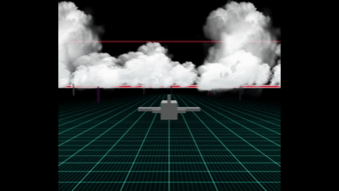  
*雲（通常時）*

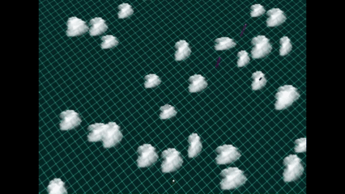  
*雲（違和感：高高度から急降下しながら方向転換時）*

ちなみに同じ画像を使って細長くすれば、巻雲（けんうん）っぽくなります。

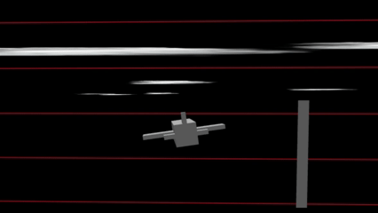  
*巻雲*


----------------------------------------------------------------------
### 飛行感５：降雪

#### 目的

気流の感じを出すための演出として、粒子を飛行の前に配置します。
下記、生成AIの説明のように noiseTexture を使ったところ、降雪の中の飛行感になりました。
ただ、高高度では OFF にしないと、雲もないのに雪が降っているという不思議な現象になりますｗ

ちなみに、カメラに雨粒がぶつかって流れるような演出は、非常に心惹かれるのですが難しそうだったので今後の課題です。
（技術的には出来そうだけどハードルが高そう）

生成AIの説明

> 「気流」の可視化（パーティクルシステム）
> 
> 空気そのものは見えませんが、そこにある「チリ」や「水蒸気」を動かすことで気流を表現します。
> 
> * **ウィンドストリーク（風の筋）:**
> 長細い、半透明のパーティクルをカメラの進行方向と逆に高速で飛ばします。これにより、マッハを越えるようなスピード感を演出できます。
> * **流体のような動き:**
> `BABYLON.ParticleSystem` の `noiseTexture` を使用すると、粒子にランダムでうねるような動き（ノイズ）を与えられます。これが「空気のうねり」に見えます。
> * **手順:**
> 1. `GPU` パーティクル（大量の計算が可能）を選択。
> 2. テクスチャに細長い線状の画像を指定。
> 3. `updateSpeed` を速度に同期させ、`velocityGradient` で加速感を出す。

#### 実装

```js
// 降雪
let enableSnow = true;
let psSnow = null;
if (enableSnow) {
    // let fpathFlare = "textures/flare.png";
    let meshFountain;
    {
        meshFountain = BABYLON.MeshBuilder.CreateBox("", {}, scene);
        // meshFountain.position.set(4, 0, 4); // 30;
        meshFountain.position.z = 20; // 30;
        meshFountain.visibility = 0;
        meshFountain.parent = myMesh;
        myMesh._meshFountain = meshFountain; // for setMyMeshVisibility
    }
    let particleSystem = new BABYLON.ParticleSystem("", 200, scene);
    particleSystem.particleTexture = new BABYLON.Texture(fpathFlare, scene);
    // Where the particles come from
    particleSystem.emitter = meshFountain;
    particleSystem.minEmitBox = new BABYLON.Vector3(-10, -10, 0);
    particleSystem.maxEmitBox = new BABYLON.Vector3(10, 10, 0);
    // Colors of all particles
    particleSystem.color1 = new BABYLON.Color4(0.7, 0.8, 1.0, 1.0);
    particleSystem.color2 = new BABYLON.Color4(0.2, 0.5, 1.0, 1.0);
    particleSystem.colorDead = new BABYLON.Color4(0, 0, 0.2, 0.0);
    // Size of each particle
    particleSystem.minSize = 0.1;
    particleSystem.maxSize = 0.2;
    // Life time of each particle
    particleSystem.minLifeTime = 0.3;
    particleSystem.maxLifeTime = 1.5;
    // Emission rate
    particleSystem.emitRate = 100;
    // Blend mode
    particleSystem.blendMode = BABYLON.ParticleSystem.BLENDMODE_ONEONE;
    // Gravity
    particleSystem.gravity = new BABYLON.Vector3(0, -10, 0);
    // Direction of each particle after it has been emitted
    particleSystem.direction1 = new BABYLON.Vector3(-1, 0, 1);
    particleSystem.direction2 = new BABYLON.Vector3(1, 0, -1);
    // Angular speed
    particleSystem.minAngularSpeed = 0;
    particleSystem.maxAngularSpeed = Math.PI;
    // Speed
    particleSystem.minEmitPower = 0;
    particleSystem.maxEmitPower = 0;
    particleSystem.updateSpeed = 0.005;
    // Noise
    const noiseTexture = new BABYLON.NoiseProceduralTexture("perlin", 256, scene);
    noiseTexture.animationSpeedFactor = 5;
    noiseTexture.persistence = 2;
    noiseTexture.brightness = 0.5;
    noiseTexture.octaves = 2;
    particleSystem.noiseTexture = noiseTexture;
    particleSystem.noiseStrength = new BABYLON.Vector3(100, 100, 100);
    psSnow = particleSystem;
    if (enableSnow) {
        particleSystem.start();
    } else {
        particleSystem.stop();
    }
}
```

#### 結果

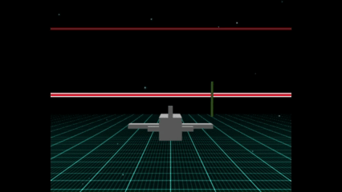  
*降雪*


----------------------------------------------------------------------
### 飛行感６：フォグ

#### 目的

正直、Babylon.js のフォグは使いどころがやや難しいのですが、飛行機の高度に依存してフォグの濃淡を変えるようにしてみました。
ある高度になると急に視界が悪く、急に視界が晴れる感じになります。

何もない空間で急にホワイトアウトすると違和感があるので、同じ高さに雲を配置するとちょうど良いかもしれません。

フォグを使うと skybox が意味なくなるので使い勝手が悪いというか、適用シーンが難しいんですよね。

生成AIの説明

> フォグ
> 
> 必須級。
> 
> ---
> 
> 距離フォグ
> 
> 遠景を霞ませる。
> 
> ```ts id="ll8q08"
> scene.fogMode = BABYLON.Scene.FOGMODE_EXP2;
> ```
> 
> ---
> 
> 高度フォグ
> 
> 地表近くを霞ませる。
> 
> これだけで：
> 
> * 湿度
> * 大気
> * スケール感
> 
> が出る。

#### 実装

```js
// 高度に応じた霧
let enableFog = false;
scene.onBeforeRenderObservable.add(() => {
    if (enableFog) {
        let y = myMesh.position.y % 1000;
        if (100 < y && y < 500) {
            scene.fogDensity = 0.01/Math.abs(300-y);
            scene.fogMode = BABYLON.Scene.FOGMODE_EXP2;
        } else {
            scene.fogMode = BABYLON.Scene.FOGMODE_NONE;
        }
    }
});
let setFog = function(bflag) {
    enableFog = bflag;
    if (enableFog) {
        scene.fogMode = BABYLON.Scene.FOGMODE_EXP2;
        scene.fogColor = new BABYLON.Color3(0.9, 0.9, 0.85);
        scene.fogDensity = 0.001;
        let y = myMesh.position.y % 1000;
        if (100 < y && y < 500) {
            scene.fogDensity = 0.05/Math.abs(300-y);
        }
    } else {
        scene.fogMode = BABYLON.Scene.FOGMODE_NONE;
    }
}
setFog(enableFog);
```

#### 結果

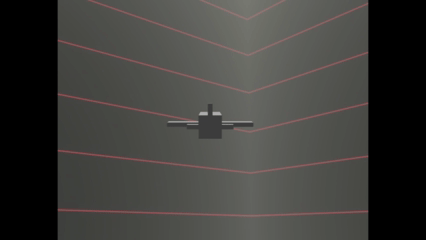  
*フォグ*


### 飛行感まとめ

個人的に効いた演出ランキング

お勧め度   | 効果
-----------|------
★★★★★ | 雲
★★★★★ | FollowCamera
★★★★☆ | 障害物
★★★★☆ | 地面
★★★★☆ | 翼端渦
★★★☆☆ | 微振動
★★★☆☆ | 降雪
★★☆☆☆ | フォグ
★☆☆☆☆ | FOV


## 第二部　操作感

### 機体操作１：上昇下降とヨー回転

#### 特徴

常に前進させつつ、
上下操作で（上昇／下降）、
左右操作で（方向転換：ヨー回転）させます。

#### 向いている用途

実装は簡単ですが、旋回時に機体が傾かないので、**動きがドローン** っぽくなります。

ゲーム操作に慣れている人なら逆にこちらの方がぴったりくるかもです。

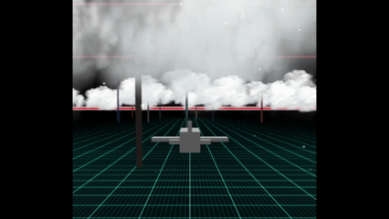  
*操作１での「上」*

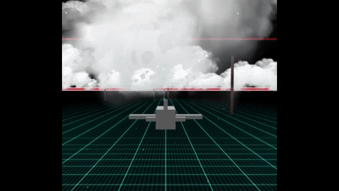  
*操作１での「右」*

#### 実装

```js
// 機体操作１：上昇下降とヨー回転
if (act.mud != 0) {
    let rateUD = 0.3;
    let vdir = BABYLON.Vector3.Up().scale(rateUD*act.mud);
    myMesh.position.addInPlace(vdir);
}
if (act.mrl != 0) {
    let rateRL = 0.05;
    let v3axisY = BABYLON.Vector3.Up().applyRotationQuaternion(quat);
    let quatR = BABYLON.Quaternion.RotationAxis(v3axisY, rateRL*act.mrl);
    quat = quatR.multiply(quat);
    myMesh.rotationQuaternion = quat;
}
// 前進
let vdir = BABYLON.Vector3.Forward().applyRotationQuaternion(quat);
if (act.ctrl) {
    vdir.scaleInPlace(3);
}
myMesh.position.addInPlace(vdir);
//境界条件
if (myMesh.position.x < worldMin) { myMesh.position.x += worldRng; }
if (myMesh.position.x > worldMax) { myMesh.position.x -= worldRng; }
if (myMesh.position.z < worldMin) { myMesh.position.z += worldRng; }
if (myMesh.position.z > worldMax) { myMesh.position.z -= worldRng; }
```

----------------------------------------------------------------------
### 機体操作２：ロール角度に応じたヨー回転と自動補正

#### 特徴

飛行機っぽく、上下でピッチ、左右でロールさせて動かします。

上下のピッチに関しては前後に傾いた角度で上昇・下降します。
ただし、
左右の方向転換には、ロール角に応じて方位角（ヨー）を変更させます。
つまり、簡単操作にする都合上、見た目と実際の挙動を切り分けています。

また、キーが押されていないときは水平状態に戻るようにしています。
水平状態に戻す都合上、ピッチとロールには最大角を設けており、それ以上傾かないようにしています。
つまり宙返りができません。

またピッチ／ロール／ヨーを通常とは違う使い方をしているためか、上下・左右を同時に押すと、向きと進行方向がズレることが多々あります。
水平状態に復元するためにオイラー角を使っているせいかもしれませんが。

#### 向いている用途

実装はかなりややこしい（難しい）ですが、お手軽操作で飛行機を操っている感が得られます。

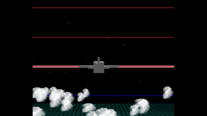  
*操作２での「上」*

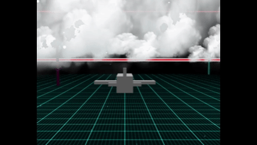  
*操作２での「右」*

#### 実装

```js
// 機体操作２：ロール角度に応じたヨー回転と自動補正
const R60 = Math.PI/3;
const R360 = Math.PI*2;
let vEuler = quat.toEulerAngles();
if (act.mud != 0) {
    // 上下時：ピッチ
    if (Math.abs(myMesh._vEuler.x) < R60) {
        let v3axisP = BABYLON.Vector3.Right().applyRotationQuaternion(quat);
        let v = 0.02*act.mud;
        myMesh._vEuler.x += v;
        let quatP = BABYLON.Quaternion.RotationAxis(v3axisP, v);
        quat = quatP.multiply(quat);
        myMesh.rotationQuaternion = quat;
    }
} else {
    // 水平 に復帰
    if (myMesh._vEuler.x == 0) {
    } else if (Math.abs(myMesh._vEuler.x) > 0.001) {
        myMesh._vEuler.x = BABYLON.Lerp(myMesh._vEuler.x, 0, 0.02);
    } else {
        myMesh._vEuler.x = 0;
    }
    quat = BABYLON.Quaternion.RotationYawPitchRoll(myMesh._vEuler.y, myMesh._vEuler.x, myMesh._vEuler.z);
    myMesh.rotationQuaternion = quat;
}
if (act.mrl != 0) {
    // 左右時：ロール
    if (Math.abs(myMesh._vEuler.z) < R60) {
        let v3axisR = BABYLON.Vector3.Forward().applyRotationQuaternion(quat);
        let v = -0.02*act.mrl;
        myMesh._vEuler.z += v;
        let quatR = BABYLON.Quaternion.RotationAxis(v3axisR, v);
        quat = quatR.multiply(quat);
        myMesh.rotationQuaternion = quat;
    }
} else {
    // 垂直に復帰
    if (myMesh._vEuler.z == 0) {
    } else if (Math.abs(myMesh._vEuler.z) > 0.001) {
        myMesh._vEuler.z = BABYLON.Lerp(myMesh._vEuler.z, 0, 0.02);
    } else {
        myMesh._vEuler.z = 0;
    }
    quat = BABYLON.Quaternion.RotationYawPitchRoll(myMesh._vEuler.y, myMesh._vEuler.x, myMesh._vEuler.z);
    myMesh.rotationQuaternion = quat;
}
if ((act.mud == 0) && (act.mrl == 0)) {
    myMesh.rotationQuaternion = BABYLON.Quaternion.RotationYawPitchRoll(myMesh._vEuler.y, myMesh._vEuler.x, myMesh._vEuler.z);
}
// ロールの傾きに応じてヨー回転させる
if (myMesh._vEuler.z != 0) {
    let v = -0.02*myMesh._vEuler.z
    myMesh._vEuler.y += v;
    if (myMesh._vEuler.y < 0) {myMesh._vEuler.y += R360;} else if (myMesh._vEuler.y > R360) {myMesh._vEuler.y -= R360;}
    let quatY = BABYLON.Quaternion.RotationAxis(BABYLON.Vector3.Up(), v);
    quat = quatY.multiply(quat);
    myMesh.rotationQuaternion = quat;
}
// 前進
{
    let q = BABYLON.Quaternion.RotationYawPitchRoll(myMesh._vEuler.y, myMesh._vEuler.x, myMesh._vEuler.z);
    let vdir = BABYLON.Vector3.Forward().applyRotationQuaternion(q);
    if (act.ctrl) {
        vdir.scaleInPlace(3);
    }
    myMesh.position.addInPlace(vdir);
    //境界条件
    if (myMesh.position.x < worldMin) { myMesh.position.x += worldRng; }
    if (myMesh.position.x > worldMax) { myMesh.position.x -= worldRng; }
    if (myMesh.position.z < worldMin) { myMesh.position.z += worldRng; }
    if (myMesh.position.z > worldMax) { myMesh.position.z -= worldRng; }
}
```


----------------------------------------------------------------------
### 機体操作３：クォータニオンによる回転

#### 特徴

飛行機を、上下でピッチ、左右でロール、"A"/"D" でヨーを回転、で操作します。
（ロールとヨーのキー配置は入れ替えた方が扱いやすい人がいるかもですが、自分はこちらの配置が合ってます）

#### 向いている用途

リアルな飛行機の操作をしたい方向け（上級者向け）の操作になります。

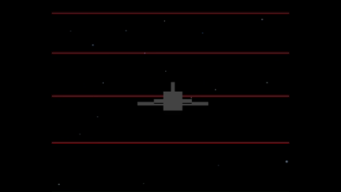  
*操作３での「上」*

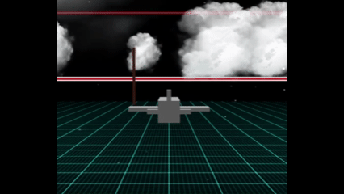  
*操作３での「右」*

#### 実装

実装はクォータニオンを使えば簡単に実現できます。

```js
// 機体操作３：クォータニオンによる回転
// 飛行機モード：ロール・ピッチ・ヨー操作
if (act.mud != 0) {
    // ピッチ
    let v3axisP = BABYLON.Vector3.Right().applyRotationQuaternion(quat);
    let v = 0.02*act.mud;
    if (act.mud < 0) {
        v = 0.04*act.mud;
    }
    let quatP = BABYLON.Quaternion.RotationAxis(v3axisP, v);
    quat = quatP.multiply(quat);
    myMesh.rotationQuaternion = quat;
    myMesh._resetPosture = 0;
}
if (act.mrl != 0) {
    // ロール
    let v3axisR = BABYLON.Vector3.Forward().applyRotationQuaternion(quat);
    let v = -0.03*act.mrl;
    let quatR = BABYLON.Quaternion.RotationAxis(v3axisR, v);
    quat = quatR.multiply(quat);
    myMesh.rotationQuaternion = quat;
    myMesh._resetPosture = 0;
}
if (act.rrl != 0) {
    // ヨー
    let v3axisY = BABYLON.Vector3.Up().applyRotationQuaternion(quat);
    let v = -0.02*act.rrl;
    let quatR = BABYLON.Quaternion.RotationAxis(v3axisY, v);
    quat = quatR.multiply(quat);
    myMesh.rotationQuaternion = quat;
    myMesh._resetPosture = 0;
}
// 姿勢をリセットする：ヨーだけを残して、ロール・ピッチを徐々に０にする
if (act.ent) { myMesh._resetPosture = 1; }
if (myMesh._resetPosture) {
    let vEuler = quat.toEulerAngles();
    vEuler.x = BABYLON.Lerp(vEuler.x, 0, 0.05);
    vEuler.z = BABYLON.Lerp(vEuler.z, 0, 0.05);
    if (Math.abs(vEuler.x) < 0.01 && Math.abs(vEuler.z) < 0.01) {
        vEuler.x = 0;
        vEuler.z = 0;
        myMesh._resetPosture = 0;
    }
    quat = BABYLON.Quaternion.RotationYawPitchRoll(vEuler.y, vEuler.x, vEuler.z);
    myMesh.rotationQuaternion = quat;
}
// 前進
{
    let vdir = BABYLON.Vector3.Forward().applyRotationQuaternion(quat);
    if (act.ctrl) {
        vdir.scaleInPlace(3);
        myMesh._resetPosture = 0;
    }
    myMesh.position.addInPlace(vdir);
    //境界条件
    if (myMesh.position.x < worldMin) { myMesh.position.x += worldRng; }
    if (myMesh.position.x > worldMax) { myMesh.position.x -= worldRng; }
    if (myMesh.position.z < worldMin) { myMesh.position.z += worldRng; }
    if (myMesh.position.z > worldMax) { myMesh.position.z -= worldRng; }
}
```


### 操作方式まとめ

type   | 操作 | 実装難度 | 所感
-------|------|----------|-------
操作１ | 上下（上昇／下降）<br>左右（方向転換：ヨー回転） | 簡単 | ドローン操作っぽい。<br>動きがやや不自然。機体が傾かない
操作２ | 上下（ピッチ回転）<br>左右（左右に傾きと方向転換：見た目だけロール回転させ、ロール角度に応じてヨー回転） | 難しい | 動きは自然<br>ピッチやロールに制限しないと破綻<br>姿勢の自動修正が必要
操作３ | 前進＋上下（ピッチ回転）<br>左右（左右に傾き：ロール回転） | やや難 | 上級者向けの機体制御。クォータニオンが必須。


## まとめ・雑感

[Babylon.js レシピ集 Vol.8](https://techbookfest.org/product/a6nDvbmAXEE593Ke3PkByc?productVariantID=58K2EKGaMUCm0MsyQC39WZ)
にある
「第5章  Babylon.jsで大空を飛ぶ」
はスゴイですね。
だけど、自分には機体操作が難しくて扱いきれませんでした。
そんな思いから、もうちょっと簡単操作で楽しめるものを模索してみました。

個人ランキング「飛行感」って本当？と思われた方、できれば上記リンクのデモを触ってみていただきたいです。正直、どれもそれなりに効果はあると思います。あとは好みの問題な気がします。
操作に関しても、「操作２」が自分好みなので、これをデフォルトにｗ。

遊覧飛行を楽しんでいると気づくのですが、やっぱりバトルものならオートロック機能は必須と思いました。
空中にも障害物を配置しているので、それに狙いを定めるように飛んでみると難しいことがわかりました。
止まっている状態でこれなのに、動きだして、攻撃するようになったら、もう無理じゃないかと。
ヌルゲーじゃないとプレイできなくなって、弱くなってしまいました。

------------------------------

前の記事：[Babylon.js ：標準メッシュだけで飛行機・記号・生物を作ってみた](151.md)

次の記事：[Babylon.js ：球面ゲーム用のメッシュ基盤を作る](153.md)


目次：[目次](000.md)

この記事には関連記事がありません。

--
