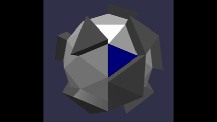
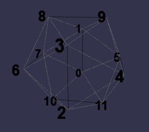
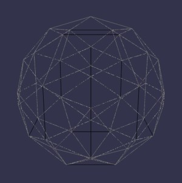
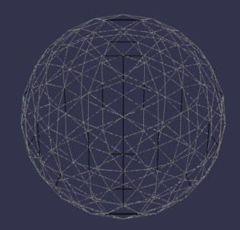
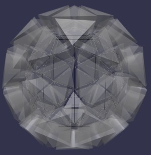
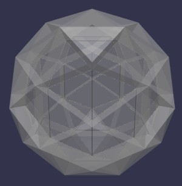
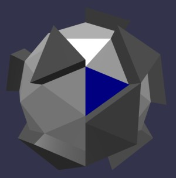

# Babylon.js ：球面ゲーム用のメッシュ基盤を作る

## この記事のスナップショット

  
*球表面の迷路*

https://playground.babylonjs.com/?BabylonToolkit#IZXIVP

（上記のURLにおいて、ツールバーの歯車マークから「EDITOR」のチェックを外せばウィンドウいっぱいに、歯車マークから「FULLSCREEN」を選べば画面いっぱいになります。）

[ソース](153/)

ローカルで動かす場合、上記ソースに加え、別途 git 内の [136/js](https://github.com/fnamuoo/webgl/tree/main/136/js) を ./js として配置してください。

## 概要

球面上を移動するゲームを作ろうと思い、情報収集をしました。
ただ、既存の球面メッシュ、
[Sphere](https://doc.babylonjs.com/features/featuresDeepDive/mesh/creation/set/sphere/)
や
[Icospheres](https://doc.babylonjs.com/features/featuresDeepDive/mesh/creation/polyhedra/icosphere/)
を使おうとすると、下記の操作に難があることがわかりました。

- メッシュの加工
- メッシュデータの応用


そこで今回は、
自前で幾何情報を作成するため、正20面体を再帰分割して球面メッシュを作ることにしました。
幾何情報を作ったら、
「３点の座標値」と「面の点情報」から作成する方法
[Create Custom Meshes From Scratch](https://doc.babylonjs.com/features/featuresDeepDive/mesh/creation/custom/custom/)
でメッシュを作成します。

今回は球面の幾何情報を使った応用例として、「球表面の迷路」を生成してみました。

迷路にするには、表面の三角メッシュを球の中心から伸ばすように三角柱のブロックにして壁のようにしています。
乱数で壁にするかどうかを判断しているので、どのような迷路になるかは運任せです。


球面上の舞台としたゲーム（迷路）をつくるなら、
自前で幾何情報（面の隣接や面を構成する点座標など）を持たせたうえで、別途描画するのがよいと聞いたので
このような手順になってます。
生成AIからは、三角メッシュの辺を壁／通路にする方法も提案されましたが、手順がやや煩雑なので今回は見送りました。

また、今回は球面上に舞台を作ったところまでです。つまり地形を眺めるだけしかできていません。

Zennの
「この春、始めたこと」
に参加です。
少々苦しい言い訳ですが、球面上を舞台としたゲームに初挑戦ということでｗ

## やったこと

- 正20面体を作成する
- 再帰的に面を分割
- 球面迷路へ応用する

### 正20面体を作成する

正20面体の点座標は、長方形を 3つ組み合わせる構成法があるそうで、それを利用して正20面体を作成します。
この辺の数学的な話は検索するとすぐに見つかるので解説は識者にお任せします。

```js
    // 黄金比 phi
    const t = (1 + Math.sqrt(5)) / 2;
    // 点の座標
    let p2xyz = [
        0, -1,  t,
        0,  1,  t,
        0, -1, -t,
        0,  1, -t,
        t,  0, -1,
        t,  0,  1,
       -t,  0, -1,
       -t,  0,  1,
       -1,  t,  0,
        1,  t,  0,
       -1, -t,  0,
        1, -t,  0,
    ];
    // 面を構成する３点（点のindex）
    let f2pid = [
        0,5,11,
        0,1,5,
        0,7,1,
        0,10,7,
        0,11,10,
        5,1,9,
        11,5,4,
        10,11,2,
        7,10,6,
        1,7,8,
        3,4,9,
        3,2,4,
        3,6,2,
        3,8,6,
        3,9,8,
        9,4,5,
        4,2,11,
        2,6,10,
        6,8,7,
        8,9,1,
    ];
```


  
*正20面体*

### 再帰的に面を分割

正20面体の三角メッシュを 4つに分割したら、分割点の座標値を球面上に移動させます。

分割を繰り返すことで、より滑らかな球になっていきます。
また分割された面は正三角形ではなく、やや崩れた三角形になっていきます。

```
subdivision の基本

1. triangle を：

      A
     / ＼
    /   ＼
   M-----N
  / ＼  / ＼
 /   ＼/   ＼
B-----P-----C

のように4 triangleへ分割。

2. face の変換

元：
[a,b,c]
↓
[a,ab,ca]
[b,bc,ab]
[c,ca,bc]
[ab,bc,ca]

3. 座標値の補正
   基準点(そのまま踏襲)
     Pnew = Pold
   中間座標を球面上に射影（長さ１に規格化して、半径倍する）
     Pnew = Pold.normalize().scale(R)
```

  
*1回分割：80面体*

  
*2回分割：320面体*

### 球面迷路へ応用する

上記で、幾何情報の取得とメッシュ表示が可能になりました。
これらの応用例として迷路を作ります。

迷路を作る方法には次の 2つの方法があります。
- 面を通路／壁にする
  - 壁をランダムに配置
  - スタートとゴールは通路上で A* で最長経路を求めて配置する
- 辺を通路／壁にする
  - 面が部屋、辺が壁／通路のイメージ
  - 穴掘り法を適用可能

ここでは簡単に、前者（面を通路／壁）の方法で迷路を作りました。

ここで１つ問題になるのは壁メッシュで、面は正確に正三角形ではありません。
また曲面上に配置する都合上、上面と底面の大きさが異なります。

結果、三角柱(CreateCylinder({tessellation:3}))を使うのはなかなか難しいです。

  
*Cylinderで表面を埋め尽くした場合*

なので、ここでは面の頂点座標を使って、原点（球の中心）から延長した点を求め、
自前で三角柱を作成します。

  
*自前の三角柱で表面を埋め尽くした場合*

迷路にする場合は以下のようにしています。

- ランダムでブロックを生成。ただし、手前側にある面をスタート地点（壁無し）にする。
- スタート地点から A* アルゴリズムでもっとも離れた位置を求め、ゴール地点とする。
- スタート地点に青いパネルを、ゴール地点に赤いパネルを配置。

  
*球表面の迷路*

## まとめ・雑感

今回は、球面上の舞台を作ったところまでです。
球面上にプレイヤーを置いて歩き回ることはできていません。
今後の課題です。


------------------------------

前の記事：

次の記事：..


目次：[目次](000.md)

この記事には次の関連記事があります。

--
