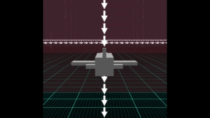
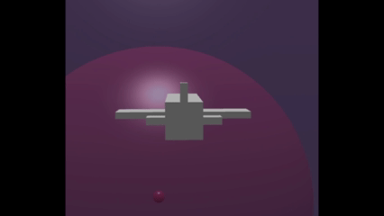
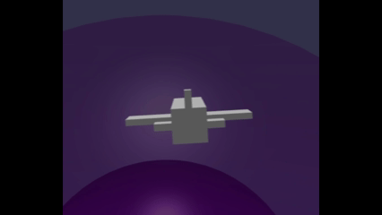

# Babylon.js ：重力が異なる異空間を飛ぶ試作

## この記事のスナップショット

  
*重力空間1 sample*

重力空間1  
https://playground.babylonjs.com/?BabylonToolkit#4XLXAK

重力空間2  
https://playground.babylonjs.com/?BabylonToolkit#4XLXAK#1

重力空間3  
https://playground.babylonjs.com/?BabylonToolkit#4XLXAK#2

（上記のURLにおいて、ツールバーの歯車マークから「EDITOR」のチェックを外せばウィンドウいっぱいに、歯車マークから「FULLSCREEN」を選べば画面いっぱいになります。）

[ソース](155/)

ローカルで動かす場合、上記ソースに加え、別途 git 内の [136/js](https://github.com/fnamuoo/webgl/tree/main/136/js) を ./js として配置してください。

## 概要

「重力が異なる異空間」といっても、上方向（重力方向とは反対の向き）を空間ごとに変化させた空間のことです。
カメラの向きを飛行機の上方向に位置させることで異空間を飛んでいるような雰囲気を出します。
本記事では便宜上「重力方向」という言葉を使いますが、実際に力をかけているわけではなく、
「重力方向」と反対方向を「上方向」として機体制御を行います。

なお、飛行機の操縦は
[Babylon.js ：飛んでいる演出と操作方法](152.md)
[Babylon.js ：飛んでいる演出と操作方法](https://zenn.dev/fnamuoo/articles/106eec7a3e5a5b)

のときの３パターンを改修しました。

重力を発生させる空間は、下記３パターンを作ってみました。

- 重力空間1. 長方形（重力方向を一定方向に）
- 重力空間2. 球形（重力方向が中心に向かう） .. 球表面（外側）にそって飛ぶ感じ
- 重力空間3. 球形（重力方向が外側に向かう） .. 球表面（内側）にそって飛ぶ感じ


空間内を飛ぶだけで、ゲームとして作り込んではいません。

小さな小惑星を模して 5～10 個配置すればゲームっぽくなると生成AIから提案されたのですが、
その空間（重力空間2）を飛んでみると、重力圏（重力の影響範囲）に捕まった宇宙船のように難易度が高いです。
別に重力が発生しているわけではないので、スイングバイ（重力を利用した加速）はできません。

## やったこと

- 重力空間1
- 重力空間2
- 重力空間3
- 機体操作1の改修
- 機体操作2の改修
- 機体操作3の改修

### 重力空間1

重力を一定方向にかけます。
通常は下向きと固定ですが、この領域内では右方向だったり左方向だったり上方向にします。

重力方向は目に見えないものですが、
ここでは重力方向に線分を配置しています。

  
*重力空間1に突入して、カメラが切り替わり、自動で姿勢調整する様子*

### 重力空間2

球の中心を重力方向とした空間です。
球面上を移動するような空間になります。

上方に移動していくと、この空間から逃れることができます。

  
*重力空間2に突入して姿勢が変わる様子*

### 重力空間3

重力方向を「重力空間2」と逆向きにした、中心から斥力（外に押し出す力）が働くような空間です。
このため、中心が上方向になります。

  
*重力空間3に突入してひっくり返る様子*


### 機体操作1の改修

機体操作1の操作は基本「上昇下降とヨー回転」ですが、
別途、重力方向に合わせた姿勢補正を行います。

```js
// 機体操作1の改修+重力空間1の場合
// 重力空間1の場合
if (act.mud != 0) {
    let rateUD = 0.3;
    let vdir = updir.scale(rateUD*act.mud);
    myMesh.position.addInPlace(vdir);
}
if (act.mrl != 0) {
    let rateRL = 0.05;
    let quatR = BABYLON.Quaternion.RotationAxis(updir, rateRL*act.mrl);
    quat = quatR.multiply(quat);
    myMesh.rotationQuaternion = quat;
}
// 姿勢修正
{
    let vdir = BABYLON.Vector3.Forward().applyRotationQuaternion(quat);
    let quat0 = BABYLON.Quaternion.FromLookDirectionRH(vdir, updir);
    let rlerp = 0.1;
    quat = BABYLON.Quaternion.Slerp(quat, quat0, rlerp);
    myMesh.rotationQuaternion = quat;
}
// 前進
let vdir = BABYLON.Vector3.Forward().applyRotationQuaternion(quat);
if (act.ctrl) {
    vdir.scaleInPlace(3);
}
myMesh.position.addInPlace(vdir);
//境界条件
if (myMesh.position.x < worldMin) { myMesh.position.x += worldRng; }
if (myMesh.position.x > worldMax) { myMesh.position.x -= worldRng; }
if (myMesh.position.z < worldMin) { myMesh.position.z += worldRng; }
if (myMesh.position.z > worldMax) { myMesh.position.z -= worldRng; }
myMesh.rotationQuaternion = quat;
```

### 機体操作2の改修

機体操作2の操作は基本「ロール角度に応じたヨー回転と自動補正」です。
もともとキー入力がないときに姿勢を戻す機能を設けていましたが、
戻す際に重力方向を加味して姿勢補正を行います。


```js
// 機体操作2の改修+重力空間1の場合
// 重力空間1の場合
let v3F = BABYLON.Vector3.Forward().applyRotationQuaternion(myMesh._quat); // 進行方向
let v3HB = updir.cross(v3F).normalize(); // 水平-Bitangent（従接線）方向
let v3HF = updir.cross(v3HB).normalize(); // 水平-前面方向
// 見た目の上方向
let viewU = BABYLON.Vector3.Up().applyRotationQuaternion(quat);
let viewF = BABYLON.Vector3.Forward().applyRotationQuaternion(quat);
if (act.mud != 0) {
    // 上下時：ピッチ
    let vdot = viewU.dot(updir);
    let raduu = Math.acos(vdot);
    {
        let v = 0.02*act.mud;
        let quatP = BABYLON.Quaternion.RotationAxis(v3HB, v);
        myMesh._quat = quatP.multiply(myMesh._quat);
        quat = quatP.multiply(quat);
        myMesh.rotationQuaternion = quat;
    }
}
// ヨー回転
if (act.mrl != 0) {
    let v = 0.05*act.mrl;
    myMesh._roll += v;
    let raduu = Math.acos(viewU.dot(updir));
    let vdotHB = viewU.dot(v3HB);
    if ((v*vdotHB < 0)  || (v*vdotHB >= 0 && raduu < R90)) {
        let quatR = BABYLON.Quaternion.RotationAxis(viewF, -v);
        quat = quatR.multiply(quat);
        myMesh.rotationQuaternion = quat;
    }
}
if (myMesh._roll != 0) {
    // ロールに応じたヨー
    let v = myMesh._roll;
    let quatR = BABYLON.Quaternion.RotationAxis(updir, v*0.02); //現在のロール角 _roll に対する旋回
    myMesh._quat = quatR.multiply(myMesh._quat);
    quat = quatR.multiply(quat);
    myMesh.rotationQuaternion = quat;
    myMesh._roll = BABYLON.Lerp(v, 0, 0.02); // 等比で減衰
    if (Math.abs(myMesh._roll) < 1e-3) {
        myMesh._roll = 0;
    }
}
// 姿勢修正
if ((act.mud == 0) && (act.mrl == 0)) {
    let quat0 = BABYLON.Quaternion.FromLookDirectionLH(v3HF, updir);
    let rlerp = 0.02;
    myMesh._quat = BABYLON.Quaternion.Slerp(myMesh._quat, quat0, rlerp);
    quat = BABYLON.Quaternion.Slerp(quat, quat0, rlerp);
    myMesh.rotationQuaternion = quat;
}
// 前進
if (act.ctrl) {
    v3F.scaleInPlace(3);
}
myMesh.position.addInPlace(v3F);
//境界条件
if (myMesh.position.x < worldMin) { myMesh.position.x += worldRng; }
if (myMesh.position.x > worldMax) { myMesh.position.x -= worldRng; }
if (myMesh.position.z < worldMin) { myMesh.position.z += worldRng; }
if (myMesh.position.z > worldMax) { myMesh.position.z -= worldRng; }
myMesh.rotationQuaternion = quat;
```

### 機体操作3の改修

機体操作3の操作は「上下でピッチ、左右でロール、"A"/"D" でヨーを回転」です。
「機体操作1」のときと同様に、別途、重力方向に合わせた姿勢補正を緩やかに行います。
（姿勢補正が強いとキー操作を打ち消してしまうので弱めに。）

```js
// 機体操作3の改修+重力空間1の場合
// 飛行機モード：ロール・ピッチ・ヨー操作
if (act.mud != 0) {
    // ピッチ
    let v3axisP = BABYLON.Vector3.Right().applyRotationQuaternion(quat);
    let v = 0.02*act.mud;
    if (act.mud < 0) {
        v = 0.04*act.mud;
    }
    let quatP = BABYLON.Quaternion.RotationAxis(v3axisP, v);
    quat = quatP.multiply(quat);
    myMesh.rotationQuaternion = quat;
    myMesh._resetPosture = 0;
}
if (act.mrl != 0) {
    // ロール
    let v3axisR = BABYLON.Vector3.Forward().applyRotationQuaternion(quat);
    let v = -0.03*act.mrl;
    let quatR = BABYLON.Quaternion.RotationAxis(v3axisR, v);
    quat = quatR.multiply(quat);
    myMesh.rotationQuaternion = quat;
    myMesh._resetPosture = 0;
}
if (act.rrl != 0) {
    // ヨー
    let v3axisY = BABYLON.Vector3.Up().applyRotationQuaternion(quat);
    let v = -0.02*act.rrl;
    let quatR = BABYLON.Quaternion.RotationAxis(v3axisY, v);
    quat = quatR.multiply(quat);
    myMesh.rotationQuaternion = quat;
    myMesh._resetPosture = 0;
}

// リセットなしでも徐々に姿勢を調整
// 姿勢をリセットする：ヨーだけを残して、ロール・ピッチを徐々に０にする
if (act.ent) { myMesh._resetPosture = 1; }
let rlerp = 0.002;
if (myMesh._resetPosture) {
    rlerp = 0.1;
}
if (g2pnt != null) {
    // 重力空間2の場合
    ..

} else {
    // 重力空間1の場合
    let vdir = BABYLON.Vector3.Forward().applyRotationQuaternion(quat);
    let quat0 = BABYLON.Quaternion.FromLookDirectionRH(vdir, updir);
    quat = BABYLON.Quaternion.Slerp(quat, quat0, rlerp);
    myMesh.rotationQuaternion = quat;
}

// 前進
{
    let vdir = BABYLON.Vector3.Forward().applyRotationQuaternion(quat);
    if (act.ctrl) {
        vdir.scaleInPlace(3);
        myMesh._resetPosture = 0;
    }
    myMesh.position.addInPlace(vdir);
    //境界条件
    if (myMesh.position.x < worldMin) { myMesh.position.x += worldRng; }
    if (myMesh.position.x > worldMax) { myMesh.position.x -= worldRng; }
    if (myMesh.position.z < worldMin) { myMesh.position.z += worldRng; }
    if (myMesh.position.z > worldMax) { myMesh.position.z -= worldRng; }
}
```

## まとめ・雑感

動きは面白いんですが、これからどうやってゲームに仕上げようかと悩むところです。


------------------------------

前の記事：[Babylon.js で物理演算(Havok)：静止状態を利用した崩壊する物理ステージの実験](154.md)

次の記事：..


目次：[目次](000.md)

この記事には次の関連記事があります。

[Babylon.js ：飛んでいる演出と操作方法](152.md)

--
