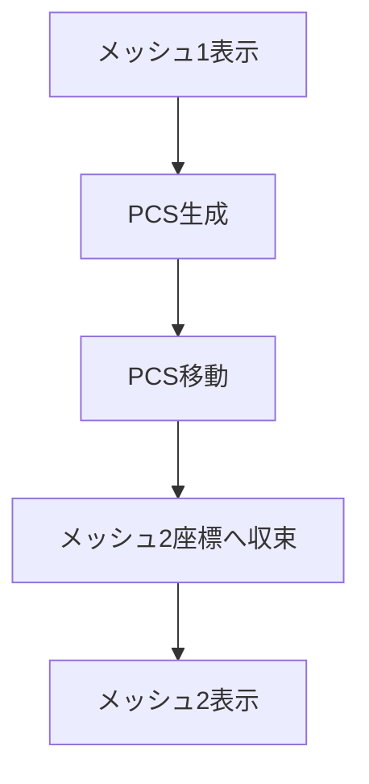
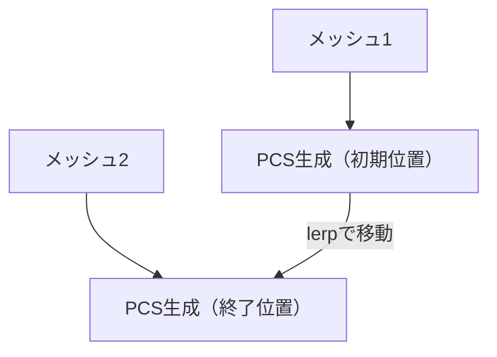
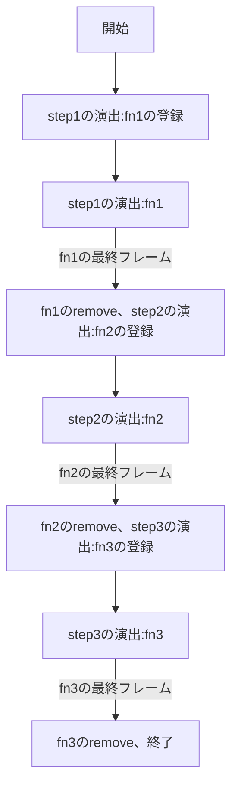

# Babylon.js ：ナノマシン・トランスフォーム

## この記事のスナップショット

  
*ナノマシン・トランスフォーム（２倍速）*

https://playground.babylonjs.com/?BabylonToolkit#2A2IGK

（上記のURLにおいて、ツールバーの歯車マークから「EDITOR」のチェックを外せばウィンドウいっぱいに、歯車マークから「FULLSCREEN」を選べば画面いっぱいになります。）

[ソース](157/)

ローカルで動かす場合、上記ソースに加え、別途 git 内の [136/js](https://github.com/fnamuoo/webgl/tree/main/136/js) を ./js として配置してください。

## 概要

メッシュ形状を変形（トランスフォーム）させる方法として以下のものがあります。

- 頂点モーフィング [Dynamically Morph A Mesh](https://doc.babylonjs.com/features/featuresDeepDive/mesh/dynamicMeshMorph)
- [Morph Targets](https://doc.babylonjs.com/features/featuresDeepDive/mesh/morphTargets)
- Babylon.js TIPS 集から
  - clipping planeを使った変身：[Dudeさん](https://scrapbox.io/babylonjs/Dude%E3%81%95%E3%82%93)

モーフィングの制限として、メッシュの頂点をそろえておく必要があります。

そこで今回は「一度粒子に分解してから別のメッシュへ凝集する」という演出を使うことで、全く異なるメッシュ同士でも変身演出を実現しました。

> メッシュ1 → 粒子に分解  →  粒子が移動 → 凝集 → メッシュ2

ここでは次の手順を取っています

step | メッシュ1    | 粒子1         | メッシュ2  | 粒子2
-----|--------------|---------------|------------|-------
step1|フェードアウト| フェードイン  |(不可視)    | 拡大＋回転
step2|(不可視)      | 移動          |(不可視)    | 回転
step3|(不可視)      | フェードアウト|フェードイン| 縮小＋回転

粒子1は「メッシュ1の外周からメッシュ2の外周に移動する粒子」、
粒子2は「球形で回転する粒子」です。

## やったこと

- メッシュ1、メッシュ2
- 粒子1
- 粒子2
- レンダリング処理を段階的に切り替え

以下の処理フローのように実行します。



※ PointsCloudSystem（以下PCS）

### メッシュ1、メッシュ2

[Babylon.js ：飛行機メッシュを作ってみた](151.md)

から適当に 2つ、メッシュを選んでいます。

これが、変形前のメッシュ、変形後のメッシュになります。


ちなみに、メッシュ1 と メッシュ2の alpha値を同時に変化させる（フェードアウトとフェードインを同時に実行する）ことで変形っぽく見せることもできます。しょぼいですが。

  
*alpha値（フェードアウトとフェードイン）による変形*


### 粒子1

[PointsCloudSystem](https://doc.babylonjs.com/features/featuresDeepDive/particles/point_cloud_system/pcs_creation/) を使います。
mesh1の表面に粒子＋移動用と、移動後の座標用（mesh2の表面）にそれぞれ PCS を用意します。

メッシュは幾つかのパーツ（複数の矩形や球）から構成されています。
大きさに合わせて粗密を調整した方が良さげですが、簡単に各パーツで同じ粒子数を割り当てます。
一旦、総粒子数を固定(N = 10000)にして、均一に粒子を割り当てています。

粒子の移動方法もいろいろ考えられますが、ここでは 線形補間（Lerp） でフレームごとの移動処理をしています。




ちなみに粒子1 だけを使った場合、単調で物足りなさがあります。

  
*粒子1のみのナノマシン・トランスフォーム*

### 粒子2

「粒子1」だけでは見た目が単調だったため、バリアとして展開したような、球状に回転する「粒子2」を追加しました。

球形に 結界粒子 を表示させます。
常に回転させつつ、開始時にサイズを大きくして、終わり際に小さくします。

  
*粒子2を含めたナノマシン・トランスフォーム*

### レンダリング処理を段階的に切り替え

変形処理を実現するために、
レンダリング時の処理、フェードイン／フェードアウトやPCSの移動を stepごとの動作として切り替えていきます。

ここでは各step を関数化(fn1,fn2,fn3)します。一定回数関数を繰り返したら、最終フレームで次の関数を実行するように、レンダリングに登録(add)・削除(remove)を繰り返します。





```js
// 効果の登録と削除
{
    let i = 0, n = 30, v;
    let fn1 = null, obs1 = null;
    let fn2 = null, obs2 = null;
    let fn3 = null, obs3 = null;
    // 粒子2 のstep1 処理（拡大・回転）の実体
    pcs9.updateParticle = function(particle) {
        particle.position.scaleInPlace(1.075);
        particle.rotation.y += 0.11;
    }
    fn1 = function() {
        // step1の演出
        if (i++ < n) {
            let v1 = (n-i)/n, v0 = Math.min(1-v1+0.1, 1);
            // 粒子1 をフェードイン
            meshPCS1.visibility = v0;
            // mesh1をフェードアウト
            setVisibility(mesh1, v1);
            // 粒子2 を拡大・回転
            pcs9.setParticles();
        } else {
            meshPCS1.visibility = 1;
            // step1の演出の削除
            scene.onBeforeRenderObservable.remove(obs1);
            // step2の演出の登録
            obs2 = scene.onBeforeRenderObservable.add(fn2);
            i = 0; n = 120;
            // step2での粒子1, 粒子2の動作登録
            // 粒子1 のstep2 処理（移動）の実体
            pcs1.updateParticle = function(particle) {
                let idx = particle.idx;
                let p3 = pcs3.particles[idx].position;
                p3 = BABYLON.Vector3.Lerp(particle.position, p3, 0.05);
                particle.position = p3;
            }
            // 粒子2 のstep2 処理（回転）の実体
            pcs9.updateParticle = function(particle) {
                particle.rotation.y += 0.1;
            }
        }
    }
    fn2 = function() {
        // step2の演出
        if (i++ < n) {
            // 粒子1 を移動
            pcs1.setParticles();
            // 粒子2 を回転
            pcs9.setParticles();
        } else {
            // step2の演出の削除
            scene.onBeforeRenderObservable.remove(obs2);
            // step3の演出の登録
            obs3 = scene.onBeforeRenderObservable.add(fn3);
            i = 0; n = 30;
            // 粒子2 のstep3 処理（縮小・回転）の実体
            pcs9.updateParticle = function(particle) {
                particle.position.scaleInPlace(0.9);
                particle.rotation.y += 0.1;
            }
        }
    }
    fn3 = function() {
        if (i++ < n) {
            let v3 = i/n, v0 = 1-v3;
            // 粒子1 をフェードアウト
            meshPCS1.visibility = v0;
            // mesh3 をフェードイン
            setVisibility(mesh3, v3);
            // 粒子2 を縮小・回転
            pcs9.setParticles();
        } else {
            meshPCS1.visibility = 0;
            // step3の演出の削除
            scene.onBeforeRenderObservable.remove(obs3);
            // 粒子1 の削除
            pcs1.dispose();
            pcs1 = null;
            // 粒子2 の削除
            pcs9.dispose();
            pcs9 = null;
        }
    }
    // 最初の演出の登録
    obs1 = scene.onBeforeRenderObservable.add(fn1);
}
```

## まとめ・雑感

Morph Targetのようなメッシュ変形とは異なり、この方法は頂点数が一致しないメッシュ同士でも変身演出を実現できます。粒子の移動方法や軌道を工夫すれば、魔法・テレポート・召喚・変身など様々な演出にも応用できそうです。

まぁ、ナノマシンというには粒子数が足らないですが。


------------------------------

前の記事：[Babylon.js ：地球儀で玉乗り](156.md)

次の記事：[Babylon.js ：飛行機操作をバイクへ応用](158.md)


目次：[目次](000.md)

この記事には次の関連記事があります。

[Babylon.js ：飛行機メッシュを作ってみた](151.md)

--

