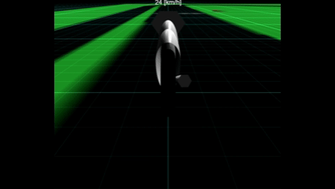
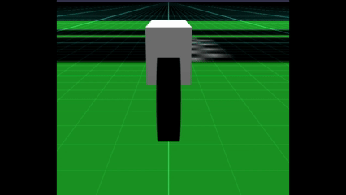
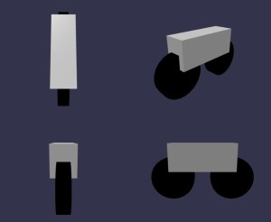
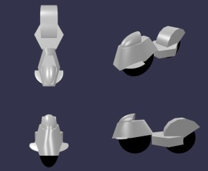
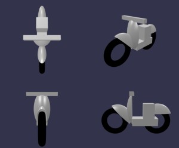
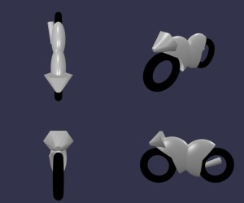

# Babylon.js ：飛行機操作をバイクへ応用

## この記事のスナップショット

  
*sample（4倍速）*

https://playground.babylonjs.com/?BabylonToolkit#SEF9CP

（上記のURLにおいて、ツールバーの歯車マークから「EDITOR」のチェックを外せばウィンドウいっぱいに、歯車マークから「FULLSCREEN」を選べば画面いっぱいになります。）

[ソース](158/)

ローカルで動かす場合、上記ソースに加え、別途 git 内の [136/js](https://github.com/fnamuoo/webgl/tree/main/136/js) を ./js として配置してください。

## 概要

[Babylon.js ：飛んでいる演出と操作方法](152.md)
[Babylon.js ：飛んでいる演出と操作方法](https://zenn.dev/fnamuoo/articles/106eec7a3e5a5b)

を作った際に、操作方法 2（ロール角に応じて旋回する仕組み）がそのままバイクの挙動に適用できそうだったので
バイクのメッシュに適用させ、どの程度自然に走れるか試してみました。

コースは簡単に、平面にコース図のテクスチャを貼ったものです。

物理エンジンを使わず、メッシュのみを動かしています。
グリップ走行のような動きで、加速や減速で滑るような挙動にはならず、
また、ぬるっと加速して、キュッとブレーキがかかる感じです。

バイクが 90度まで傾きますが仕様です（笑）。

バイクゲームをプレイしたことがないため、このような挙動で合っているのか正直手探り状態ですが、
車体を傾けて曲がったり、車体を起こして直進する挙動はちょっと面白いです。

## やったこと

- 飛行機操作を移植
- 操作をバイク向けに調整
- バイクメッシュを作る
- 試走

### 飛行機操作を移植

#### 上下を加速・減速に変更

飛行機操作だとカーソルの上下でピッチに割り当ててましたが、バイクでは加速・減速に割り当て直します。
移動は 速度(vel)を、レンダリングごとにメッシュ位置に足し合わせて移動させます。
キー操作（カーソルの上下）で速度(vel)を増減させます。

実際のスピードとは違いますが、上記のvel を定数倍としてスピードとしています。
スピードメーターを配置・表示させることで、移動速度の目安としています。

### 操作をバイク向けに調整

#### スピードを落として、曲がりやすくする

そのまま移植しただけでは移動スピードが速すぎて、曲がりにくくなってます。

スピードは飛行機の時の 30%に減速した状態で開始し、
さらにバイクの傾き（ロール角／バンク）に応じた旋回性を高めるため、
感度を 0.03 から 0.05 に上げます。

  
*移植したまま*

  
*調整したあと*

### バイクメッシュを作る

せっかくなのでバイクのメッシュを幾つか作ってみました。
（下記添付画像は、正面、側面、上面、斜めからの視点の 4分割）

  
*バイク1*

  
*バイク2*

  
*バイク3*

  
*バイク4*

### 試走

レース物でたびたび使ってきたカートコース（画像）を平面に貼り付けて試走しました。
その中で問題点や改善点が見えてきました。

- 操作が特殊（バンク操作で曲がる）で、なかなか操作に慣れず、加速・減速まで操作しづらい。
- キーボードだからなのか、キー操作で同時押しの感度がいまいち。コーナリング中のブレーキが効いたり効かなかったりする。
    - ※キーボードのハードウェア的な同時押し制限によるものかもしれません。
- 加速時に車体が起きる感じが弱いかも。もっと「グイッ」と起き上がってもよさげ。
- 旋回性能、バンクに対するヨー回転をもっと敏感にしてもよいかも（少し滑っている、ドリフトしている感じがする）

## まとめ・雑感

飛行機用として作った操作モデルでしたが、少し調整するだけでバイクらしい挙動を作ることができました。
もちろんまだ物理的にはかなり単純ですが、車体を倒して曲がる感覚は十分楽しめるレベルになったと思います。
今後はスリップやウィリー、ジャンプなどを追加してみるのもおもしろいと思ったり。

あとは今まで作ったコースを走らせてみるのも面白いかも。
今回はシンプルに平面上（コース画像を貼り付けただけ）でしたが、
過去に作成したカートコース上で走らせるとどんな感じになるのか気になります。

------------------------------

前の記事：[Babylon.js ：ナノマシン・トランスフォーム](157.md)

次の記事：..

目次：[目次](000.md)

この記事には次の関連記事があります。

- [Babylon.js ：飛んでいる演出と操作方法](152.md)

--
