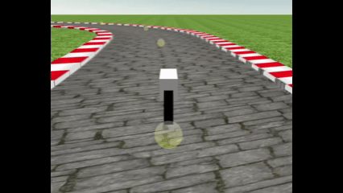
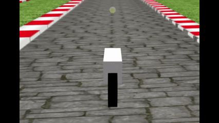

# Babylon.js で物理演算(Havok) ：バイクっぽいキャラクターコントローラーでカートコースを疾走

## この記事のスナップショット

  
*sample（2倍速）*

https://playground.babylonjs.com/?BabylonToolkit#J9G3UU

（上記のURLにおいて、ツールバーの歯車マークから「EDITOR」のチェックを外せばウィンドウいっぱいに、歯車マークから「FULLSCREEN」を選べば画面いっぱいになります。）

[ソース](159/)

ローカルで動かす場合、上記ソースに加え、別途 git 内の [136/js](https://github.com/fnamuoo/webgl/tree/main/136/js) を ./js として配置してください。

## 概要

今回 [キャラクターコントローラー](https://doc.babylonjs.com/features/featuresDeepDive/physics/characterController/) を人型キャラクターではなく、バイク風の乗り物にも応用しました。

既存のバイク挙動を キャラクターコントローラー に移植すると、
旋回時に独特の滑る（ドリフトする）挙動になり、それが意外とゲームとして面白くなりました。

コースには、以前作成した
[Babylon.js で物理演算(Havok)：カートレース](116.md)
[Babylon.js で物理演算(Havok)：カートレース](https://zenn.dev/fnamuoo/articles/7af076bef4cc25)
のコースを流用しました。

キャラクターコントローラーを使うことで、アップダウンのあるコースに対応でき、衝突にも対応できます。
通常なら摩擦や Raycast といった考慮が必要なところをキャラクターコントローラーでスキップします。

## やったこと

- キャラクターコントローラーをバイク挙動にする
- カートコースを移植する

### キャラクターコントローラーをバイク挙動にする

バイクの挙動は、
前回の
[Babylon.js ：バイクのシミュレーション試作](158.md)
[Babylon.js ：バイクのシミュレーション試作](https://zenn.dev/fnamuoo/articles/9cc4b88d4f3b0f)

と同じく、
倒れた分だけ曲がるようにしました。

前回のメッシュのときと比べ、滑っている（ドリフトしている）感じがあります。
キャラクターコントローラーを介して移動・旋回をしているので、微妙に反応がずれて、ドリフトのような挙動になっているのではと予想しています。

もっとクイックに反応できそうな気もしますが、まずはこれで良しとしました。

  
*コーナリングの感じ（2倍速）*

前後移動に関しては、停止せずに前進しかしませんが、加速・減速するようにしています。
速度変化は一定レートの加減速（等速変化）よりも、
毎フレーム Lerp（線形補間）を用いて目標速度へ近づけるスムージング処理 を行うことで、心地よいイージング（加減速）がかかるようにしました。

  
*加速している感じ（1.5倍速）*

### カートコースを移植する

過去の
[Babylon.js で物理演算(Havok)：カートレース](116.md)
[Babylon.js で物理演算(Havok)：カートレース](https://zenn.dev/fnamuoo/articles/7af076bef4cc25)
からコースを移植します。
このときには色々作り込んでいたので、機能をシンプルにして移植します。

まず、 2つのカメラ（追跡用と画面右上のミニマップ用）のためにレイヤーマスクを指定していたので、ここでは削除します。
カメラも追跡カメラの 1つだけとします。

また、ライバルカーは実装から外し（移植せず）、今回は自車のみとしました。
普通に走るだけでも難しいのに、ライバルがいたら気が散ってしまいます。

## 挙動の確認

衝突時のアクションを設定していないので壁にぶつかっても一時的に止まりますが、向きを変えると元のスピードになります。
衝突時の減速処理をあえて組み込んでいないための挙動であり、バグではなく現在の実装における仕様です。

物理演算（Havok）自体は有効ですが、坂道による重力の影響を受けず、プログラム側で制御した速度で移動するようにしています。
このため上り坂では減速している感じがしません。
一方で下り坂だと一瞬空中判定になって、ややスピードが伸びる挙動になります。

  
*峠でアップダウン（7倍速）*

## まとめ・雑感

バイクの挙動ってこんな感じじゃない気もしますが、まぁゲームなのでご容赦ください。
キャラクターコントローラーに適用したらよりドリフトっぽく滑って、更に操作が難しくなりました。
コースを覚えたうえで、コーナーを先読みして動かないとなかなか前に進めません。
でもそれはそれで面白いかも？

------------------------------

前の記事：[Babylon.js ：飛行機操作をバイクへ応用](158.md)

次の記事：..

目次：[目次](000.md)

この記事には次の関連記事があります。

[Babylon.js で物理演算(Havok)：カートレース](116.md)
[Babylon.js ：バイクのシミュレーション試作](158.md)

--

