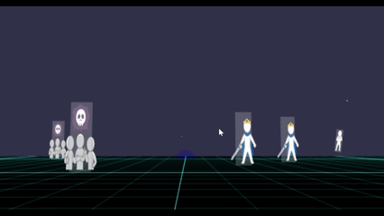
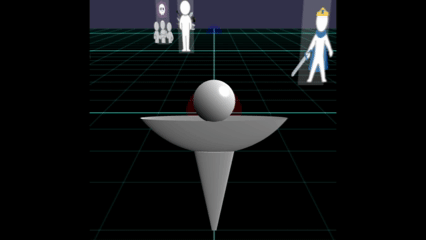
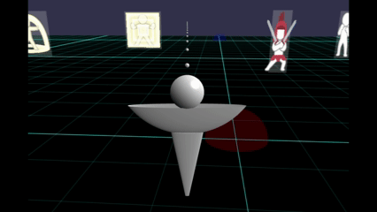
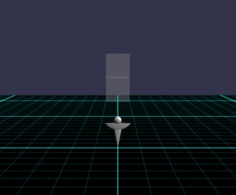
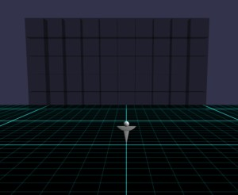
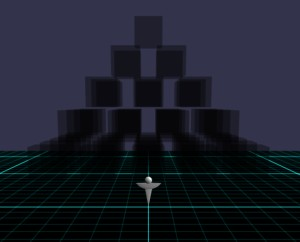
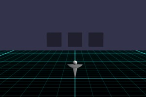
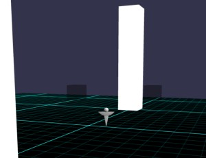
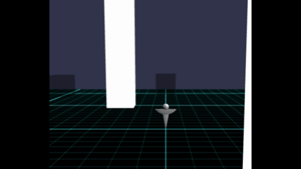
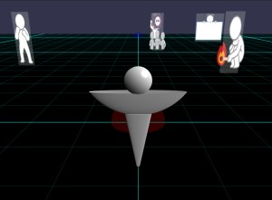

# Babylon.js で物理演算(Havok) ：FPSゲーム２（手探り中）

## この記事のスナップショット

  
*sample*

https://playground.babylonjs.com/?BabylonToolkit#MT4ZIV

（上記のURLにおいて、ツールバーの歯車マークから「EDITOR」のチェックを外せばウィンドウいっぱいに、歯車マークから「FULLSCREEN」を選べば画面いっぱいになります。）

[ソース](161/)

ローカルで動かす場合、上記ソースに加え、別途 git 内の [136/js](https://github.com/fnamuoo/webgl/tree/main/136/js) を ./js として配置してください。

## 概要

Havokによる物理演算を利用して、FPS操作とタワーディフェンスを組み合わせたゲームを作ってみました。
プレイヤーは武器を切り替えながら、ブロックや迫ってくる敵を吹き飛ばしてステージクリアを目指します。

ステージに配置されたブロック（黒）や棒人間を、場外に押し出しもしくは倒せばステージクリアになります。
ヒットの演出（スプラッタ）はなく、プレイヤー視点で移動してもカメラは上下しません。

ターゲットも弾も物理法則で処理します。
弾は発射すれば放物線を描くし、跳弾もします。ターゲットに当たって跳ね飛ばすこともあれば、跳ね返ることもあります。

オートターゲットで吹っ飛ばすも良し、手動（マウスクリック）で射撃することもよしです。
お好みの攻撃方法（短距離の連射／長距離狙撃／大玉で一括）で蹴散らしてやりませう。

なお、イラスト（棒人間）は、 [いらすとや](https://www.irasutoya.com/) さんから拝借しました。

## やったこと

- 武装を作る
- ステージを作る
- ノックアウト・ステージクリア判定

### 武装を作る

手っ取り早い武装として、銃（弾を射出）を用意しました。
といってもスプラッタ要素はありません。弾がぶつかっても跳ね飛ばしたり、弾き返されたりです。
ヒットや爆発の演出もありません。

弾はオートで発射しますが、正面にとらえていないと発射しません。
真正面でなくてもとらえるように初心者向けの「照準角」の広いもの（キー=4~6）、
更に対象に照準を合わせずに正面に弾をばらまくもの（キー=7~9）も用意してます。

玄人向けには、マウスのクリックした位置に（正確にはマウスでとらえたメッシュ位置の方向に）発射するものも用意してます。
こちらは、FPS（ファーストパーソン・シューティング）さながらにバンバン打つことを意識してリロードタイムを短くしてます。
この操作を行うには、カメラをプレイヤー視点(キー=cで変更)にする必要があります。

種類     | キー | 射程   | 照準角 |リロードタイム
---------|:----:|--------|--------|-----------------
拳銃     | 1    | 近     | 狭     | 速
ライフル | 2    | 中     | 狭     | 中
大玉     | 3    | 中～遠 | 狭     | 中
拳銃     | 4    | 近     | 広     | 中
ライフル | 5    | 中     | 広     | 遅
大玉     | 6    | 中～遠 | 広     | 遅
拳銃     | 7    | 近     | (正面のみ) | 速
ライフル | 8    | 中     | (正面のみ) | 中
大玉     | 9    | 中     | (正面のみ) | 中

  
*操作＝オートの様子（キー＝４）*

  
*操作＝オートの様子（キー＝７）*

  
*操作＝手動の様子（キー＝２）*

ちなみにオートの場合のアルゴリズムは、メッシュの正面方向と対象との相対位置のベクトルから角度を求め照準角以内＋射程の範囲内なら、対象に向けて弾を射出します。

```js
// オート時の射出判定コード
    let meshWeapon = [];
    let iweapon = 0;
    let weaponAtt = {
        // 射程距離^2, 発射速度 .弾質量   ,弾大きさ,存在step,射撃間隔              , 射角(1-余弦値)の補数
        1:{rSq:100  , spd:100   , mass:0.1, s:0.1, life:20 , cool:0, coolReload:1  , shtAng:0.99, }, // マシンガン
        2:{rSq:10000, spd:100000, mass:5  , s:0.2, life:50 , cool:0, coolReload:100, shtAng:0.99, }, // ライフル
        3:{rSq:10000, spd:50    , mass:100, s:5  , life:200, cool:0, coolReload:150, shtAng:0.99, }, // 巨岩
        // 射角広く、cool時間を長く
        4:{rSq:100  , spd:100   , mass:0.1, s:0.1, life:20 , cool:0, coolReload:2  , shtAng:0.95, }, // マシンガン
        5:{rSq:10000, spd:100000, mass:5  , s:0.2, life:50 , cool:0, coolReload:150, shtAng:0.95, }, // ライフル
        6:{rSq:10000, spd:50    , mass:100, s:5  , life:200, cool:0, coolReload:200, shtAng:0.95, }, // 巨岩
        // 照準なしで弾をばらまく
        7:{rSq:100  , spd:100   , mass:0.1, s:0.1, life:20 , cool:0, coolReload:1  , shtAng:-1, }, // マシンガン
        8:{rSq:10000, spd:100000, mass:5  , s:0.2, life:50 , cool:0, coolReload:100, shtAng:-1, }, // ライフル
        9:{rSq:10000, spd:50    , mass:100, s:5  , life:200, cool:0, coolReload:150, shtAng:-1, }, // 巨岩
    };
    scene.registerAfterRender(function() {
        if ((iweapon > 0) && (--weaponAtt[iweapon].cool <= 0)) {
            // 自動射撃
            if (iweapon <= 6) {
                if (icamera != 3) {
                    // フロントビュー以外 ..  射程内に入ったら自動で攻撃
                    let quat = myMesh.rotationQuaternion;
                    let vdir0 = BABYLON.Vector3.Forward().applyRotationQuaternion(quat); // 進行方向
                    let rSq = weaponAtt[iweapon].rSq;
                    let meshTrg = null;
                    for (let m of meshCheck) {
                        let lenSq = BABYLON.Vector3.DistanceSquared(myMesh.position, m.position)
                        if (lenSq < rSq) {
                            // 射程内に見つかった。姿勢（向き）と位置関係を見て、視線の範囲にある場合に対象とする
                            let vdir = m.position.subtract(myMesh.position).normalize(); // 目標の方向
                            // 高さ方向は無視して、ヨー角だけをみる
                            vdir0.y = 0;
                            vdir.y = 0;
                            let vcos = vdir0.dot(vdir);
                            if (weaponAtt[iweapon].shtAng < vcos) { // 約8[degree]
                                meshTrg = m;
                                break;
                            }
                        }
                    }
                    if (meshTrg != null) {
                        let vdir = meshTrg.position.subtract(myMesh.position).normalize(); // 目標の方向
                        let p0 = vdir.add(myMesh.position);
                        let mesh = BABYLON.MeshBuilder.CreateSphere("", {diameter:weaponAtt[iweapon].s}, scene);
                        mesh.position.copyFrom(p0);
                        mesh._agg = new BABYLON.PhysicsAggregate(mesh, BABYLON.PhysicsShapeType.SPHERE, {mass:weaponAtt[iweapon].mass}, scene);
                        vdir.scaleInPlace(weaponAtt[iweapon].spd);
                        mesh._agg.body.applyImpulse(vdir, mesh.absolutePosition);
                        mesh._life = weaponAtt[iweapon].life;
                        meshWeapon.push(mesh);
                        weaponAtt[iweapon].cool = weaponAtt[iweapon].coolReload;
                    }
                }
            } else {
                // 前方に弾をばらまく
                let quat = myMesh.rotationQuaternion;
                let vdir = BABYLON.Vector3.Forward().applyRotationQuaternion(quat); // 進行方向
                let mesh = BABYLON.MeshBuilder.CreateSphere("", {diameter:weaponAtt[iweapon].s}, scene);
                mesh.position.copyFrom(vdir.add(myMesh.position));
                mesh._agg = new BABYLON.PhysicsAggregate(mesh, BABYLON.PhysicsShapeType.SPHERE, {mass:weaponAtt[iweapon].mass}, scene);
                vdir.scaleInPlace(weaponAtt[iweapon].spd);
                mesh._agg.body.applyImpulse(vdir, mesh.absolutePosition);
                mesh._life = weaponAtt[iweapon].life;
                meshWeapon.push(mesh);
                weaponAtt[iweapon].cool = weaponAtt[iweapon].coolReload;
            }
        }
        // 弾のlife が尽きたら削除
        {
            let dels = [];
            for (let m of meshWeapon) {
                if (--m._life <= 0) {
                    dels.push(m);
                }
            }
            for (let m of dels) {
                let i = meshWeapon.indexOf(m);
                meshWeapon.splice(i, 1);
                m.dispose();
            }
        }
    });
```

手動の場合のアルゴリズムは、マウスでクリックした位置にメッシュがあるかを確認し、メッシュがあればその方向に弾を発射します。
なので、射程は無視して、正面になくても射出できますが、メッシュ（対象）のないところに発射できません。
今回参考にした
[サンプルコード](https://playground.babylonjs.com/#I6AR8X)
がそのような挙動だったためですが、クリック位置にメッシュが無くてもイベント検出する方法はあるみたいです。
(後日別の機会で紹介します)

```js
// 手動時の射出判定コード
    var useRaycast = true;
    scene.skipPointerMovePicking = true;
    var pickingRay = new BABYLON.Ray(
        new BABYLON.Vector3(0, 0, 0),
        new BABYLON.Vector3(0, 0, 1)
    );
    var raycastResult = new BABYLON.PhysicsRaycastResult();
    var physEngine = scene.getPhysicsEngine();
    scene.onPointerPick = (event, pickInfo) => {
        if ((iweapon > 0) && (--weaponAtt[iweapon].cool <= 0)) {
            // 手動で攻撃、クリック位置の方向に射出
            if (icamera != 3) {return;}
            var hit = false;
            var hitPos = null;
            scene.createPickingRayToRef(
                scene.pointerX,
                scene.pointerY,
                null,
                pickingRay,
                camera
            );
            physEngine.raycastToRef(pickingRay.origin, pickingRay.origin.add(pickingRay.direction.scale(10000)), raycastResult);
            hit = raycastResult.hasHit;
            hitPos = raycastResult.hitPointWorld;
            if (hit) {
                let vdir = pickingRay.direction.clone().normalize();
                let p0 = vdir.add(myMesh.position);
                let mesh = BABYLON.MeshBuilder.CreateSphere("", {diameter:weaponAtt[iweapon].s}, scene);
                mesh.position.copyFrom(p0);
                mesh._agg = new BABYLON.PhysicsAggregate(mesh, BABYLON.PhysicsShapeType.SPHERE, {mass:weaponAtt[iweapon].mass}, scene);
                vdir.scaleInPlace(weaponAtt[iweapon].spd);
                mesh._agg.body.applyImpulse(vdir, mesh.absolutePosition);
                mesh._life = weaponAtt[iweapon].life;
                meshWeapon.push(mesh);
                // 手動で照準の場合は cool時間を短縮
                weaponAtt[iweapon].cool = Math.floor(weaponAtt[iweapon].coolReload*0.2)-1;
            }
        }
    };
```

### ステージを作る

ステージには以下のものを用意しました。

動作確認用に作ったものに少し手を加えたり、お試しで対象を動かしてみた版だったりしますが。

- 対象（ブロック）を置いただけのステージ  
    
  *前方に２つ*

    
  *前方に壁*

    
  *ピラミッド*

    
  *四方に配置*

- 対象（ブロック）＋障害物のあるのステージ  
    
  *対象が円形＋障害物が四方に*
  
    
  *対象が円形＋障害物が移動*

- 対象（棒人間）が迫ってくるステージ
  - 棒人間は2種類、軽量（拳銃１発でダウン）と重量級（バリアを張っている）を用意
  - 遠方からこちらに迫ってくるように動きます

      
    *棒人間*


### ノックアウト・ステージクリア判定

対象（ブロック・棒人間）が吹っ飛ばした後の余韻、飛ばされる様子を出したく、
指定エリア外に出たらノックアウト（消滅）としています。

棒人間の場合は更に、床に倒れたとき（ある高さを下回ったら）にもノックアウト判定にします。

この判定だと高所に棒人間が倒れたときにノックアウト判定できないので、
正確を期すなら、ドミノ倒しの時のようにメッシュの角度（倒れた角度）で判断すべきでしたが今後の課題です。

## まとめ・雑感

物理で殴ってストレス解消するゲームを作っているつもりが、
仮組したり、動作確認したりしていくうちに迷走している感じがしてきたので、
一息ついて振り返る意味でも記事にしてみました。

結果、
[車で吹っ飛ばし／ラッセル車](053.md)
にアクションを加えたものになるつもりが、
[Babylon.js：パンプキンFPS](100.md)
と
[Babylon.js で物理演算(havok)：タワーディフェンスのゲームをつくる](103.md)
を足して割った感じのものが出来上がりました。

おかしいなぁ。
設計論的に「やりたいこと」をマインドマップで書き下して、詳細を詰めていったはずなのに、、、
お手軽に実現できる方法やら短時間でコスパよく見栄えする方法とかを考えていたせいですかね？

構想段階では、
市街地ステージを用意したり、敵アルゴリズムでこちらを攻撃すようなユニットとか、
あと敵ユニットを「イラっとするイラスト」にしたりとか夢想していたのですが..

具体的なイメージが無くて、ぼんやりイメージのまま見切り発車で動きだしたものの、途中から手段が目的化してしまった気がしないでもないです。
（結果、立ち止まって良かったのかもしれない）

------------------------------

前の記事：[Babylon.js で物理演算(Havok) ：球の表面を移動する](160.md)

次の記事：[Babylon.js ：日本地図・市区町村の表示](162.md)


目次：[目次](000.md)

この記事には次の関連記事があります。

- [車で吹っ飛ばし／ラッセル車](053.md)
- [Babylon.js：パンプキンFPS](100.md)
- [Babylon.js で物理演算(havok)：タワーディフェンスのゲームをつくる](103.md)

--

