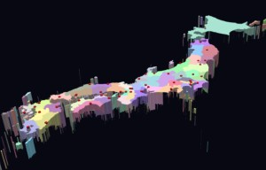
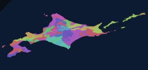

# Babylon.js ：日本地図・市区町村の表示

## この記事のスナップショット

  
*日本地図の表示*

https://playground.babylonjs.com/?BabylonToolkit#L88FQX

  
*市区町村の表示*

https://playground.babylonjs.com/?BabylonToolkit#L88FQX#1


（上記のURLにおいて、ツールバーの歯車マークから「EDITOR」のチェックを外せばウィンドウいっぱいに、歯車マークから「FULLSCREEN」を選べば画面いっぱいになります。）

[ソース](162/)

ローカルで動かす場合、上記ソースに加え、別途 git 内の [136/js](https://github.com/fnamuoo/webgl/tree/main/136/js) を ./js として配置してください。

## 概要

この記事では

- 日本地図（都道府県）
- 市区町村

を Babylon.js 上に表示する方法を紹介します。

[D3.js](https://d3js.org/) と 
[市区町村・選挙区 地形データ](https://github.com/smartnews-smri/japan-topography)
（topojson データ(s0010/N03-21_210101.json)）
 を利用することで、日本全域から市区町村まで描画できます。

なお、データの利用に関して下記から取得、簡素化処理を行ったものを二次利用しています（利用規約に基づく明記）。


- 国土交通省 国土数値情報（行政区域） https://nlftp.mlit.go.jp/ksj/ （2021年9月28日取得）
  - [利用規約](https://nlftp.mlit.go.jp/ksj/other/agreement_01.html)


ちなみに「あれ？ここって日本！？」 となった方は下記もしくは `Point of View` でググってみてください。

- [Natural EarthのPOV（Point of View）データ](https://visualizing.jp/natural-earth-pov/)


## やったこと

今回は実装の大半を Claude Sonnet 5 に任せました。

- 都道府県表示
- 市区町村表示

### 都道府県表示

Claude の Sonnet 5 工数：中（フリー利用）でコード生成させてみました。

```prompt
d3の日本地図を babylon.js の playground で表示する例は？
```

の結果に、県庁所在地のデータを別途付け足して、表示させた結果がこちらになります。

```fig
AIが作ったもの
　↓
県庁所在地のデータを追加
　↓
完成
```

利用しているライブラリは以下の通りです。

- Babylon.js
- D3.js

https://playground.babylonjs.com/?BabylonToolkit#L88FQX


### 市区町村表示

Claude の Sonnet 5 `工数：高` 、`思考：ON` （フリー利用）でコード生成させてみました。

```prompt
https://github.com/smartnews-smri/japan-topography の topojson, topojson-client, earcutを使って babylon.js の playground で市区町村を表示させるコードの例を作成。レビューと修正を3回繰り返した結果、3回目の全コードを表示
```

の結果です。（こちらはなにも手を加えず）

https://playground.babylonjs.com/?BabylonToolkit#L88FQX#1

利用しているライブラリは以下の通りです。

- Babylon.js
- topojson
- Earcut


## まとめ・雑感

D3のサイトを見ていたら
[アメリカの地図](https://d3js.org/d3-geo/conic#geoAlbers)
の例があったので、日本もあるのかなと思って調べたのがきっかけです。

正直、D3を使った例なんて今更感が半端ないですが、個人的な技術メモとしてご勘弁ください。
本当にやりたかったことはボロノイ図です。次回、D3のボロノイ図を使った例をやります。


------------------------------

前の記事：[Babylon.js で物理演算(Havok) ：FPSゲーム２（手探り中）](161.md)

次の記事：[Babylon.js ：ボロノイ図を使った地域制圧ゲームの素案](163.md)


目次：[目次](000.md)

この記事には関連記事がありません。

--

