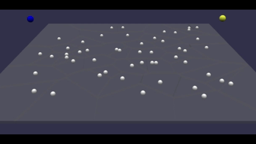
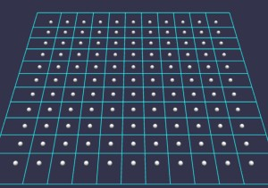
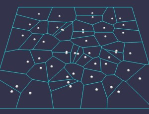

# Babylon.js ：ボロノイ図を使った地域制圧ゲームの素案

## この記事のスナップショット

  
*sample*

https://playground.babylonjs.com/?BabylonToolkit#WF2IE9

（上記のURLにおいて、ツールバーの歯車マークから「EDITOR」のチェックを外せばウィンドウいっぱいに、歯車マークから「FULLSCREEN」を選べば画面いっぱいになります。）

[ソース](163/)

ローカルで動かす場合、上記ソースに加え、別途 git 内の [136/js](https://github.com/fnamuoo/webgl/tree/main/136/js) を ./js として配置してください。

## 概要

「ボロノイ図」を地域制圧ゲームに応用したシンプルな例、
コンピュータ同士のシミュレーションを示します。

## やったこと

- 地域制圧ゲーム
- なぜボロノイ図？
- ボロノイ図で領域をつくる
- ゲームルール


### 地域制圧ゲーム

ボロノイ図を領地にみたてたゲームです。

基本、中立地帯（白）を占拠して自領にしたり、相手領地を奪ったり、時には相手を攻撃します。
最後まで生き残り、より広い地域を持っていた方が勝ちになります。

ルールベースで COMプレイヤーを動かしています。
操作可能なプレイヤーは用意せず、眺めるだけのデモになっています。

  
*地域制圧ゲームの様子*

### なぜボロノイ図？

正方格子のマス目では味気なく、粗密のある感じとしてボロノイ図をチョイスしました。

ボロノイ図の詳細は他の多くのサイトで紹介されているので割愛します。
気になる方は、`ボロノイ図`（Voronoi Diagram）の他にも、双対である`デローニー`（Delaunay）分割、もしくはドロネー分割でも調べてみてください。

ボロノイ図には [D3.js](https://d3js.org/d3-delaunay/voronoi) を用います。

  
*ボロノイ図／領域分割*

### ボロノイ図で領域をつくる

「点群」と「ボロノイ図」はそのまま、「拠点」と「支配領域」とみなすことができます。
なので点と区分領域を紐づけて管理します。

領域をつくるために、任意の点群 points から作成します。

```js
// d3 で ボロノイ図を作成
const delaunay = d3.Delaunay.from(points);
const voronoi = delaunay.voronoi(stageRange); // 表示範囲を設定
```

点群をグリッド上に配置すれば格子の領域になりますが、
ランダムに配置した点群だとそれっぽい領域になります。

  
*ボロノイ図／グリッド*

  
*ボロノイ図／ランダム*

### ゲームルール

点群を基にしたボロノイ図から、点（以降「拠点」と呼称）と区域を紐づけておきます。

主なルールは次のとおり。

- すべての区域は中立としておく
- 拠点にCOMプレイヤーが到達できたら、その拠点の区域はそのプレイヤーの領域とする
- すでに他プレイヤーの区域となっている拠点に別のプレイヤーが到達した場合、その区域は到達したプレイヤーの領域に変わる
- プレイヤーの区域が増えるごとに、プレイヤーが強くなる（HPが増え、攻撃力が上がる）
- プレイヤーの区域が減るごとに、プレイヤーが弱くなる（HPはそのままで、攻撃力が下がる）
- プレイヤーの攻撃範囲に他プレイヤーが侵入すると、相手に攻撃して、相手をノックバックさせる
- プレイヤーのHPが0以下になったら負け（停止させる）
- 最後まで残っていたプレイヤーが勝者
- 一定時間で勝敗がつかないときは、HPが高いプレイヤーの勝利。複数該当する場合はドロー。

COMプレイヤーは以下のアルゴリズムで動かしました。

- 中立の区域が残っていれば、一番近い中立の区域を目指す
- 中立の区域が無ければ、一番近い他プレイヤーの区域を目指す
- もし攻撃範囲に他プレイヤーがいれば攻撃する

## まとめ・雑感

プレイヤー操作のことは後回しにし、
まずは COMプレイヤー同士の動きを見ることで面白くなる可能性があるかを探ってみたのですが、うん、まぁいいんじゃないかなという感想です。

改良案としてはこんなところ（以下）だけど、やる気になるかは別問題（笑）

- ルールの見直し（復活可能）
- COMプレイヤーのアルゴリズムを増やす
- プレイヤー／ユニットを増やして、属性（得手不得手）を付与→戦略ゲームっぽく
- 地形効果を入れてユニットのバフ／デバフ
- 都道府県の地図を使って「信長〇野望」っぽく

いっそのこと領地を奪い合うのではなく、プレイヤーとCOMでそれぞれ同じステージを用意してスピード勝負してもよいのですが、「巡回セールスマン問題」になるんだよなぁ。

------------------------------

前の記事：[Babylon.js ：日本地図・市区町村の表示](162.md)

次の記事：..


目次：[目次](000.md)

この記事には次の関連記事があります。

- [Babylon.js ：日本地図・市区町村の表示](162.md)

--

