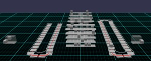
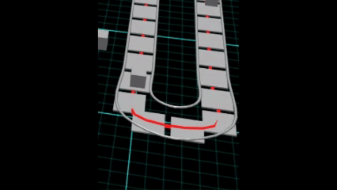
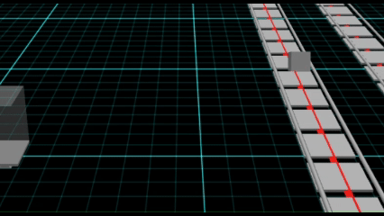
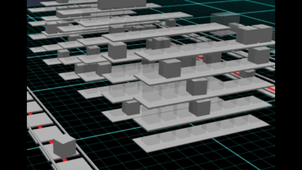
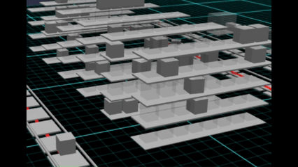

# Babylon.js で物理演算(Havok) ：倉庫の搬入・搬出シミュレーション(いまいち)

## この記事のスナップショット

  
*sample*

https://playground.babylonjs.com/?BabylonToolkit#ERJ2PN

（上記のURLにおいて、ツールバーの歯車マークから「EDITOR」のチェックを外せばウィンドウいっぱいに、歯車マークから「FULLSCREEN」を選べば画面いっぱいになります。）

[ソース](165/)

ローカルで動かす場合、上記ソースに加え、別途 git 内の [136/js](https://github.com/fnamuoo/webgl/tree/main/136/js) を ./js として配置してください。

## 概要

[Babylon.js Tips集](https://scrapbox.io/babylonjs/)で
倉庫シミュレーション
[マイクラ風](https://playground.babylonjs.com/#SCJXCA#11)
を見かけて、
倉庫という題材を使って、Havokでの物体搬送のギミックをどこまで作れるか試してみました。

物理演算を有効にして、トラックからの搬入、 Box をベルトコンベアで流して、
倉庫棚に格納・取り出し、トラックで搬出までの流れを模してみました。

Box の移動させ方は大きく２通りあります。
動きの前半部分（トラックからの搬入と、ベルトコンベアでの移動）はプレートに Box を載せて移動させています。
一方で他の操作（棚への格納と取り出し、トラックへの積み込み）は動きが難しく、移動経路を決めた移動になっており、
結果、Box が浮き上がって移動する動きです。
この動きは安定しておらず、棚にぶつかって Box が傾いたり他の Box にぶつかったりします。

この辺、もっと安定した動かし方を考えないとダメですね。今後の課題です。

アクション | 実装状況
-----------|---------------
搬入(トラック～ベルトコンベア)     | プレート上で移動
ベルトコンベア                     | プレート上で移動
棚への格納(ベルトコンベア～棚)     | 経路で移動（浮かせて移動・ぶつかることあり：不安定）
棚からの取り出し(棚～ベルトコンベア) | 経路で移動（浮かせて移動）
トラックへの積み込み(ベルトコンベア～トラック) | 経路で移動（浮かせて移動・ピックアップに失敗あり：不安定）

## やったこと

- Box をプレートで移動させる
- 倉庫棚に格納する(Box を勝手に移動させる）

### Box をプレートで移動させる

ベルトコンベア上で Box を運ばせる方法として、ベルトコンベアに見立てた、
連続した流れるプレートを配置して、その上に Box を置けば流れているように見えると考えた次第です。

ベルトコンベアが U字カーブしていると Box が遠心力でプレート上からこぼれるので、
転落防止のガードレールをベルトコンベアの左右に設けてます。

  
*ベルトコンベア*

ベルトコンベアの動きを応用して、トラックからの荷降ろしもプレートを楕円軌道で、トラックとベルトコンベアをつなぎます。
タイミングを合わせて、Box と荷降ろし用のプレートを作成します。

  
*トラックからの荷降ろし（4倍速）*

### 倉庫棚に格納する( Box を勝手に移動させる）

正確に Box の位置を把握して掴む（ピックアップする）、安定して荷崩れを起こさないように配置することが難しく思えたので、
経路にそって移動させることにしました。

トラックからの荷降ろしは３通りのみなので経路を固定できますが、
倉庫棚には多数（240)の空きがあるので動的に経路を作成して格納、経路に沿って Box を動かします。
ただ経路の作り方が甘いのか、棚にぶつかったり、他の Box にぶつかったりします。
ピックアップ時の Box の姿勢も関係していそうです。

  
*棚への格納：成功（2倍速）*

  
*棚への格納：失敗（3倍速）*

他にも、「棚からの取り出し」と「トラックへの積み込み」を経路に沿って Box を動かします。

## まとめ・雑感

今回の倉庫シミュレーションは、まだ完成とは言えません。

特に、棚への格納など Box そのものを移動させる部分は、
他の Box や棚との衝突を考慮した経路生成が十分ではありませんでした。

一方で、Box をプレートに載せて運ぶ方法は思ったよりうまく動きました。

今回試してみて、物理演算を使った搬送ギミックを組み合わせれば、
倉庫だけでなく、スロープトイのような「物が次々と運ばれていく仕組み」も
作れそうだという手応えを得ました。

今回は倉庫を題材にしましたが、むしろこちらのほうが今回の収穫だったかもしれません。

[Babylon.js で物理演算(Havok)：チューブの中で玉を転がす](130.md)

のときは、アクチュエーターで押し上げるときに、上手く玉を運べずに飛び出すことがありました。
今なら安定して運べそうな気がします。
ギミックのあるスロープトイ
[Marblerun - MBT10V1](https://www.youtube.com/watch?v=rNNqIzJkvbw)
（ここまでクオリティが高いものは無理ですが近いものも）を作れるんじゃないかという手ごたえを感じた次第です。

------------------------------

前の記事：[Babylon.js で物理演算(Havok) ：FPS3（微改修）](164.md)

次の記事：..

目次：[目次](000.md)

この記事には次の関連記事があります。

- [Babylon.js で物理演算(Havok)：チューブの中で玉を転がす](130.md)

--

