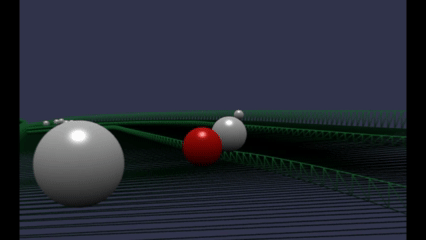
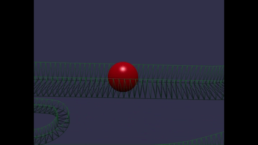
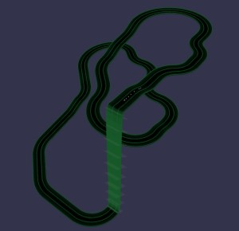
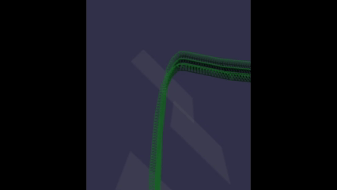
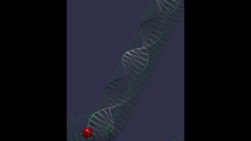
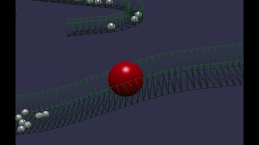
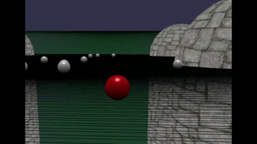

# Babylon.js で物理演算(Havok) ：スロープトイ（偏心ボール）

## この記事のスナップショット

  
*sample*

  
*sample2*

https://playground.babylonjs.com/?BabylonToolkit#Y0IEIZ

（上記のURLにおいて、ツールバーの歯車マークから「EDITOR」のチェックを外せばウィンドウいっぱいに、歯車マークから「FULLSCREEN」を選べば画面いっぱいになります。）

[ソース](168/)

ローカルで動かす場合、上記ソースに加え、別途 git 内の [136/js](https://github.com/fnamuoo/webgl/tree/main/136/js) を ./js として配置してください。

## はじめに

以前のスロープトイではギミックがうまく動きませんでした。
[Babylon.js で物理演算(Havok)：チューブの中で玉を転がす](https://zenn.dev/fnamuoo/articles/c639b65c3448b3)
のときのギミック、アクチュエーターが上手く作用せずに、ボールを「静かに」押し出すことが出来ずに、ボールが急に飛ばされたり、
チューブから飛び出したりしました。

そこで、
[Babylon.js で物理演算(Havok) ：倉庫の搬入・搬出シミュレーション(いまいち)](https://zenn.dev/fnamuoo/articles/95892ee6501ba9)
の知見（positionではなく、setTargetTransform で動かす）を使って、スロープトイをリメイクしました。

以前と同じレイアウト（コース）だと面白味が無いので、違うコースを用意し、
更にボールの違い（大小サイズや偏心ありのボール）にも変化を付けてみました。

## コースを作る

スロープトイのコースの複数の線分を組み合せて、方向転換や分岐や合流を表現します。

一本分の線分は
[Babylon.js ：UpDownなコースを作る](https://zenn.dev/fnamuoo/articles/843702cd399420)
と同様に、
三次元空間内の点列を結んで補間（滑らかに）した点列を使います。
点列は疑似プログラムコード（～ブロックのように直線や曲線のメタ情報の組み合せ）で作成します。

複数の線分を組み合せるときは、大きさ（コース幅や長さ）を一本ごとに変更し、任意の位置に配置して、
複雑なコースが作れるようになっています。

コース例として、
下記は同じ線分のコースを使いつつコース幅や道端のガードレールの高さを変えて重ねています。

  
*コース例*

## ボールを運ぶギミック

今回用意しているギミックは、「プレートを軌道に沿って動かし、ボールを押し出す」装置です。
これにより、低位にあるボールを高位に運ぶエレベーターとして作用します。

  
*高位にボールを運ぶプレート*

検討段階で「上に運ぶ」もう１つの装置として『アルキメデスのスクリュー』も作ってみました。

  
*アルキメデスのスクリューの例*

激重なアルキメデスのスクリューの例
https://playground.babylonjs.com/?BabylonToolkit#Y0IEIZ#1

が、処理が重くてフレーム落ちしてしまう感じになり、結果、軽量で軽快に動作する今の形に落ち着きました。

## ボールに変化を付ける

ボールを落とすだけでは単調になりがちです。
そこで多少変化を付けたくて、「大小のボール」や「偏心のボール」も用意しました。

### 大小のボール

大きさが違うことで、予測不能な面白い挙動を期待していたのですが、
実験的だったとはいえいまいちな出来です。

  
*大小のボールを一緒に転がす例*

### 偏心ボール

通常、重心は形状の中心にありますが、重心位置をずらしたものが「偏心ボール」になります。

ボールの重心が幾何学的な中心からずれているため、傾斜面に置いたときに重力によるトルクが通常の球とは異なります。
そのため、単純に斜面の下方向へ転がるのではなく、横方向の動きを伴うことがあります。

  
*偏心のボールを転がす例*

## 隠し機能

ここまで読んでくれた読者に特別なお知らせ。

スロープトイとありながら、実はボールをカーソルキー(WASD)で操作できます。
「見ているだけでは物足りない」と思われた方はどうぞボールを操ってみてください。

## スロープトイを面白くする難しさ

単調なものしか作れてないので、「次どうなるんだろう？」「何が起きるの？」といったワクワク感が作り出せずにいます。

今回転がすボールにも手を入れてみたものの、ボールだけを変化させても限界を感じました。
例えばよく跳ねるスーパーボールのようなボールを用意してもジャンプ台のようなものも必要だし、
「金属球をひきつける磁石を用意して」と思うとボールをひきつける装置が必要になるし、
いずれにせよ何かしらのギミックをペアで用意する必要があるといった感じです。

一番の障害は、自分のモチベーションにあるような気がします。
ついついコスパ良く面白い動きができればと考えつつも、そんな都合の良いものがあるわけもなく、
手間のわりにがっかりな出来になったらと思うと二の足を踏んで立ち止まってしまいます。

そんな中、
こちら
[Marblerun - MBT10V1](https://www.youtube.com/watch?v=rNNqIzJkvbw)
を見つけてしまいました。
クオリティが高すぎて脱帽です。

正直、意気消沈ぎみで次の一手を考え中です。

## まとめ・雑感

今回、以下を実施しました。

- コース生成
- プレート式のボール搬送ギミック
- 大小のボール
- 偏心ボール

以前はうまく動かせなかったボール搬送については、
プレートを setTargetTransform で動かすことで動作させることができました。

一方で、スロープトイとして見ると、
コースを作ってボールを転がすだけでは単調になりやすく、
「次に何が起こるのか」というワクワク感を作ることが難しいと感じました。

ギミックを増やせば面白くできそうですが、
その分制作コストが増えてしまい、モチベーションとのトレードオフになっています。

今回はこのあたりで一区切りとします。

------------------------------

前の記事：[Babylon.js で物理演算(Havok) ：ボール（摩擦）でコースを走ってみる](167.md)

次の記事：..

目次：[目次](000.md)

この記事には次の関連記事があります。

[Babylon.js で物理演算(Havok)：チューブの中で玉を転がす](130.md)
[Babylon.js で物理演算(Havok) ：倉庫の搬入・搬出シミュレーション(いまいち)](165.md)
[Babylon.js ：UpDownなコースを作る](166.md)

--
