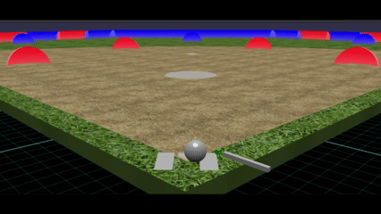
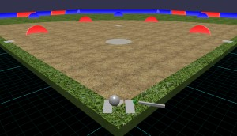
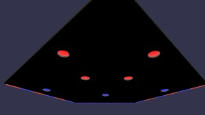
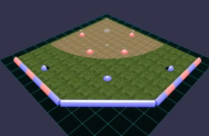
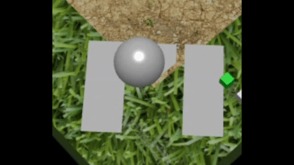
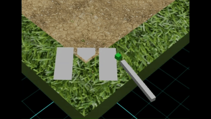
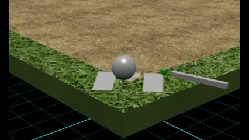

# Babylon.js で物理演算(Havok) ：ユニバーサル野球もどき

## この記事のスナップショット

  
*sample（1.5倍速）*

https://playground.babylonjs.com/?BabylonToolkit#DUUQQS

（上記のURLにおいて、ツールバーの歯車マークから「EDITOR」のチェックを外せばウィンドウいっぱいに、歯車マークから「FULLSCREEN」を選べば画面いっぱいになります。）

[ソース](169/)

ローカルで動かす場合、上記ソースに加え、別途 git 内の [136/js](https://github.com/fnamuoo/webgl/tree/main/136/js) を ./js として配置してください。

## 概要

[ユニバーサル野球](https://universalbaseball.world/)
を見て、Babylon.js + Havokで似たゲームを作ってみました。

野球盤のように、フィールド上を転がるボールをバットで打ちます。
ユニバーサル野球では、ルール・仕組みが下記のように単純化されています。

- ピッチャーは作らない
- ボールはホームベース付近を円軌道で動かす
- バットを振ってボールを打つ
- 打球がフィールド上の穴に入ったら（野手に捕らえられたら）ヒット(1BH, 2BH)と判定する

ここから、遊びやすくなるよう下記変更を加えました。

- 内野手・外野手の判定を変更（アウトや1BHに）
- 6イニングで終了する
- 凡打（ボールが届かなかった場合）はヒット(1BH)に

今回のポイントとしては、ボールとバットの動きをHavokの物理演算で作ったところになります。

## ゲームの流れ

前述のとおり、ピッチャーはおらず、ホームベース上をボールが回転しています。
バットを振るだけで、ヒット、アウトもしくはファールになります。

3アウトで交替ですが、
「攻守切り替え」や「ゲームセット」の演出は無いので、あっさりしています。

## 球場・盤面を作る
### CSG2で穴をあける

野球盤のように内野手・外野手の位置に穴をあけます。

穴をあけるため、CSG2 機能による [Merging Meshes](https://doc.babylonjs.com/features/featuresDeepDive/mesh/mergeMeshes/) を使います。

### 穴に落とすためのカバー

打球が思いのほか速いので、盤面に穴をあけただけでは上手く穴に落ちてくれないので、カバーをつけて穴に落ちやすくします。

  
*ホームベース側から眺めたとき*

  
*盤面を下から眺めたとき*

  
*盤面を外野席側から眺めたとき*

## ボールを動かす

ピッチャーマウンドからボールを転がせば、まさしく野球盤のようになるのですが、
ここでは「ユニバーサル野球」を真似ます。
ホームベース上の回転台まで真似ると遠心力で落ちてしまいそうな気がしたので、動きだけを真似して円軌道させます。

  
*ボールの動き*

## バットを振る

### アンカーとhinge

バットは簡単に直方体にしておきます。
スイングの動きは、mass=0のアンカーを配置して、バットとアンカーを ヒンジ(HingeJoint) でつなぎます。

### applyForceでスイング

バットのスイングは、バットの位置（向き）に合わせて、回転方向に力を加えます。

```js
let vb = myMesh.position.subtract(myMesh._p0).normalize();
let vn = BABYLON.Vector3.Up().cross(vb).normalize();
myMesh.physicsBody.applyForce(vn.scale(5000), myMesh.absolutePosition);
```

### バットを構える

スイングするごとに回転を止めてもよかったのですが、
ボールを打ち出したとき（指定の範囲からボールが飛び出たとき）に
スイングを止める（バットを構える）ようにしています。

キー（enter）を押しても、バットを構え直すようにしています。
バットを構えるときは、軽く動かしつつ、指定角度になったらバットを止めます。

  
*バットを構える動き*

## テストプレイ

### うまくいったところ

- ボールをバットで飛ばす動作がやたら上手くいきすぎて、飛びまくりでした。
  スイングの力加減や質量を調整して、浮き上がらないように転がりつつも、場外まで届くように調整しました。

### うまくいかなかったところ

- 当たり判定が不安定でまれにすり抜けることがあったりします。
  物理的な動きが安定しておらず、eスポーツとしてはいまいちな出来です。

  -   
    *当たり判定がおかしな様子*

- 当初、オリジナルのユニバーサル野球を真似て、内野手の穴をヒットにしていたのですが、なかなかアウト・交替にならずに、点がどんどん入る状態でした。
  あまりにバランスが悪いので、内野手の穴をアウトにすることにしました。

## ゲームとして作ってみて

### ルール判定

プレイしていると、内野手・外野手のカバーにあたってボールが転がったり、凡打でどこにも届かなかったりということがありました。
なので時間制限を設け、一定以上フィールド上をさまよっていたらヒット(1BH)相当にしています。

また、ファールになることもちょくちょくあります。
今回、ストライクやボールのカウントが無いので、ファールになっても、カウントそのままでやり直しにしてます。

ルール判定が甘くて、最終イニングで先攻が負けていても、後攻のターンがあります。

### 攻守切り替え

「攻守切り替え」が非常に分かりづらいです。


### 状況表示・演出

一応、情報はテキスト表示するようにしていますがいまいちかも。

演出というか状況の表示は大事ですね。
先攻か後攻かよくわからないし、
アウトカウントが見えないので緊張感がいまいちだし、
スコアボードがないので点差がわからないのもちょっとイケてないです。

## ゲームとして残った課題

- 出塁が分からない
- アウトカウントが分からない
- 先攻／後攻が分かりにくい
- スコアボードがない
- 最終イニングのルールが少し不自然
- 演出が少ない

## まとめ・雑感

今回は、Havokを使ってバットとボールの衝突を作るところを試してみました。
物理演算だけでそれらしい打球を作ることはできましたが、一方で衝突の安定性や、物理的な結果をゲームルールに変換する部分には難しさがありました。
また、ゲームとして遊んでみると、物理演算とは別に、攻守やスコアなどの「状況をプレイヤーに伝える仕組み」も重要だと分かりました。

ぶっちゃけ スイングするところまで作ったら満足してしまい、他がおざなりになってしまいました。

------------------------------

前の記事：[Babylon.js で物理演算(Havok) ：スロープトイ（偏芯ボール）](168.md)

次の記事：[Babylon.js で物理演算(Havok) ：ジャンプ・ゴルフ](170.md)


目次：[目次](000.md)

この記事には次の関連記事があります。

--
